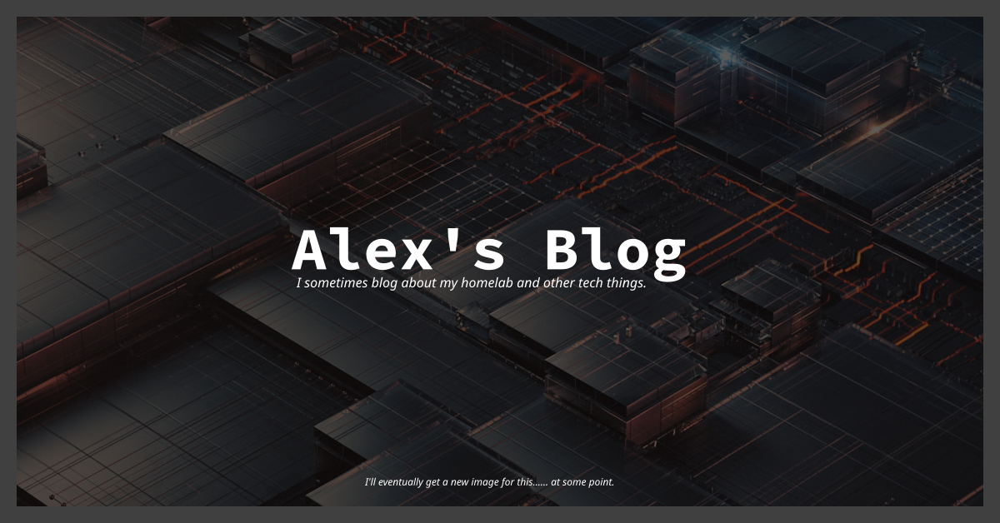

# Alex's Blog 

I blog about stuff sometimes.

## Todo

- Table of contents on posts.
- Fix giscus comment themes when switching site themes.
- Add image caching to local runner, so workflows do not have to re-optimize existing images.

 

## Development Commands

All commands are run from the root of the project, from a terminal:

| Command             | Action                                             |
| :------------------ | :------------------------------------------------- |
| `npm install`       | Installs dependencies                              |
| `npm run dev`       | Starts local dev server at `localhost:4321`        |
| `npm run build`     | Build your production site to `./dist/`            |
| `npm run preview`   | Preview your build locally, before deploying       |
| `npm run check`     | Check your project for errors                      |
| `npm run fix`       | Run Eslint and format codes with Prettier          |
| `npm run astro ...` | Run CLI commands like `astro add`, `astro preview` |

 

## Built on Astrowind 🚀

This blog is built on the [Astrowind](https://github.com/onwidget/astrowind) theme, a modern Astro blog theme with a minimalistic approach.

### Acknowledgements

Initially created by [onWidget](https://onwidget.com) and maintained by a community of [contributors](https://github.com/onwidget/astrowind/graphs/contributors).

### License

**AstroWind** is licensed under the MIT license — see the [LICENSE](./LICENSE.md) file for details.
