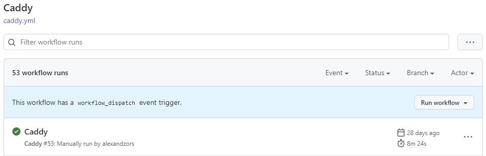

import ImgDesc from '~/components/custom/ImgDesc.astro'
import Aside from '~/components/widgets/Aside.astro'
import WebmVideo from '~/components/custom/WebmVideo.astro'
import GH_CREATE_REPO from 'gh-create-repo.webm'
import GH_CLONE_REPO from 'gh-clone-repo.webm'

I used to run a local Jenkins set up to automatically build and push my custom docker containers to Docker Hub. This was complicated to set up and maintain. Jenkins would sometimes throw errors or a plugin update would break a workflow. To fix this headache I ended up moving my build environment to [GitHub Actions](https://github.com/features/actions). This also made it even easier to integrate configs via git as it was all in a single repository. This four part post series will get you up and running with GitHub Actions and Docker container building. The fourth part will demonstrate how to build and release a binary version. If you are just interested in the building process of the container image you can ___[skip ahead](#creating-the-files).___

We will be using [Caddy](https://caddyserver.com/) as our base container for this post series. A lot of the building steps are already provided by the Caddy team which makes learning a bit easier.

# The Environment

I will be running this series as if you were running on Windows 10/11 with [Visual Studio Code](https://code.visualstudio.com) installed. Now this series can also be followed fairly easily if you are running on a straight Linux setup or WSL. I am also assuming you have a general understanding of a command line interface and a vague familiarity with [Docker](https://docker.com). If you need more help leave a comment below and I will reach out!

## Pre-Requisites

You should have these items created and set up before following this post.

- Create a [GitHub account](https://github.com/signup)
- Create a [GitHub account PAT](https://github.com/settings/tokens/new)
  - Must have the Repo and Workflows scopes enabled.
- Create a [Docker Hub account](https://hub.docker.com/signup)
- [git-scm](https://git-scm.com/book/en/v2/Getting-Started-Installing-Git) installed and configured.

<Aside type="note">
You can use GitHub's container registry instead of Docker Hub. You will just have to change the actions workflow to push to it instead.
</Aside>

*insert Jerry Rig Everything "Let's get started."*

# Creating and Cloning the Repository

The first thing we need to do is get our repository up and going on GitHub. The easiest way to do this is to first create the repository on GitHub using the [web interface](https://github.com/new). Can be public or private, choice is yours.

<WebmVideo src={GH_CREATE_REPO} alt="Creating a new repository on GitHub" width={1920} autoplay loop muted />
<ImgDesc>Creating a new repository on GitHub</ImgDesc>

Once your repository is created you'll want to clone it to your environment. Open Windows Terminal (mine defaults to PowerShell 7 though the commands should be similar on older versions) and run the following commands:

```shell showLineNumbers=false
#PowerShell 7.2
mkdir $env.USERPROFILE/Documents/git
cd $env.USERPROFILE/Documents/git
```

Now clone the repository by running:

```shell showLineNumbers=false
#PowerShell 7.2
git clone https://github.com/yourusername/yourgitrepo.git
```

<WebmVideo src={GH_CLONE_REPO} alt="Cloning the repository locally" width={1920} autoplay loop muted />
<ImgDesc>Cloning the repository locally</ImgDesc>

<Aside type="tip">
If it asks you to login enter your GitHub username and then your PAT as your password.
</Aside>

Change your directory to the newly cloned git repo.

```shell showLineNumbers=false
#PowerShell 7.2
cd $env.USERPROFILE/Documents/git/yourgitrepo
```

# Creating the Files

Now that we have our repository setup and cloned locally we can start adding files. Type `code .` inside the terminal while in the git repository to launch VSC. Once it's launched create a new file called `Dockerfile`. Then copy the following into the new file:

```dockerfile title="Dockerfile"
# Get caddy image with builder tag as builder step
FROM caddy:builder AS builder

# Run xcaddy builder with plugins.
# Plugins can be found here: https://caddyserver.com/download
# Plugins in this template are:
# caddy-dns/cloudflare, caddyserver/ntlm-transport, sjtug/caddy2-filter, greenpau/caddy-auth-portal, caddyserver/transform-encoder
RUN xcaddy build --with github.com/caddy-dns/cloudflare --with github.com/caddyserver/ntlm-transport --with github.com/sjtug/caddy2-filter --with github.com/greenpau/caddy-auth-portal --with github.com/caddyserver/transform-encoder

# Get caddy alpine image to keep the container as small as possible
FROM caddy:alpine

# Copy caddy executable from builder step
COPY --from=builder /usr/bin/caddy /usr/bin/caddy
```

Next create a folder and call it `.github`, then navigate to that folder and create another folder and call it `workflows`. Now create a file inside the `workflows/` folder called `actions.yml`. Your file path should look like this `.github/workflows/actions.yml`. 

Copy the following into the newly created `actions.yml` file:

```yaml title="actions.yml"
### This section defines the action ###

# Name of the action
name: Caddy

on:
  # Allows you to set off the action via a POST request to the GitHub workflow API
  repository_dispatch:
    types: caddy 
  # Allows you to manually run the action from inside the Actions tab of the repo
  workflow_dispatch: 

# See https://docs.github.com/en/actions/using-workflows/triggering-a-workflow for more options

### This section defines the job steps for the action ###
jobs:
  build:
    runs-on: ubuntu-latest
    steps:
      - uses: actions/checkout@v2
      # Login to Docker Hub using repo secrets
      - name: Docker Hub Login
        id: login_docker
        if: always()
        run: |
          echo ${{ secrets.DOCKER_HUB_PW }} | docker login -u ${{ secrets.DOCKER_HUB_USR }} --password-stdin
      # Build docker image using the Dockerfile
      - name: Build Docker Image
        id: build_docker
        if: success()
        run: |
          docker build -f ./Dockerfile -t ${{ secrets.DOCKER_HUB_USR }}/caddy:latest .
      # Push docker container to Docker Hub
      - name: Push Docker Image
        id: push_docker
        if: success()
        run: |
          docker push ${{ secrets.DOCKER_HUB_USR }}/caddy:latest
```

<Aside type="tip">
In order to use GitHub's container registry, you will need to change the Docker Hub Login step to point to GitHub. Add `ghcr.io` after docker login. `docker login ghcr.io`. Then update the 'Push Docker Image' step to use `ghcr.io`: `docker push ghcr.io/${{ secrets.DOCKER_HUB_USR }}/caddy:latest`.
</Aside>

Verify your new git repository looks like the following tree output:

```shell showLineNumbers=false
gh-actions-blog-guide
├── .github
│   └── workflows
│       └── actions.yml
├── Dockerfile
└── README.md
```

<br />

# Creating GitHub Actions Secrets

Before we can run the actions pipeline, we need to setup our new repository with secrets. These secrets will be used to login to your Docker Hub account from inside the Actions CLI. 

## Obtaining an Access Token for Docker Hub

<Aside type="note">
If you are using GitHub's container registry then you can skip this step.
</Aside>

First login to your Docker Hub account and go to [Account Settings > Security](https://hub.docker.com/settings/security). Under Access Tokens click on `New Access Token`. Give it a memorable description and access permissions scope of `Read & Write`. Then click on `Generate` to generate the new token. It should look like the following image if you are successful. Copy the new token to a safe location as it is only displayed this one time.


<ImgDesc>Creating a new access token in Docker Hub</ImgDesc>

## Adding GitHub Repository Secrets

Navigate to your repository and go to `Settings > Security > Secrets > Actions` and then click on `New repository secret`. Create two secrets with the following info:

Name | Value
--- | ---
DOCKER_HUB_USR | your docker hub username
DOCKER_HUB_PW | your docker hub access token from above

**If you are using GitHub's container registry then use the following value setup:**

Name | Value
--- | ---
DOCKER_HUB_USR | your github username
DOCKER_HUB_PW | A github PAT with `write:packages` scope

Once done your Actions secrets should look similar to this:


<ImgDesc>GitHub Actions secrets configuration</ImgDesc>

# Running the Job

Now that we have everything ready we can push our local changes to GitHub. For this guide series, we will be working directly off of the main (master) branch. Run the following commands to push your changes.

```shell showLineNumbers=false
# Adds all changed files/folders to commit
git add .

# Creates the commit with message
git commit -m "First Commit"

# Pushes commits to the GitHub hosted repository
git push
```

After pushing our changes we can verify the Action is running by navigating to the `Actions` tab in your repository on GitHib.

You will see a new entry in the list view similar to the one below.


<ImgDesc>GitHub Actions tab showing workflow runs</ImgDesc>

Clicking on the item will bring you to the pipeline log. You can expand each of the steps to see what it did and if there are errors and what they are. The below image is from the actions pipeline for my [Caddy](https://hub.docker.com/alexandzors/caddy) image that also builds a executable binary. The red boxes are what you should see in yours.


<ImgDesc>GitHub Actions pipeline execution view</ImgDesc>

<Aside type="note">
If you have errors double check your pipeline config or Dockerfile for spelling mistakes.
</Aside>

Now that we have our base pipeline setup and functional we can start doing some more advanced things with it. Stay tuned for more posts in this series. For easy access check out the [Guides tab](https://blog.alexsguardian.net/guides/). Let me know down below if you run into any trouble!

*Thanks to my good friend [Stefan](https://github.com/StefanMarAntonsson) for helping proof this post series!*

----
## Affiliate Links

- [Linode](https://www.linode.com/?r=67f6812cc5712674183021660b122e45095f35b5)💜
- [Private Internet Access](https://www.privateinternetaccess.com/pages/buy-a-vpn/1218buyavpn?invite=U2FsdGVkX1-8fM3Tf_qW3eYYf6yVliXSmIZwo4nDBfM%2CYfeBrdg4n9UbF4jCvDzT83kfTKA)

<sub>*FTC: Some links in this post are income generating.*</sub> 