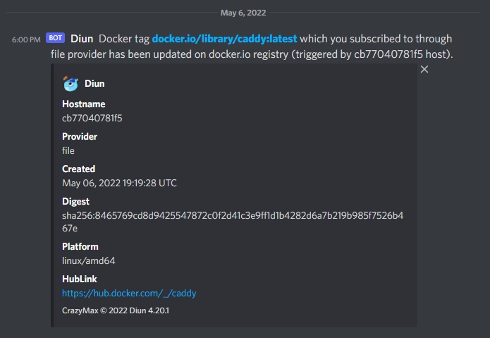

import ImgDesc from '~/components/custom/ImgDesc.astro'
import Aside from '~/components/widgets/Aside.astro'

In my [previous post](https://blog.alexsguardian.net/posts/AutoGHActionsDocker/), we got our [GitHub Actions](https://github.com/features/actions) pipeline set up and built our first Docker container image based on [Caddy](https://caddyserver.com/). In this post, we will be covering the process of automating the pipeline based on upstream changes in the parent [Caddy](https://hub.docker.com/_/caddy) Docker image. For this we will be deploying a service called [Diun](https://crazymax.dev/diun/) on a local docker machine.

## What is Diun?

> **<u>D</u>**ocker **<u>I</u>**mage **<u>U</u>**pdate **<u>N</u>**otifier is a CLI application written in Go and is delivered as a single executable (and as a Docker image) to receive notifications when a Docker image is updated on a Docker registry.
>
>[https://crazymax.dev/diun/](https://crazymax.dev/diun/)

Diun is a cool utility that watches a docker registry for updates and can run notifications based on them.

# The Environment

I will be running this series as if you were running on Windows 10/11 with [Visual Studio Code](https://code.visualstudio.com) installed. Now this series can also be followed fairly easily if you are running Linux setup or WSL. I am also assuming you have a general understanding of the command line interface. If you need more help, leave a comment below and I will reach out!

## Pre-Requisites

You should have these items created and set up before following this post.

- Have a [Linux machine running Docker](https://docs.docker.com/engine/install/ubuntu/)
- Have SSH access to the Docker machine
- Have an SSH client installed or have OpenSSH client enabled if running on Windows 10/11.
- Completed the [previous post](https://blog.alexsguardian.net/posts/AutoGHActionsDocker/).

# Deploying Diun

Before we deploy Diun we need to setup the directory for Diun to house configuration files in. SSH to your Docker machine and run the following commands:

```shell showLineNumbers=false
mkdir ~/diun
mkdir ~/diun/scripts
mkdir ~/diun/data
```

Now create the following files:

```shell showLineNumbers=false
cd ~/diun
touch docker-compose.yml
touch config.yml
touch /scripts/caddy.sh
touch /data/images.yml
```

Your directory should now look like this tree output:

```shell showLineNumbers=false
diun
├── scripts
│   └── caddy.sh
├── data
│   └── images.yml
├── config.yml
└── docker-compose.yml
```

## Configuring Diun

Now that we have our directory and file structure ready for Diun, we need to tell it what to do. First edit the `config.yml` file.

```shell showLineNumbers=false
nano config.yml
```

Add the following info to the file:

```yaml title="config.yml"
#config.yml
watch:
  workers: 1
  schedule: "0 */6 * * *"
providers:
  file:
    filename: /data/images.yml
notif:
# Enable this if you would like to post update notifications to a discord channel via a webhook.
#  discord:
#    webhookURL: <https://discordwebhookurl.com>
#    timeout: 10s
  script:
    cmd: "sh"
    args: "/scripts/caddy.sh"
```

<Aside type="tip">
You can change the schedule to whatever you'd like. However, I would not recommend going shorter than once a day.
</Aside>

<Aside type="note">
You can find more configuration docs on the [Diun wiki](https://crazymax.dev/diun/config/).
</Aside>

`CTRL + X` then `Y` to save and close the file. Now lets edit the `images.yml` file.

```shell showLineNumbers=false
nano /data/images.yml
```

Add the following info to the file:

```yaml title="images.yml"
#images.yml
- name: docker.io/caddy:latest
```

`CTRL + X` then `Y` to save and close the file. Now edit the `caddy.sh` script file.

```shell showLineNumbers=false
nano /scripts/caddy.sh
```

Copy the following info into the file. Make sure to edit the `<TOKEN>`, and `<git_repo>` (username/repo) portions.

```bash title="caddy.sh"
#!/bin/bash
#caddy.sh

curl -H "Accept: application/vnd.github.v3+json" \
    -H "Authorization: token <TOKEN>" \
    --request POST \
    --data '{"event_type": "caddy"}' \
    https://api.github.com/repos/<git_repo>/dispatches
```

<Aside type="note">
You will need a [GitHub PAT](/posts/2022/06/12/AutoGHActionsDocker/#obtaining-an-access-token-for-docker-hub) with both `repo` and `workflows` scopes enabled for the `<TOKEN>` section of the script.
</Aside>

`CTRL + X` then `Y` to save and close the file. Finally edit the `docker-compose.yml` file.

```shell showLineNumbers=false
nano docker-compose.yml
```

Copy the following info into the compose file.

```yaml title="docker-compose.yml"
#docker-compose.yml
version: "3"
services:
  diun:
    restart: always
    image: crazymax/diun:latest
    volumes:
      - "/opt/docker/diun/data:/data"
      - "/opt/docker/diun/scripts:/scripts:ro"
      - "/opt/docker/diun/diun.yml:/config.yml:ro"
      - "/var/run/docker.sock:/var/run/docker.sock"
    environment:
      - "TZ=America/New_York"
      - "LOG_LEVEL=info"
      - "LOG_JSON=false"
```

<Aside type="note">
Diun can be configured by environment variables instead of mounting host paths. See the [Diun wiki](https://crazymax.dev/diun/config/#environment-variables) for an example.
</Aside>

`CTRL + X` then `Y` to save and close the file.

## Starting Diun

Now that we have all of our config/script files configured we can start Diun. While in the `~/diun` directory, run:

```shell showLineNumbers=false
docker compose up -d
```

<Aside type="caution">
If you have an older version of docker compose installed, you may have to change the above command to `docker-compose`.
</Aside>

<Aside type="tip">
You can run `docker ps` to verify if Diun is running after the `docker compose` command completes.
</Aside>

Now that Diun is running, we can test the script to make sure its able to fire off our Actions pipeline. To make sure Diun can access the script and run it, we need to exec into the Diun container.

```shell showLineNumbers=false
docker exec -it diun-diun-1 /bin/sh
```

<Aside type="tip">
_Note:_ If you are using an older version of Docker Compose you will need to change the container name to `diun_diun_1`.
</Aside>

Once inside the container we can navigate to the `scripts` directory and run the `caddy.sh` script.

```shell showLineNumbers=false
cd /scripts
sh caddy.sh
```

<Aside type="tip">
If you get an error stating that `curl` is not found (similar to this)
`Tue, 05 Apr 2022 06:00:01 EDT ERR Script notification failed error="/scripts/caddy.sh: line 3: curl: not found: exit status 127" image=docker.io/library/caddy:latest`
you can install it by running: `apk add curl --no-cache`. Once installed re-run the `sh caddy.sh` command. Every time the container gets updated you will have to re-add curl.
</Aside>

After the script completes you can exit the container environment by typing `exit`. Next open your GitHub repository and navigate to the Actions tab. You should see a new active entry that was triggered by a repository dispatch. See below picture for an example of a completed action run by a repository dispatch.


<ImgDesc>Example of a completed GitHub Actions run triggered by repository dispatch</ImgDesc>

With that, all we need to do now is wait until the Caddy base image updates! Here is what the container log looks like when Diun successfully initiates an update notification.

```shell showLineNumbers=false
Fri, 06 May 2022 18:00:00 EDT INF Cron triggered
Fri, 06 May 2022 18:00:00 EDT INF Found 1 image(s) to analyze provider=file
Fri, 06 May 2022 18:00:01 EDT INF Image update found image=docker.io/library/caddy:latest provider=file
Fri, 06 May 2022 18:00:02 EDT INF Jobs completed added=0 failed=0 skipped=0 unchanged=0 updated=1
Fri, 06 May 2022 18:00:02 EDT INF Next run in 5 hours 59 minutes (2022-05-07 00:00:00 -0400 EDT)
```

The log output shows Diun found an image update for Caddy which fired off our notification setup. In my case it ran the script to update my image, as well as post a notification to my personal discord server:


<ImgDesc>Discord notification from Diun about an image update</ImgDesc>

Let me know down below if you run into any issues and stay tuned for Part 3!

*Thanks to my good friend [Stefan](https://github.com/StefanMarAntonsson) for helping proof this post series!*

----
## Affiliate Links

- [Linode](https://www.linode.com/?r=67f6812cc5712674183021660b122e45095f35b5)💜
- [Private Internet Access](https://www.privateinternetaccess.com/pages/buy-a-vpn/1218buyavpn?invite=U2FsdGVkX1-8fM3Tf_qW3eYYf6yVliXSmIZwo4nDBfM%2CYfeBrdg4n9UbF4jCvDzT83kfTKA)

<sub>*FTC: Some links in this post are income generating.*</sub> 