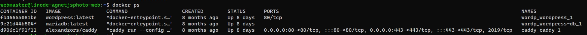

import ImgDesc from '~/components/custom/ImgDesc.astro'
import Aside from '~/components/widgets/Aside.astro'
import FTCDisclaimer from '~/components/custom/FTCDisclaimer.astro'

This is part 3 of this series so if you haven't completed [part 1](/posts/2022/06/12/AutoGHActionsDocker/) and [part 2](/posts/2022/06/20/AutoGHActionsDiun/) yet, go back if you want to follow along. In this part we will be updating our Caddy pipeline to deploy updates from Actions to a VM running in [Linode](https://www.linode.com/?r=67f6812cc5712674183021660b122e45095f35b5)'s cloud. As we are using Docker to run Caddy this will be very easy. In Part 4 we will be building a binary and pushing it to the Linode VM instead, which is slightly more complicated.

<Aside type="note">
Note: This is merely a guide to get started. These are the base steps to get you through the door. I'd recommend after you complete this guide that you review your security setup for your VM. As well as locking down access (disabling root login, etc). I will be covering some hardening topics later and will link them here when they are ready.
</Aside>

<Aside type="caution">
To fully complete this post you need to have a domain name registered and pointed to your Linode VM's public IP. If you do not then you can ignore the very end of this post where it demonstrates a working web server.
</Aside>

# The Environment

I will be running this series as if you were running on Windows 10/11 with [Visual Studio Code](https://code.visualstudio.com) installed. Now this series can also be followed fairly easily if you are running Linux setup or WSL. I am also assuming you have a general understanding of the command line interface. If you need more help, leave a comment below and I will reach out!

## Pre-Requisites

You should have these items completed and set up before trying to follow this post.

- Created a [Linode Account](https://login.linode.com/signup?promo=signup100-62122)
  - You can use [my affiliate link](https://www.linode.com/?r=67f6812cc5712674183021660b122e45095f35b5) to open an account and get credit. <sup>It helps support the blog! :)</sup>
- Have a [Linux VM](https://www.linode.com/docs/guides/creating-a-compute-instance/) running in Linode's Cloud with [Docker Engine installed](https://docs.docker.com/engine/install/).
  - Have [SSH Key Auth setup](https://www.linode.com/docs/guides/set-up-and-secure/#harden-ssh-access) on the VM.
  - Have a secondary SSH key pair set up.
- Have followed the previous<sup>[1](/posts/2022/06/12/AutoGHActionsDocker/)</sup> parts<sup>[2](/posts/2022/06/20/AutoGHActionsDiun/)</sup> in this series.
- Have a Domain registered and an A record pointed to the public IP of your Linode VM.
  - I use [Google Domains](https://domains.google/) with DNS handled by [Cloudflare](https://developers.cloudflare.com/dns/zone-setups/full-setup/setup/).

# Setting up the VM

First we need to create a new user account on our VM so Actions is not logging in as `root`. To do this, first SSH into your VM as root (since we haven't setup any other users yet) and run the following commands to create a new non-root user.

```shell showLineNumbers=false
ssh i- /path/to/private_key root@host
```

<Aside type="note">
If the ssh login fails you may have to permit `root` login. To do this you will need to access the `Lish` console of your VM from the Linode Dashboard. See ["Troubleshoot Rejected SSH Logins"](https://www.linode.com/docs/guides/troubleshooting-ssh/#troubleshoot-rejected-ssh-logins) section from the Linode docs site.
</Aside>

<Aside type="tip">
If you have key auth setup edit your `~/.ssh/config` file and add the VM user, hostname, and the path to your private key. You can then run `ssh vm` to login without needing to specify the key or ip/dns name. Example setup can be found [here](https://linuxhandbook.com/ssh-config-file/).
</Aside>

```shell showLineNumbers=false
# Create a new user called "actions" with a home directory (-m).
useradd -s /bin/bash -m -c "GitHub Actions Account" actions
```

After the command completes, create a password for the new account.

```shell showLineNumbers=false
passwd actions
```

Follow the prompts to set a new password for the `actions` account. Once done, switch to the new user and verify the home directory was created properly.

```shell showLineNumbers=false
su actions && cd ~ && ls -a -l
```

You should see some default hidden files that were created:

```shell showLineNumbers=false
total 20
drwxr-xr-x 2 actions actions 4096 Jul  6 14:55 .
drwxr-xr-x 4 root    root    4096 Jul  6 14:55 ..
-rw-r--r-- 1 actions actions  220 Feb 25  2020 .bash_logout
-rw-r--r-- 1 actions actions 3771 Feb 25  2020 .bashrc
-rw-r--r-- 1 actions actions  807 Feb 25  2020 .profile
```

Now create the `.ssh` directory structure for the `actions` user.

```shell showLineNumbers=false
mkdir .ssh
touch .ssh/authorized_keys
```

Set permissions on the `.ssh` directory.

```shell showLineNumbers=false
chmod 700 .ssh
chmod 600 .ssh/authorized_keys
```

<Aside type="tip">
If you are unable to set the permissions correctly, switch back to root and set the permissions from there. Update the above commands:
```shell
chmod 700 /home/actions/.ssh
chmod 600 /home/actions/.ssh./authorized_keys
```
</Aside>

Now Add the second key pair's public key to the `.ssh/authorized_keys` file. From your PC run the following commands depending on the OS:

**Windows 10/11**
```shell showLineNumbers=false
type $env.USERPROFILE\.ssh\mykey.pub | ssh actions@host "cat >> .ssh/authorized_keys"
```

**Linux**
```shell showLineNumbers=false
ssh-copy-id -i ~/.ssh/mykey.pub actions@host
```

You can then test to make sure your SSH key auth is working.

```shell showLineNumbers=false
ssh -i ~/.ssh/mykey actions@host
```

Make sure to update the path to the public key file and the `@host` to the public IP/DNS name of your VM.

<Aside type="tip">
If it fails, check the troubleshooting section from [ssh.com](https://www.ssh.com/academy/ssh/copy-id).
</Aside>

Once we have verified that our user can login via SSH, we can disable password auth for the VM. Switch back to root and edit the `/etc/ssh/sshd_config` file.

```shell showLineNumbers=false
su root
# `exit` can also be used
nano /etc/ssh/sshd_config
```

Hit `CTRL+W` to enter search and type `PasswordAuthentication` and hit `Enter`. Change the value from *yes* to *no*. Hit `CTRL+X` then `y` to save and close the file. Now restart the sshd service so the changes take affect.

```shell showLineNumbers=false
systemctl restart sshd
```

## Creating the File Structure
Now we need to setup and create the directory structure for Caddy on the Linode VM. Run the following commands to setup the directory and file structure for Caddy.

```shell showLineNumbers=false
mkdir ~/caddy
mkdir ~/caddy/data
mkdir ~/caddy/Caddyfile
mkdir ~/caddy/docker-compose.yml
```

Now edit the `docker-compose.yml` file:

```shell showLineNumbers=false
nano ~/caddy/docker-compose.yml
```

Copy the following into the docker-compose file. Make sure to change `<username>` to your Docker Hub username. If you used GitHub's container repo, make sure to add `ghcr.io/` in front of your username, which should be your GitHub one (e.g. `ghcr.io/alexandzors/caddy`).

```yaml title="docker-compose.yml"
version: '3.6'
services:
  caddy:
    restart: always
    logging:
      driver: "json-file"
      options:
        max-size: "500k"
        max-file: "1"
    image: <username>/caddy
    ports:
        - 80:80
        - 443:443
    volumes:
        - ~/caddy/config/Caddyfile:/etc/caddy/Caddyfile:ro
        - ~/caddy/config:/config
        - ~/caddy/data:/data
```

Save and close the file by hitting `CTRL + X` then `y`.

Now edit the Caddyfile and add the following content (same quick start from [Caddy's docs](https://caddyserver.com/docs/quick-starts/caddyfile)):

```shell showLineNumbers=false
nano ~/caddy/config/Caddyfile
```

```shell title="Caddyfile"
#Caddyfile
yourdomain.tld

respond "Hello World"
```

<Aside type="note">
If you do not have a domain you can change the `yourdomain.tld` line to `localhost` in the **Caddyfile**.
</Aside>

<Aside type="danger">
If you are using Cloudflare for your DNS **AND** have it proxying connections, you will need to update the **Caddyfile** to include your CF token. Otherwise automatic SSL certificate generation will fail, which can cause you to become rate limited from Let's Encrypt or ZeroSSL. If you are using `localhost` you can ignore this.
```shell title="Caddyfile"
#Caddyfile
(tls) {
  tls {
    dns cloudflare <yourcftokenhere>
  {
}
yourdomain.tld {
  import tls
  respond "Hello World"
}
```
</Aside>

Save and close the file by hitting `CTRL + X` then `y`. We can leave the current SSH session open as we will be needing it later.

# Updating the Actions pipeline

Now that we have the VM file structure ready to go, we can update our GitHub Actions pipeline to automatically update our docker container on image updates. Navigate to our actions repository and open the `actions.yml` file with your favorite text editor. Now add the following lines at the end of the file:

```yaml title="actions.yml"
[Previous YAML content...]
```

<Aside type="tip">
If your Caddy directory is not in `/home/username/caddy`, you will need to change the `cd ~/caddy` portion of the `script:` line to match your directory path. (e.g. `cd /opt/docker/caddy`)
</Aside>

Once you are done editing, save the file.

## Updating Actions Secrets

With our actions pipeline file updated, we need to update our secrets to match. Navigate to your repository on [GitHub.com](https://github.com) and click on the Settings tab > Secrets > Actions, then create the following secrets:

Name | Value
--- | ---
LINODEhost | public ip / dns name of your Linode VM
LINODEuser | username for login
LINODEkey | SSH secret key (use the second pair's secret key not the one you used to deploy the host with.)

## Updating the Repository

Now that we have the secrets created we can update our repository.

```shell showLineNumbers=false
git add .
git commit -m "set actions to update linode vm"
git push
```

After the push our actions pipeline will automatically kick off. To watch the log, return to the repository on GitHub and click on the Actions tab. Under "All Workflows" click on `Caddy`. The newest run should show up as a yellow flashing dot. Click on the item title to view the pipeline and follow the log output. When it completes we can run a `curl` check on our webserver to verify its running.

```shell showLineNumbers=false
curl https://yourdomain.tld
```

<Aside type="tip">
If you are using `localhost` you need to be in the ssh session of your VM to get a response.
</Aside>

If successful, you should get a `Hello World` response. If it fails, return to your SSH session and first check that Caddy is running using `docker ps`.


<ImgDesc>Docker ps output showing Caddy container running</ImgDesc>

If it is not, `cd` to the `caddy` directory and manually run the container.

```shell showLineNumbers=false
cd ~/caddy
docker compose up
```

<Aside type="tip">
Running `docker compose up` without the `-d` switch runs the container in your current terminal session. It is useful when troubleshooting as you can watch the container's log output live. When you exit (CTRL+C) the session the container will stop. Add the `-d` switch to run in detached mode.
</Aside>

If it starts up with no errors, terminate the container using `CTRL+C`. Then double check your action's file commands for spelling mistakes during the container running portion under the "*Deploy to VM*" step. As always, if you run into issues, let me know in the comments or reach out via email and I'll gladly walk you through it! Check out [part 4](/posts/2022/06/30/AutoGHBinary/) where we change up the pipeline to build and release a binary version of Caddy.

*Thanks to my good friend [Stefan](https://github.com/StefanMarAntonsson) for helping proof this post series!*

----
## Affiliate Links

- [Linode](https://www.linode.com/?r=67f6812cc5712674183021660b122e45095f35b5)💜
- [Private Internet Access](https://www.privateinternetaccess.com/pages/buy-a-vpn/1218buyavpn?invite=U2FsdGVkX1-8fM3Tf_qW3eYYf6yVliXSmIZwo4nDBfM%2CYfeBrdg4n9UbF4jCvDzT83kfTKA)

<FTCDisclaimer /> 