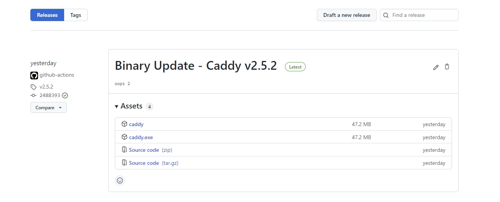

import ImgDesc from '~/components/custom/ImgDesc.astro'
import Aside from '~/components/widgets/Aside.astro'
import FTCDisclaimer from '~/components/custom/FTCDisclaimer.astro'

Welcome to part 4 of my GitHub Actions post series. This part will cover how to build and release a binary version of Caddy from GitHub Actions. In [part 1](/posts/2022/06/12/AutoGHActionsDocker) we got our Actions pipeline up and building a Docker container for our custom Caddy server image. In [Part 2](/posts/2022/06/20/AutoGHActionsDiun) we automated that process to kick off when changes were detected in the parent [Caddy](https://hub.docker.com/_/caddy) image using [Diun](https://crazymax.dev/diun). And in [part 3](/posts/2022/06/25/AutoGHDeployLinode) we automated updating our Linode VM to pull and re-deploy our updated container image. As this post is the 4th and final part of the GitHub Actions series, make sure to check out the previous 3 parts before trying to follow along with this post!

# The Environment

I will be running this series as if you were running on Windows 10/11 with [Visual Studio Code](https://code.visualstudio.com) installed. Now this series can also be followed fairly easily if you are running on a straight Linux setup or WSL. I am also assuming you have a general understanding of the command line interface and are somewhat familiar with [Docker](https://docker.com). If you need more help leave a comment below and I will reach out!

## Pre-Requisites

You should have these items created and set up before trying to follow this post.

- Have followed the previous 3 parts in this series.
  - [Part 1](/posts/2022/06/12/AutoGHActionsDocker/), [Part 2](/posts/2022/06/20/AutoGHActionsDiun/), and [Part 3](/posts/2022/06/25/AutoGHDeployLinode).

# Updating the Pipeline

First thing we need to do is to update our `actions.yml` file to include the binary building steps. Now this is completely up to you but I prefer to have the binary steps built before doing Docker images. This makes it easier to catch errors during the build process before accidentally pushing a broken image to your registry. Open the `actions.yml` file in your repo and add the following lines to it.

```yaml title="actions.yml"
[Previous content with workflow configuration...]
```

<Aside type="tip">
You can change what plugins are built with Caddy by adding/removing `--with plugin-name` parameters in the build command inside each script. Edit the Dockerfile to update the container version. You can find a list of available plugins [here](https://caddyserver.com/download).
</Aside>

<Aside type="note">
If desired, you could update the Action & Dockerfile to use the built binary in the Docker image instead of using the builder provided by Caddy's team. This would be an easy way to simplify it!
</Aside>

Once the files are created we can commit and push our changes to GitHub.

```shell showLineNumbers=false
git add .
git commit -m "Added binary building"
git push
```

The next time the action runs you should see a new release on your repository with a Linux and Windows binary for Caddy. 


<ImgDesc>Example of a GitHub release with Caddy binaries</ImgDesc>

As you can see in the picture above the release was created with both `caddy` and `caddy.exe` binaries attached. It also includes a zip/tar of the source code (These archives are a copy of your repository not Caddy's!). The title was created using the version pulled from the `Get Binary Version` step in the actions file. I am currently working on pulling the proper changelogs over for Caddy but I'm running into some formatting issues with it. Once I get it working I'll update this post to include the action steps.

As always if you run into any issues please reach out either via a comment down below or through the email contact!

*Thanks to my good friend [Stefan](https://github.com/StefanMarAntonsson) for helping proof this post series!*

----
## Affiliate Links

- [Linode](https://www.linode.com/?r=67f6812cc5712674183021660b122e45095f35b5)💜
- [Private Internet Access](https://www.privateinternetaccess.com/pages/buy-a-vpn/1218buyavpn?invite=U2FsdGVkX1-8fM3Tf_qW3eYYf6yVliXSmIZwo4nDBfM%2CYfeBrdg4n9UbF4jCvDzT83kfTKA)

<FTCDisclaimer /> 