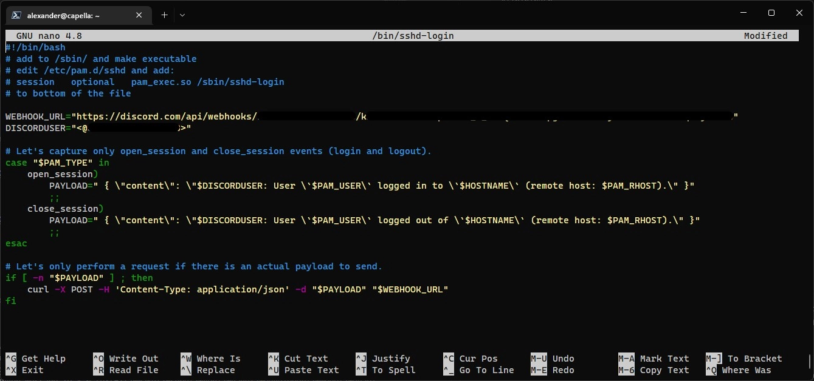

import ImgDesc from '~/components/custom/ImgDesc.astro'
import Aside from '~/components/widgets/Aside.astro'
import DISCORD_SSH_LOGGING from 'discord-ssh-logging.webp'

So in an effort to get better at log monitoring, especially for SSH, I decided to setup automatic login/logout webhook notifications. Since I already use Discord for gaming, etc. I figured it would be easy to set up a private server for just my homelab and have everything log to it. I ended up using pam.d to invoke a script that handles the webhook.

<Aside type="warning">
You will need a sudo enabled user to update pam.d config as well as creating the script for pam.d
</Aside>

<Aside type="tip">
If you are looking for a self hosted alternative take a look at my ntfy.sh post, [here](/posts/2023/09/12/selfhosting-ntfy/)!
</Aside>

# Creating the Webhook

Now I am going to assume that you already have a Discord account, if not you can sign up [here](https://discord.com/register), and you have a server setup with a text channel already created. To create the webhook, hover over the text channel you want to use and click on the settings gear. In the channel settings click on "Integrations" and then on "Webhooks". Click "New Webhook" and change the name to something you will recognize. Then click "Copy Webhook URL" and paste it into notepad so we have it for later. You can then save and exit the channel settings view.


<ImgDesc>Creating a Discord webhook through the channel settings</ImgDesc>

# Configuring SSH to Use the Webhook

Now that we have our webhook created we can setup our SSH daemon to send a webhook every time we log in and out of our Linux host. To do this SSH to your host and run the following command to create our script file:

```shell showLineNumbers=false
sudo touch /sbin/sshd-login
```

Now edit the file and add the following script to it.

```shell showLineNumbers=false
sudo nano /sbin/sshd-login
```

```bash title="sshd-login"
#!/bin/bash
# add to /sbin/ and make executable
# edit /etc/pam.d/sshd and add:
# session   optional   pam_exec.so /sbin/sshd-login
# to bottom of the file

WEBHOOK_URL=""
DISCORDUSER=""

# Capture only open and close sessions.
case "$PAM_TYPE" in
    open_session)
        PAYLOAD=" { \"content\": \"$DISCORDUSER: User \`$PAM_USER\` logged in to \`$HOSTNAME\` (remote host: $PAM_RHOST).\" }"
        ;;
    close_session)
        PAYLOAD=" { \"content\": \"$DISCORDUSER: User \`$PAM_USER\` logged out of \`$HOSTNAME\` (remote host: $PAM_RHOST).\" }"
        ;;
esac

# If payload exists fire webhook
if [ -n "$PAYLOAD" ] ; then
    curl -X POST -H 'Content-Type: application/json' -d "$PAYLOAD" "$WEBHOOK_URL"
fi
```

Before saving this file change the `WEBHOOK_URL` variable to match your webhook url you obtained earlier. If you want the script to @ notify you on each login/logout change the `DISCORDUSER` variable to include your ID. See the docs [here](https://support.discord.com/hc/en-us/articles/206346498-Where-can-I-find-my-User-Server-Message-ID-#:~:text=1%20Make%20sure%20you%20have%20Developer%20mode%20enabled.,...%205%20Obtaining%20IDs%20-%20Mobile%20App.%20) if you do not know how to obtain your Discord user ID. Once you have your ID change the variable to `"<@yourid>"`.


<ImgDesc>Example of a completed script setup</ImgDesc>

Once you are done changing variables save and close the file using `CTRL+X` then `y`. Then update the script to be executable and make sure the root user owns it.

```shell showLineNumbers=false
sudo chmod +x /sbin/sshd-login
sudo chown root:root /sbin/sshd-login
```

# Updating pam.d Config

In order for our script to send webhook notifications on login and log out we need to update `pam.d` to invoke it. To do this we need to edit the `sshd` config file located in `/etc/pam.d`.

```shell showLineNumbers=false
sudo nano /etc/pam.d/sshd
```

Add the following to the bottom of the sshd config file.

```shell title="sshd"
session   optional   pam_exec.so /sbin/sshd-login
```

Save the file by hitting `CTRL+X` then `y`. Once the file is closed we need to restart the `sshd` daemon.

```shell showLineNumbers=false
sudo systemctl restart sshd
```

# Testing the Webhook

With the script added and setup exit your SSH session and log back in again. If it's working you should get an @ notification from Discord like the example below.

<Image src={DISCORD_SSH_LOGGING} alt="SSH webhook log example" width={1920} />
<ImgDesc>Example of SSH login notifications in Discord</ImgDesc>

## Troubleshooting 

If it does not send a webhook to Discord you can try one of the following troubleshooting steps.

1. Check and verify your webhook URL is correct inside the `sshd-login` file. And is surrounded by double quotes (`"`).
2. Verify that root owns the `sshd-login` file and it's set to be executable.
3. Verify `sshd` config file in `/etc/pam.d` includes the `session   optional   pam_exec.so /sbin/sshd-login` call at the bottom of the file.

If it still does not work, try rebooting the machine and verify if it's working after. Let me know down below or via email if you run into any trouble! 