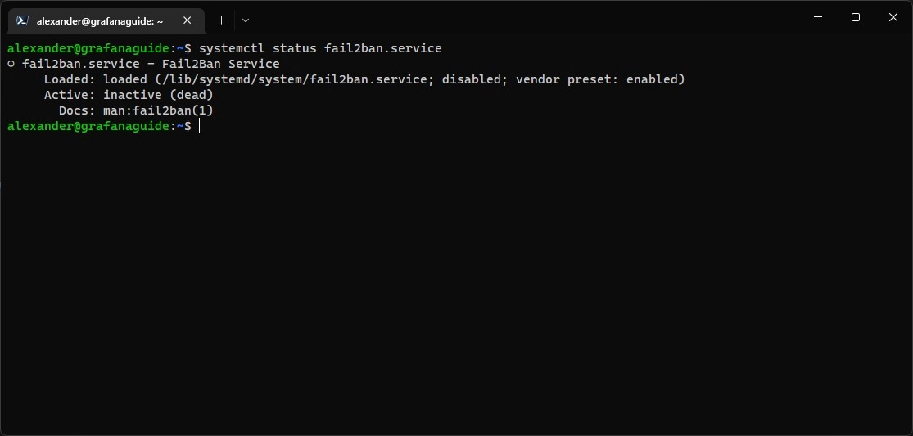
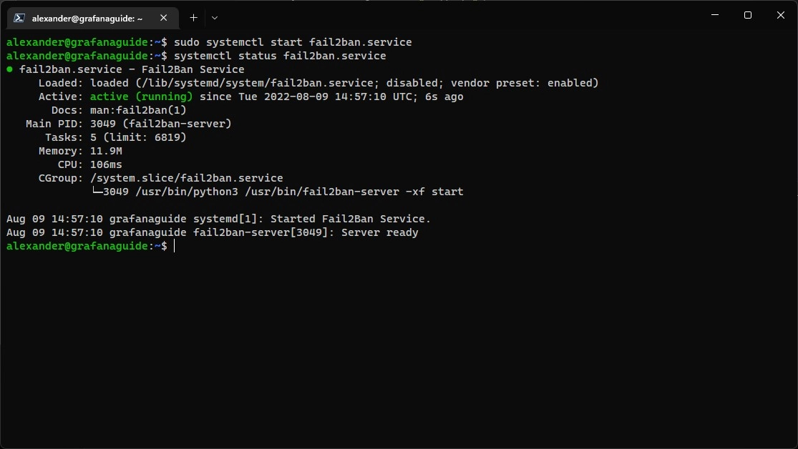
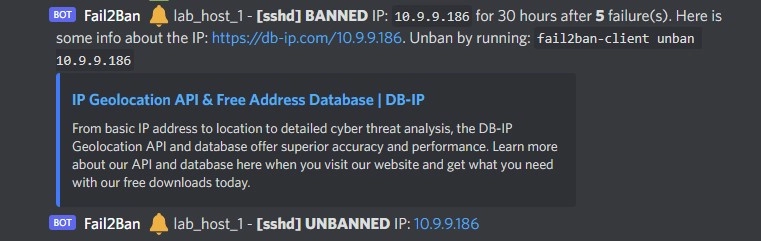

import ImgDesc from '~/components/custom/ImgDesc.astro'
import Aside from '~/components/widgets/Aside.astro'

Fail2Ban is a service that scans files like `/var/log/auth.log`, looking for failed authentication types and bans IPs that make repeated failed requests. It does this by updating firewall rules on the host to reject new connections from those IPs. It comes ready to go for reading many standard log files (sshd, Apache, etc) and is easily configurable for any other log files you want to scan for auth errors. Even though Fail2Ban is great at reducing the rate of incoming failed authentication requests, it is only one step in securing your host. 

<Aside type="tip">
Having a secure authentication set up is recommended along side fail2ban to reduce the risk of a nefarious user gaining access to your system.
</Aside>

In my previous post, [SSH Login Logging to Discord via Webhooks](/posts/2022/07/02/LoggingSSHtoDiscord/), we set up `pam.d` to log SSH logins to Discord over a webhook. We can also do this with Fail2Ban using a custom action. If you already have Fail2Ban installed you can __[skip ahead](#configuring-fail2ban)__ to the configuration.

# Installing Fail2Ban

<Aside type="note">
I use Ubuntu Server as my main linux distribution, so all my commands are geared toward it.
</Aside>

First update your package repositories and then install Fail2Ban.

```shell showLineNumbers=false
sudo apt update && sudo apt install fail2ban
```

Now verify if Fail2Ban was installed correctly you can check the status of the `fail2ban` service. Since it is not configured yet, it won't be running.

```shell showLineNumbers=false
systemctl status fail2ban.service
```


<ImgDesc>Output of the `systemctl status` command showing the status of the Fail2Ban service</ImgDesc>

# Configuring Fail2Ban

Now that Fail2Ban is installed we can configure it to log to Discord. First let's create our `/etc/fail2ban/jail.local` to tell Fail2Ban what to do.

<Aside type="note">
The default file (`/etc/fail2ban/jail.conf`) contains all the default supported monitoring points (Jails)
</Aside>

```shell showLineNumbers=false
sudo cp /etc/fail2ban/jail.conf /etc/fail2ban/jail.local
# using -l with nano gives you line numbers making it easier to read files.
sudo nano -l /etc/fail2ban/jail.local
```

Hit `CTRL`+`W` and type "bantime.increment" and hit `ENTER`. Uncomment the line by deleted the `#` at the beginning of it and set the value to `true`.

*bantime.icrement example:*

```shell title="jail.local"
# "bantime.increment" allows to use database for searching of previously banned ip's to increase a
# default ban time using special formula, default it is banTime * 1, 2, 4, 8, 16, 32...
bantime.increment = true
```

Hit `CTRL`+`W` and type "ignoreip" and hit `ENTER`. Uncomment the line and verify that the IPs listed are the local IPs `127.0.0.1/8 ::1`. Then add a space at the end and add your local network subnet. 

*ignoreip example:*

```shell title="jail.local"
# "ignoreip" can be a list of IP addresses, CIDR masks or DNS hosts. Fail2ban
# will not ban a host which matches an address in this list. Several addresses
# can be defined using space (and/or comma) separator.
ignoreip = 127.0.0.1/8 ::1 10.9.9.0/24 10.8.8.0/24
```

Hit `CTRL`+`w` again and search for "sshd".

Replace:

```shell title="jail.local"
port    = ssh
logpath = %(sshd_log)s
backend = %(sshd_backend)s
```

With:

```shell title="jail.local"
enabled = true
action = discord_notifications
         iptables-allports
port    = ssh
logpath = %(sshd_log)s
backend = %(sshd_backend)s
```

Hit `CTRL`+`x` and then `y` to save and close the `jail.local` file.

## Creating the Discord Action

Now that we have our `/etc/fail2ban/jail.local` file we can create the `/etc/fail2ban/action.d/discord_notifications.conf` action. First we need to get a webhook URL from Discord. To do this open Discord and navigate to the channel settings of the channel you want to log to. Open the integration settings and create a webhook. Give it a name you'll recognize and copy the url.

```shell showLineNumbers=false
sudo nano /etc/fail2ban/action.d/discord_notifications.conf
```

Copy the following contents into the file:

```shell title="discord_notifications.conf"
# discord_notifications.conf
# Fail2Ban Discord Webhook Action
# Updated By: Alex from https://blog.alexsguardian.net
# Author Source: Gilbn from https://technicalramblings.com
# Original Source: https://gist.github.com/sander1/075736a42db2c66bc6ce0fab159ca683
# Create the Discord Webhook in: Server settings -> Webhooks -> Create Webhooks

[Definition]

# Notify on Jail Startup
actionstart = curl -X POST "<webhook>" \
            -H "Content-Type: application/json" \
            -d '{"username": "Fail2Ban", "content":":white_check_mark: <hostname> - **[<name>]** jail has started"}'

# Notify on Jail Shutdown
actionstop = curl -X POST "<webhook>" \
            -H "Content-Type: application/json" \
            -d '{"username": "Fail2Ban", "content":":no_entry: <hostname> - **[<name>]** jail has been stopped"}'

# Notify on Ban
actionban = curl -X POST "<webhook>" \
            -H "Content-Type: application/json" \
            -d '{"username":"Fail2Ban", "content":":bell: <hostname> - **[<name>]** **BANNED** IP: `<ip>` for <bantime> hours after **<failures>** failure(s). Here is some info about the IP: https://db-ip.com/<ip>. Unban by running: `fail2ban-client unban <ip>`"}'

# Notify on Unban
actionunban = curl -X POST "<webhook>" \
            -H "Content-Type: application/json" \
            -d '{"username":"Fail2Ban", "content":":bell: <hostname> - **[<name>]** **UNBANNED** IP: [<ip>](https://db-ip.com/<ip>)"}'
[Init]

# Name of the jail in your jail.local file. default = [your-jail-name]
name = default

# Discord Webhook URL
webhook = <discord_webhook_url>
hostname = <hostname>
```

<Aside type="note">
The above file is an edited version of the one edited by GilbN over at [https://technicalramblings.com](https://technicalramblings.com)!
</Aside>

Replace `<discord_webhook_url>` with the full webhook url you created earlier. Then update the `<hostname>` with the name of the host you are running fail2ban on.

Example:

```shell title="discord_notifications.conf"
# Discord Webhook URL
webhook = https://discord.com/api/webhooks/17590182726070/AUJHWITUGHAIWUTYIAYWIT27617-Adg-hawuthawuhgiautgwaitgawiut
hostname = lab_host_1
```

Hit `CTRL`+`x` then `y` to save and close the file.

# Starting and Testing Fail2Ban

With everything configured we can now start up the fail2ban service and then check it's status.

```shell showLineNumbers=false
sudo systemctl start fail2ban.service
systemctl status fail2ban.service
```


<ImgDesc>Output of the `systemctl status` command showing the running status of the Fail2Ban service</ImgDesc>

In your Discord channel you should see a new message from your webhook user stating that the "[sshd] Jail has started" for your host.


<ImgDesc>Discord channel message stating that the [sshd] jail has started</ImgDesc>

Now to test Fail2Ban (without another host/network) we need to edit our `jail.local` config file again and remove our IP address from the `ignoreip` list as well as update the ban time so we don't have to wait long.

```shell showLineNumbers=false
sudo nano /etc/fail2ban/jail.local
```

Hit `CTRL`+`w` and type "ignoreip =" then hit `ENTER`

Edit the line and remove your ip subnet so it looks like the following:

```shell title="jail.local"
# "ignoreip" can be a list of IP addresses, CIDR masks or DNS hosts. Fail2ban
# will not ban a host which matches an address in this list. Several addresses
# can be defined using space (and/or comma) separator.
ignoreip = 127.0.0.1/8 ::1
```

Hit `CTRL`+`w` again and type "bantime =". Change the line to "30s".

*bantime example:*

```shell title="jail.local"
# "bantime" is the number of seconds that a host is banned.
bantime  = 30s
```

Hit `CTRL`+`x` then `y` to save and close the file. Now restart the fail2ban service.

```shell showLineNumbers=false
sudo systemctl restart fail2ban.service
```

You will see two notifications in your Discord channel. One stating the "[sshd] jail stopped" and then a follow up one stating "[sshd] jail started."


<ImgDesc>Discord channel messages stating that the [sshd] jail has stopped and started</ImgDesc>

<Aside type="danger">
**PROCEED WITH CAUTION!**

If you miss configure the settings you can ban yourself for 10m by default... or permanently. If this is on a machine with the ability for physical access you can unban yourself by running:
`sudo fail2ban-client unban <ip>`
</Aside>

Open a new terminal session on a different device (or the one you are using already if you are not on the device using fail2ban) and open a new ssh session. 

Try and login as `root` a few times with incorrect info. By default its 5 times before a ban happens.

```shell showLineNumbers=false
ssh root@ip
```

You should see a ban message show up in your Discord channel and then 30s later an unban message.


<ImgDesc>Discord channel messages showing ban and unban of an IP</ImgDesc>

Once you confirm it is working you can re-edit your `/etc/fail2ban/jail.local` config file and update the `bantime =` option back to the value you want (default is `10m` though, I usually set it for `24h`). Also make sure to update `ignoreip =` to include your subnet / IP again.

# Extras and Conclusion

If you want to get an @ notification when a host is banned you can update the `/etc/fail2ban/action.d/discord_notifications.conf` action to include an @ in the payload. To do this edit the file and replace:

```shell title="discord_notifications.conf"
-d '{"username":"Fail2Ban", "content":":bell: <hostname> - **[<name>]** **BANNED** IP: `<ip>` for <bantime> hours after **<failures>** failure(s). Here is some info about the IP: https://db-ip.com/<ip>. Unban by running: `fail2ban-client unban <ip>`"}'
```

with:

```shell title="discord_notifications.conf"
-d '{"username":"Fail2Ban", "content":"<@your-discord-user-id> :bell: <hostname> - **[<name>]** **BANNED** IP: `<ip>` for <bantime> hours after **<failures>** failure(s). Here is some info about the IP: https://db-ip.com/<ip>. Unban by running: `fail2ban-client unban <ip>`"}'
```

Make sure to replace the `<@your-discord-user-id>` with your actual ID. If you do not know how to obtain this you can read the Discord docs, __[here](https://support.discord.com/hc/en-us/articles/206346498-Where-can-I-find-my-User-Server-Message-ID-#:~:text=1%20Make%20sure%20you%20have%20Developer%20mode%20enabled.,...%205%20Obtaining%20IDs%20-%20Mobile%20App.%20)__, for more info.

If you have any questions please reach out via the comments down below or shoot me an email! 

Happy banning! 