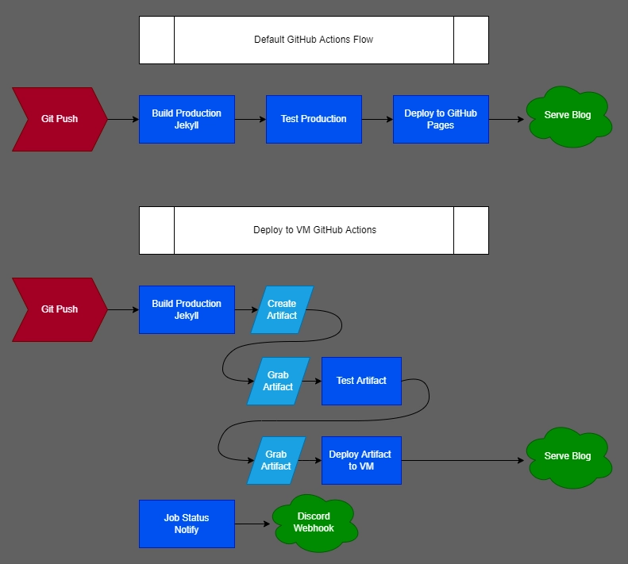

import ImgDesc from '~/components/custom/ImgDesc.astro'
import Aside from '~/components/widgets/Aside.astro'

In my GitHub Actions, "Getting your feet wet", guide series I went over how to [build a docker container](/posts/2022/06/12/AutoGHActionsDocker/), [automatically updating it](/posts/2022/06/20/AutoGHActionsDiun/) using a app called [Diun](https://crazymax.dev/diun/), [deploying the container update](/posts/2022/06/25/AutoGHDeployLinode/) to a VM in [Linode](https://linode.com), and [creating a releasable binary](/posts/2022/06/30/AutoGHBinary/). All based on the web server I use for my homelab, [Caddy](https://caddyserver.com). This post was not originally planned to be apart of the series but I am including it as an example of a more, "advanced", actions deployment. By default [Jekyll](https://jekyllrb.com/) deploys to [GitHub Pages](https://pages.github.com/) which is really nice if you do not want to spin up your own web server.

For me though I wanted to host it myself. The process for this was mostly straight forward as Jekyll already includes the ability to self host. The diagram below demonstrates the GitHub Actions flow for both the default deployment to pages and my deployment to a Linode VM.


<ImgDesc>Workflows for deploying Jekyll via GitHub Actions</ImgDesc>

If you want to use the actions file below you will need the following items completed beforehand.

* Cloned / Setup a Jekyll blog in a repository on GitHub.
* Have a VM running that is accessible by SSH from the internet (WAN).
    * I recommend [Linode](https://www.linode.com/?r=67f6812cc5712674183021660b122e45095f35b5) if you are just starting out.
* Have a user account created on the VM for actions to log into via SSH.
    * You can check out my post, [here](/posts/2022/06/25/AutoGHDeployLinode/#setting-up-the-vm), which details this process.
* Have a domain registered and pointing to the public (WAN) IP of the VM.
* Have a web server installed and setup to serve from the directory the blog will be in.
    * I am using [Caddy](https://caddyserver.com) to serve the blog directory.
* Repository secrets setup:  
    * LINODEFINGERPRINT = ssh host fingerprint  
    * LINODEHOST = hostname/wan ip of the VM  
    * LINODEUSER = username actions needs for login  
    * LINODESSHKEY = ssh private key for above user  
    * DISCORD_WEBHOOK = text channel webhook url. Only needed if you use the notify job.

<Aside type="tip">
I am using the [Chirpy](https://github.com/cotes2020/jekyll-theme-chirpy) theme for Jekyll. The files / directories being copied in the build step may be different for the theme you are using! I was also having some odd issues so these file / directory copies may not be necessary.
</Aside>

GitHub Actions workflow for deploying the Jekyll blog:

```yaml title="actions.yml"
name: 'Deploy Blog'
on:
  push:
    branches:
      - main
    paths-ignore:
      - .gitignore
      - README.md
      - LICENSE
  workflow_dispatch:

jobs:
  # build and create the jekyll blog artifact
  # include 'skip ci' in commit message to not run this workflow
  build:
    if: "github.ref == 'refs/heads/main' && !contains(github.event.head_commit.message, 'skip ci')"
    runs-on: ubuntu-latest
    steps:
      - name: checkout repo
        uses: actions/checkout@v2
        with:
          fetch-depth: 0  # for posts's lastmod
      - name: setup ruby
        uses: ruby/setup-ruby@v1
        with:
          ruby-version: 2.7
          bundler-cache: true
      - name: build production
        env:
          _config: _config.yml
          _baseurl: 
        run: JEKYLL_ENV=production bundle exec jekyll b --incremental
      - name: copy required files
        run: |
          cp -r _data _site/data
          cp -r _plugins _site/plugins
          cp -r _tabs _site/tabs
          cp _config.yml _site/config.yml
      - name: upload blog
        uses: actions/upload-artifact@v3
        with:
          path: _site/*
          retention-days: 1

  # grab the build artifact and test it using htmlproofer
  test:
    needs: build
    runs-on: ubuntu-latest
    steps:
      - name: download blog
        uses: actions/download-artifact@v3
        with:
          name: artifact
          path: _site/
      - name: test production site
        uses: chabad360/htmlproofer@master
        with:
          directory: "_site/"
          arguments: --disable-external --check-html --allow_hash_href=true

  # grab artifact if test job is successful and deploy it using rsync
  deploy:
    needs: test
    runs-on: ubuntu-latest
    steps:
      - name: download blog artifact
        uses: actions/download-artifact@v3
        with:
          name: artifact
          path: _site/
      - name:
        run: |
          mkdir ~/.ssh
          touch ~/.ssh/known_hosts
          echo ${{ secrets.LINODEFINGERPRINT }} >> ~/.ssh/known_hosts
      - name: deploy blog
        uses: burnett01/rsync-deployments@5.2.1
        with:
          switches: -avr
          path: _site/
          remote_path: /opt/sites/blog/
          remote_host: ${{ secrets.LINODEHOST }}
          remote_port: 22
          remote_user: ${{ secrets.LINODEUSER }}
          remote_key: ${{ secrets.LINODESSHKEY }}

  # use nobrayner/discord-webhook action to notify status. 
  # delete this job if you do not want to use it.
  notify:
    name: notify
    runs-on: ubuntu-latest
    needs:
      - build
      - test
      - deploy
    if: ${{ always() }}
    steps:
      - name: send notif discord
        uses: nobrayner/discord-webhook@v1
        with:
          github-token: ${{ secrets.github_token }}
          discord-webhook: ${{ secrets.DISCORD_WEBHOOK }}
          include-details: 'true'
          color-success: '#7ED321'
          color-failure: '#D0021B'
          color-cancelled: '#9013FE'
          avatar-url: 'https://octodex.github.com/images/Terracottocat_Single.png'
          title: '${{ github.workflow }}'
          description: '${{ github.workflow }} was triggered. It returned status: {{STATUS}}'
```

Workflow file for deleting artifacts to save GitHub storage space:

```yaml title="delete_artifacts.yml"
# trigger workflow to run after listed workflows are run
name: 'Delete Old Artifacts'
on:
  workflow_run:
    workflows: [Deploy Blog, Deploy Blog (DEV)]
    types:
      - completed

# delete all leftover artifacts since GitHub's lowest retention time period is 24 hours
jobs:
  delete-artifacts:
    runs-on: ubuntu-latest
    steps:
      - uses: kolpav/purge-artifacts-action@v1
        with:
          token: ${{ secrets.GITHUB_TOKEN }}
          expire-in: 0 # Setting this to 0 will delete all artifacts
```

Caddyfile example:

```shell title="Caddyfile"
{
        email email@email.com
#       acme_ca https://acme-staging-v02.api.letsencrypt.org/directory
        debug
        log {
                output file /var/log/caddy/caddy.log {
                        roll_size 12mb
                        roll_keep 10
                        roll_keep_for 24h
                }
                format json {
                        message_key msg
                        level_key debug
                        time_key ts
                        name_key name
                        time_format wall
                }
        }
}

(tls) {
        tls {
                dns cloudflare {env.CF_API_KEY}
        }
}

blog.alexsguardian.net {
        import tls
        root * /opt/sites/blog/
        file_server
        handle_errors {
                rewrite * /404.html
                file_server
        }
}
```

This post is merely an example for the [GitHub Actions](/guides/#github-actions) guide series. I actually use the above workflow to deploy this blog from GitHub, so it does work! If you have any questions, or a suggestion, feel free to reach out via a comment or email!

<Aside type="info">
If you are using the Linode Cloud Firewall, check out [my post](/posts/2024/02/25/GHActions-LinodeCLI/) about using Linode CLI to update it during the workflow run!
</Aside>

----
## Affiliate Links

- [Linode](https://www.linode.com/?r=67f6812cc5712674183021660b122e45095f35b5)💜

<sub>*FTC: Some links in this post are income generating.*</sub> 