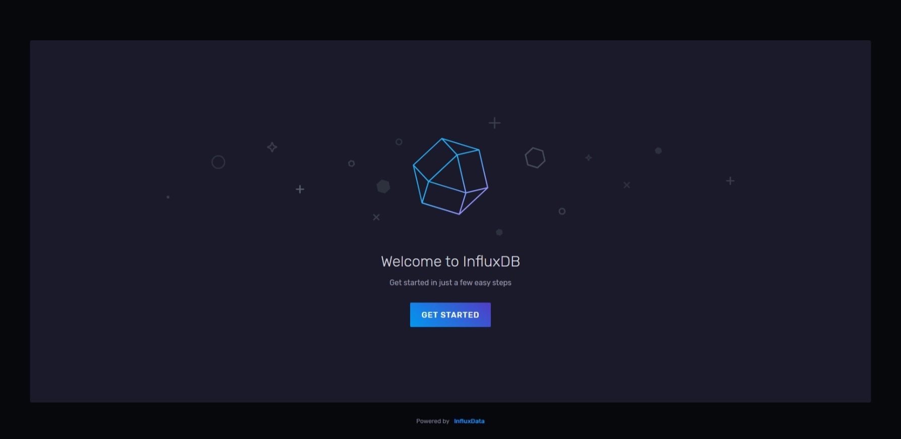
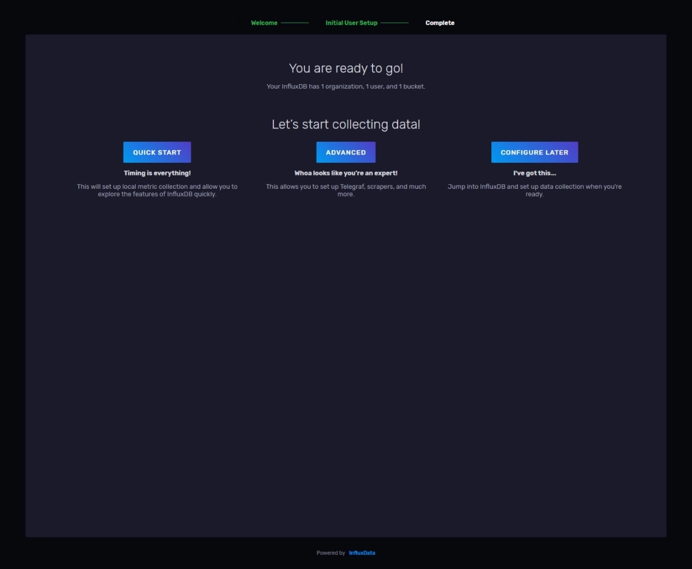
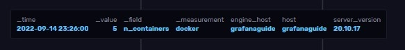
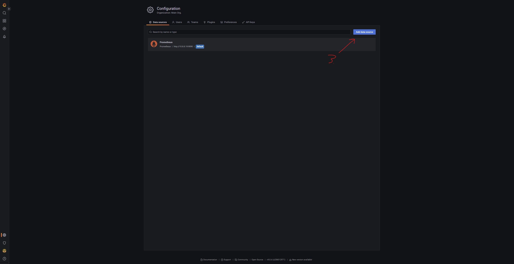
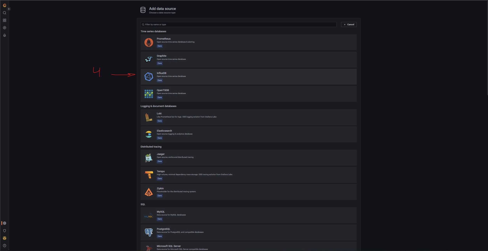
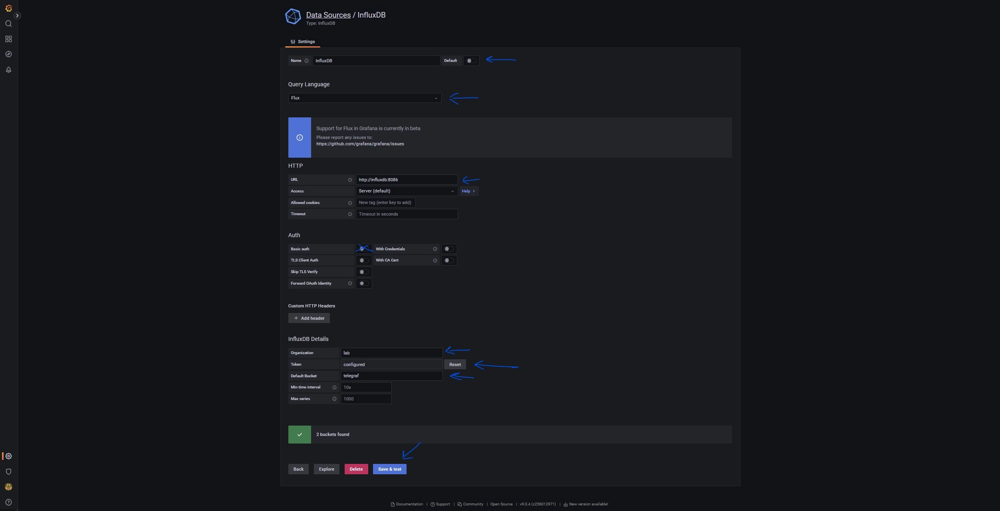
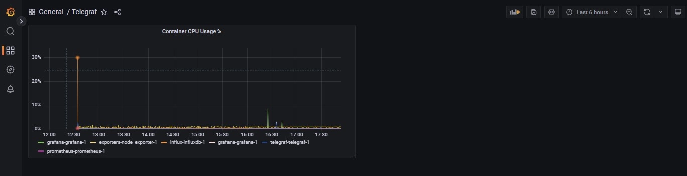

import ImgDesc from '~/components/custom/ImgDesc.astro'
import Aside from '~/components/widgets/Aside.astro'

In my [previous post](/posts/2022/07/22/Grafana-GettingStarted) of this series we deployed [Grafana](https://grafana.com), [Prometheus](https://prometheus.io), and [Node Exporter](https://github.com/prometheus/node_exporter). We also set up the dashboard in Grafana to read the data from Prometheus. In this post we will be covering the deployment of [InfluxDB](https://www.influxdata.com/products/influxdb-overview/) and [Telegraf](https://www.influxdata.com/time-series-platform/telegraf/). 

# The Environment

This guide series assumes you are on Windows 10 or 11 with [Windows Terminal](https://apps.microsoft.com/store/detail/windows-terminal/9N0DX20HK701?hl=en-us&gl=US), [Visual Studio Code](https://code.visualstudio.com), the [OpenSSH Client](https://docs.microsoft.com/en-us/windows-server/administration/openssh/openssh_install_firstuse?tabs=gui) installed and to keep this guide easy to update in the future, that you already have a Ubuntu Server or similar Linux imaged system already running and ready. If you do not know how to install Ubuntu Server, check out [this guide from Ubuntu](https://ubuntu.com/tutorials/create-a-usb-stick-on-windows#1-overview).

## Pre-Requisites

- Have an x86 computing device (PC, Server, Workstation, Micro PC, etc) with Ubuntu Server installed.
  - You can use a Raspberry Pi or other ARM based device. Just make sure to change docker / compose commands to use built for ARM images instead.
- Have a IDE / Text Editor installed on your pc.
  - I recommend [Visual Studio Code](https://code.visualstudio.com/) with the [Remote SSH extension](https://marketplace.visualstudio.com/items?itemName=ms-vscode-remote.remote-ssh) installed.
- Access to a good internet connection.
- Have a spare monitor and keyboard handy.
- Your favorite drink and snacks within reach. ( A must for hobbies )
- Followed my previous post __[here](/posts/2022/07/22/Grafana-GettingStarted)__.

# Deploying InfluxDB

Unlike Prometheus, which scrapes exporters, InfluxDB is only a database. It does not do any of its own data gathering rather you must send data to it using outside agents / collectors. This post will be covering how to set up and deploy InfluxDB OSS v2.3 and Telegraf v1.24 in Docker. To get started, we need to set up the directory for our InfluxDB container to house the database and config files. After SSH'ing to our host run the following to create the new directories.

```shell showLineNumbers=false
mkdir /opt/docker/influx
mkdir /opt/docker/influx/data
```

Next create the `docker-compose.yml` file for InfluxDB.

```shell showLineNumbers=false
cd /opt/docker/influx
touch docker-compose.yml
```

Next create the Docker vNet for InfluxDB. This will be used internally for other apps to communicate with Influx.

```shell showLineNumbers=false
docker network create --driver bridge influxdb-net
```

Now edit the compose file and copy the following into it.

```shell showLineNumbers=false
nano docker-compose.yml
```

```yaml title="docker-compose.yml"
version: '3'
services:
  influxdb:
    restart: unless-stopped
    image: influxdb:2.3.0-alpine
    networks:
      db:
    command:
      - '--reporting-disabled'
    volumes:
      - /opt/docker/influx/data:/var/lib/influxdb2
      - /opt/docker/influx/config.yml:/etc/influxdb2/config.yml
    ports:
      - 3086:8086

networks:
  db:
    external:
      name: influxdb-net
```

`CTRL` + `x` then `y` to save and close the file. Now we can create the `config.yml` file for Influx so it can be persistent.

```shell showLineNumbers=false
docker run --rm influxdb:2.3.0-alpine influxd print-config > config.yml
```

Docker will run influxdb and generate the default `config.yml` file for us. Once its generated we can deploy Influx.

```shell showLineNumbers=false
docker compose up -d
```

Once it is up, open your browser and navigate to `http://your-machine-ip:3086`. If it is working correctly you should see a "Welcome to InfluxDB" page for influxDB.


<ImgDesc>Welcome to InfluxDB page from first load</ImgDesc>

After clicking on "Get Started", run through the initial setup wizard. You will need to input the following information.

- Username
- Password
- Organization Name
- Initial Bucket Name

Click next then click on the "Configure Later" button on the completed wizard page.


<ImgDesc>Completed InfluxDB Wizard Page</ImgDesc>

## Configuring InfluxDB for Telegraf

We need 3 pieces of information before we can setup Telegraf. Since we already have our organization name from earlier we can skip right to creating the data bucket for Telegraf. To do this click on the "Load Data" tab on the left hand side of the InfluxDB web ui. Then click on "Buckets" and follow the steps below.

1. Click "+ Create Bucket" on the right hand side
  - Name it Telegraf
  - (Optional) Set up the Delete Data time period
2. Click Create

<Aside type="note">
See the [InfluxDB docs](https://docs.influxdata.com/influxdb/v2.0/organizations/buckets/) for more info on Buckets.
</Aside>

Next we need to create the Telegraf data agent. Under the left side "Load Data" menu, click on "Telegraf." Follow the steps below to configure it.

1. Click "+ Create Configuration"
2. Select your Telegraf bucket in the "Bucket" dropdown
3. Select Docker
4. Click Continue
5. Name the config
  - Click on "docker" under Plugins.
  - Enter `unix:///var/run/docker.sock` for the docker endpoint
  - Click Done
6. Click Create and Verify

You will be shown your API token for Telegraf. Copy this token (everything after `INFLUX_TOKEN=`) somewhere safe for now.

# Deploying Telegraf

Now that we have InfluxDB running, we can deploy Telegraf to monitor our Docker containers. In my [previous post](/posts/2022/07/22/Grafana-GettingStarted) we set up [node_exporter](https://github.com/prometheus/node_exporter) for host monitoring so as an example we will only be using Telegraf for Docker. It can also do host monitoring if you wanted to replace node exporter.

First create the directory to house our telegraf config and compose file.

```shell showLineNumbers=false
cd /opt/docker/influx
mkdir agents
mkdir agents/telegraf
```

Next create the docker-compose file for Telegraf.

```shell showLineNumbers=false
cd agents/telegraf
# Because of changes made to Telegraf we will need the GID of the docker group on the host.
getent group docker | cut -d: -f3
# Take this GID and replace :999 in the user: config option in the telegraf compose file with the number from the above command.
nano docker-compose.yml
```

```yaml title="docker-compose.yml"
version: '3'
services:
  telegraf:
    restart: unless-stopped
    image: telegraf:1.24-alpine
    user: telegraf:999
    networks:
      db:
    env_file: .env
    volumes:
      - /opt/docker/influx/agents/telegraf/telegraf.conf:/etc/telegraf/telegraf.conf
      - /var/run/docker.sock:/var/run/docker.sock

networks:
  db:
    external:
      name: influxdb-net
```

`CTRL` + `x` then `y` to save and close the file. Next create the `.env`.

```shell showLineNumbers=false
nano .env
```

```shell title=".env"
INFLUXDB_INIT_ADMIN_TOKEN=TELEGRAF_API_TOKEN
```

Replace `TELEGRAF_API_TOKEN` with the admin token generated earlier. It should look something like this when done.

```shell title="EXAMPLE .env"
INFLUXDB_INIT_ADMIN_TOKEN=182jqwhgah2u5a9py5ilau5kagl28y59agt5aklh5gaklqai857yai9gu5i79595
```

Once done `CTRL` + `x` then `y` to save and close the file. With that done we can create the `telegraf.conf` configuration file. 

```shell showLineNumbers=false
nano telegraf.conf
```

In the InfluxDB web ui from earlier return to the "Telegraf" section of "Load Data". Find the Telegraf config you set up earlier and click on it. Then copy the entire config and paste it into the `telegraf.conf` file. Using `CTRL` + `w` search for the following entries and change them.

- Search term: "hostname"
  - Replace with: `hostname = "yourhostname"`
- Search term: "urls"
  - Replace with: `urls = ["http://influxdb:8086"]`
- Search term: "token"
  - Replace with: `token = "$INFLUXDB_INIT_ADMIN_TOKEN"`

Once everything has been updated we can use `CTRL` + `x` then `y` to save and close the file. Finally, deploy Telegraf.

```shell showLineNumbers=false
docker compose up -d
```

## Verifying Telegraf's Data Collection

We can verify that Telegraf is sending data to InfluxDB by returning to the web ui. Click on "Data Explorer" on the left side menu. Click on "Script Editor" and paste the following script into the code editor pane. Make sure to replace "grafanaguide" with the name of your host.

```sql showLineNumbers=false
from(bucket: "telegraf")
  |> range(start: v.timeRangeStart, stop: v.timeRangeStop)
  |> filter(fn: (r) => r["_measurement"] == "docker")
  |> filter(fn: (r) => r["_field"] == "n_containers")
  |> filter(fn: (r) => r["engine_host"] == "grafanaguide")
  |> filter(fn: (r) => r["host"] == "grafanaguide")
  |> aggregateWindow(every: v.windowPeriod, fn: last, createEmpty: false)
  |> yield(name: "last")
```

Then click "Submit". The graph above the script editor should update with a single line. Hovering over the graph should net you data like the screenshot below.


<ImgDesc>The data retrieved from the query in Influx's Data Explorer tab</ImgDesc>

# Configuring Grafana

Before we can add InfluxDB as a data source to Grafana we need to first create a login for Grafana and then add Grafana to the `influxdb-net` vNet. To create a login for Grafana we need to return to the InfluxDB web ui and under the "Load Data" left side menu select "API Tokens". Follow the steps below to create the token.

1. Click on "+ Generate API Token" and select "Read/Write API Token"
2. Give the API token a description (eg. Grafana)
3. Select "All Buckets" under READ tab
4. Select  "Scoped" under WRITE tab but do not select any buckets from the list
5. Click save.
6. Click on your API Token you just created in the list. Then copy down the API Token

Now that we have an API Token for Grafana we can get it added to the influx vNet. Run the following commands to change directory to Grafana's, bring down the Grafana container, and then edit the compose file.

```shell showLineNumbers=false
cd /opt/docker/grafana
docker compose down
nano docker-compose.yml
```

```yaml title="docker-compose.yml"
version: '3'
services:
  grafana:
    restart: unless-stopped
    image: grafana/grafana-oss:latest
    user: "1000"
    networks:
      db:
    volumes:
      - /opt/docker/grafana:/var/lib/grafana
    ports:
      - 3000:3000
    environment:
#     Temporary Password for the default grafana user account
      - "GF_SECURITY_ADMIN_PASSWORD=admin"
#     List of plugins to install when the container is deployed. Pulled from Grafana's plugin repository.
      - "GF_INSTALL_PLUGINS=grafana-clock-panel,grafana-simple-json-datasource,grafana-piechart-panel,grafana-worldmap-panel"

networks:
  db:
    external:
      name: influxdb-net
```

`CTRL` + `x` then `y` to save and close the file. Then redeploy Grafana.

```shell showLineNumbers=false
docker compose up -d
```

Once Grafana is running again, open a new tab in your browser and navigate to `http://yourmachineip:3000`. Once logged in, follow the steps below to setup InfluxDB as a data source.

1. Click Settings on lower left hand side
2. Click Data Sources in the menu pop up


3. Click "Add data source" button



4. Select InfluxDB from the list of sources



5. Enter the following information into the Settings for the InfluxDB data source.
  - Name: **InfluxDB**
  - Query Language: **Flux**
  - URL: **http://influxdb:8086**
  - Basic auth: *disabled*
  - Organization: **lab**
  - Token: **Grafana's InfluxDB API Token**
  - (optional) Default Bucket: **telegraf**



6. Click "Save & Test"
7. Click Back to return to the added sources pane.

With InfluxDB added we can now add a simple Dashboard to display Telegraf's data. Since there was no pre-made ones for InfluxDB Flux queries we will have to make one from scratch. Click on the Dashboards menu option in the left hand side menu. Then click on New Dashboard. On the new dashboard page click on "Add new panel". Next select InfluxDB from the Data source dropdown. Then copy the following query into the query field.

```sql showLineNumbers=false
from(bucket: "telegraf")
  |> range(start: v.timeRangeStart, stop: v.timeRangeStop)
  |> filter(fn: (r) => r["_measurement"] == "docker_container_cpu")
  |> filter(fn: (r) => r["_field"] == "usage_percent")
  |> filter(fn: (r) => r["host"] == "grafanaguide")
  |> aggregateWindow(every: v.windowPeriod, fn: mean, createEmpty: false)
  |> yield(name: "mean")
```

Make sure to change `bucket: "telegraf"`, and `["host"] == "grafanaguide"` to match your setup. Then click on the Transform tab and select the "Labels to fields" option from the list. Set the mode to "Columns" and under the "Value field name" drop down select "container_name". In the right pane give your panel a name in the "Title" field and click Apply in the top right. You should get a panel similar to the one imaged below.


<ImgDesc>Example of a Grafana panel showing container CPU usage from Telegraf data</ImgDesc>

# Conclusion

InfluxDB 2.0 changed how the database works and broke a lot of older collectors developed by the community. However, the new version is much nicer to set up then previous versions. Also to note, most dashboards you can find on [Grafana's site](https://grafana.com/grafana/dashboards/) do not work with the InfluxDB Flux query language as they were built with the older InfluxQL query language. To get you started on your own dashboard for Telegraf's Docker input, I've included a few other panels in my [blog-files](https://github.com/alexandzors/blog-files) repository for the blog. You can find them in [this post's directory](https://github.com/alexandzors/blog-files/tree/main/guides/grafana-guide/Grafana-InfluxDB) under the Guides/Grafana directory. I will add more over time. As always if you run into any issues please reach out via a comment or email!

<Aside type="note">
Note: This is a getting started guide, not an end all be all. I recommend setting up a web server like [Caddy](https://caddyserver.com) in front of Grafana to serve it over https.
</Aside> 