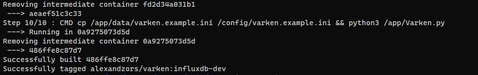
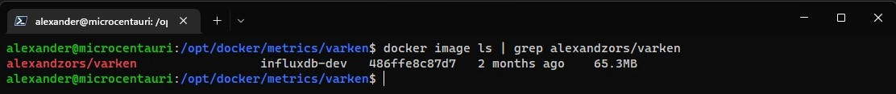
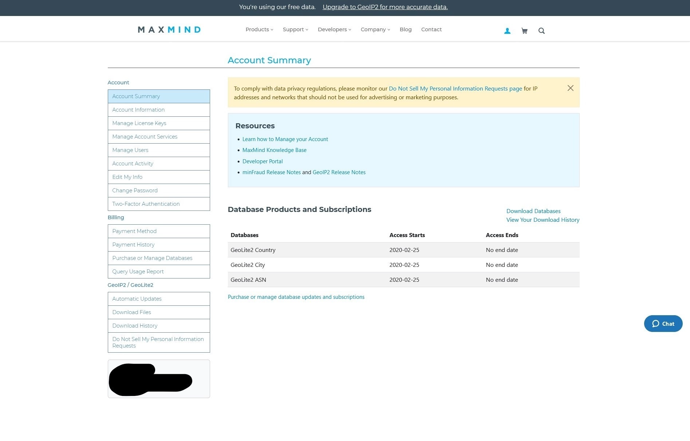
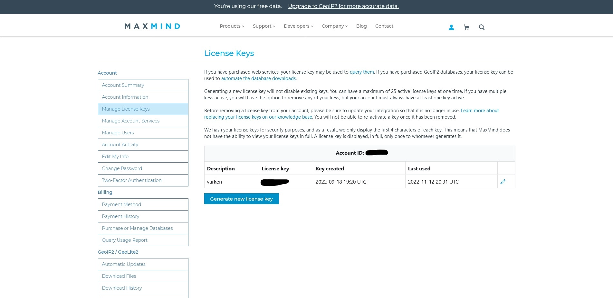
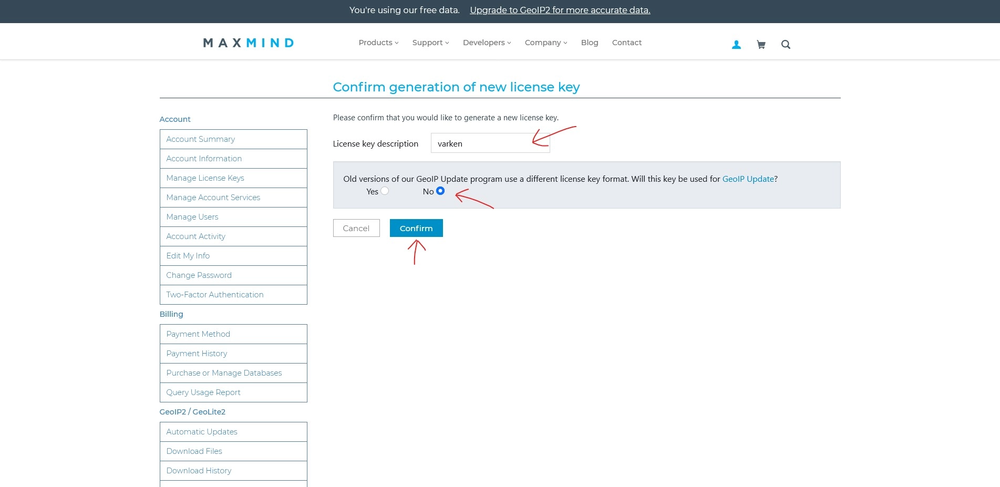
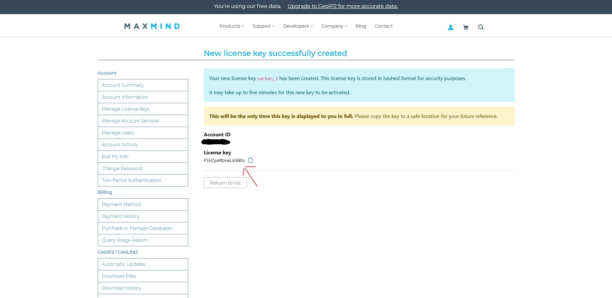
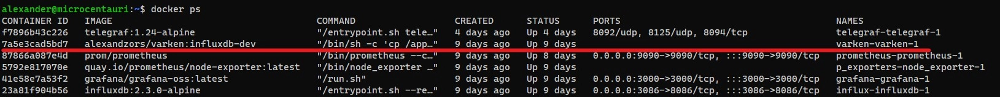
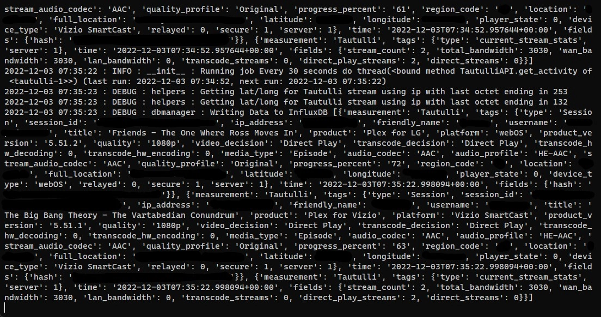
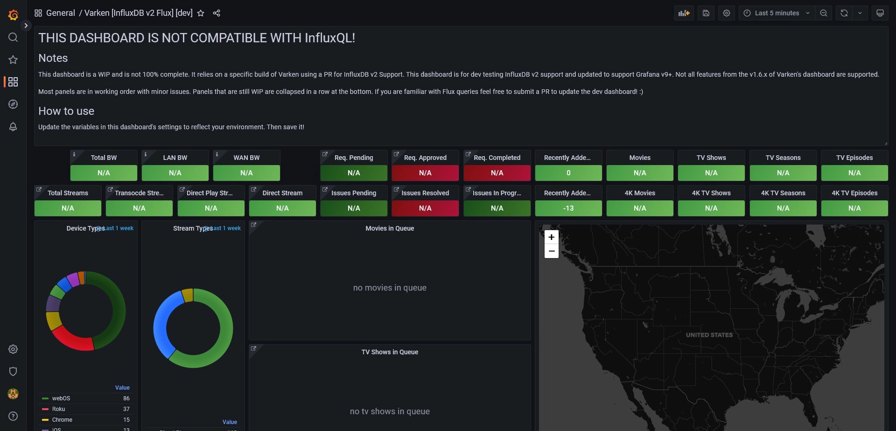
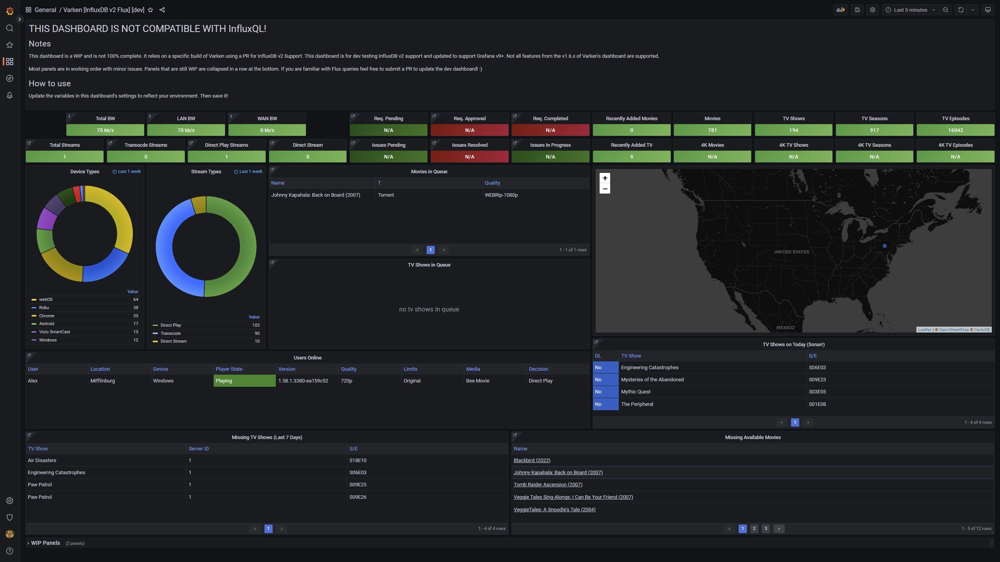

import ImgDesc from '~/components/custom/ImgDesc.astro'
import Aside from '~/components/widgets/Aside.astro'


<Aside type="danger">
Varken is no longer maintained by the original developer. As such I will not be updating this post. There are 'newer' community maintained versions that you may want to check out but I will not be covering them. I will also not be updating the dashboard any longer.
</Aside>

<Aside type="caution">
This post is currently using an *unsupported* custom dev build of Varken, that utilizes a pull request, which adds support for InfluxDB v2. It also is using a custom dashboard (created by me) that uses Flux queries instead of the old InfluxQL language. Both are not officially supported by the dev team at the moment. Varken stable and dev still use InfluxDB v1.8 which this post does not cover.
</Aside>

Have you ever wanted to easily monitor your backend apps that service your media server? Well if you are already running [InfluxDB](https://www.influxdata.com/) and [Grafana](https://grafana.com/) then do I have a cool utility for you! [Varken](https://github.com/Boerderij/Varken) is a utility app that lets you gather data from your backend media server applications and send this data to InfluxDB. You can then take this data and visualize it via Grafana. If you have followed my [Grafana guide](/posts/2022/07/22/Grafana-GettingStarted) series then getting this setup will be a breeze. If not make sure you already have InfluxDB and Grafana setup and communicating! You will also need one or more of the following applications installed, configured, and running to gather data from.

- [Sonarr](https://sonarr.tv/)
- [Radarr](https://radarr.video/)
- [Tautulli](https://tautulli.com/)

Varken also supports these apps + some in the dev branch, but I currently do not use them so will not be covering them in this post.

- [Ombi](https://ombi.io/)
- [Lidarr](https://lidarr.audio/)
- [Overseerr](https://overseerr.dev/) [dev branch]
- [SickChill](https://sickchill.github.io/)
- [Unifi Controller](https://ui.com/) (I use this but monitor it via another service)

In my case I have Sonarr, Radarr, and Tautulli running with [Plex](https://www.plex.tv/media-server-downloads/#plex-media-server) as the media server. So this post will be focusing on that.

<Aside type="note">
I will be using [Docker](https://docker.com) for this post as it makes it easier to build and run services without bloating the host OS with dependencies. If you are not using Docker you can just follow the git commands and then run the `Varken.py` script after setting up the `varken.ini` configuration file.
</Aside>

# Creating the Directory Structure and Building Varken

This install will require some familiarity with git commands. If you are unfamiliar I will do my best to make this as easiest to follow as possible. Mainly we will be pulling the [Varken repository](https://github.com/Boerderij/Varken) locally and then building a custom docker image based off [PR#242](https://github.com/Boerderij/Varken/pull/242) (from [ǝuoqɹǝuuᴉp](https://github.com/Dinnerbone) of all people :) ) which adds InfluxDB v2 support. To get started, ssh to your docker host and create a new directory structure for Varken.

```shell showLineNumbers=false
ssh user@host
mkdir /opt/docker/varken
```

Next create a new `.git` sub folder inside the new `varken` directory. This will house the clone of Varken's git repository.

```shell showLineNumbers=false
mkdir /opt/docker/varken/.git
```

Change directory to `.git` and clone the Varken repository.

```shell showLineNumbers=false
cd /opt/docker/varken/.git
git clone https://github.com/Boerderij/Varken.git
```

Once this is done it should create a new sub folder called "Varken". Change directory to this new folder and run the following [commands](https://stackoverflow.com/a/30584951) <sup>thanks <sup>@timbo <sup>on <sup>stack overflow</sup></sup></sup></sup> to check out the PR with v2.0 support.

```shell showLineNumbers=false
cd Varken
git fetch origin pull/242/head:varken-influxdb2
git checkout varken-influxdb2
```

Running these commands will first fetch the changes in PR #242 and then create a local branch called "varken-influxdb2". We can then check out this new branch to use the changes from the PR to build our custom container image.

```shell showLineNumbers=false
docker build -t yourname/varken:influxdb2-dev
```

This will take a few minutes to complete depending on your system specs. Once it is done you should see an output like the image below.


<ImgDesc>Docker container build output</ImgDesc>

Once the build process is complete we can check to make sure it was added to Docker's local image store.

```shell showLineNumbers=false
docker image ls | grep yourname/varken:influxdb2-dev
```


<ImgDesc>Docker image list showing the built container</ImgDesc>

## Setting up the Docker Compose file

Now that we have our container image ready we can quickly create our `docker-compose.yml` file for Varken. Make sure you are in the main `/opt/docker/varken/` directory.

```shell showLineNumbers=false
cd /opt/docker/varken
```

Then create the new docker compose file with the following information. Make sure to change `yourname` to the name you used above for the image.

```shell showLineNumbers=false
nano docker-compose.yml
```

<br />

```yaml title="docker-compose.yml"
# Varken [Custom] docker-compose.yml

version: '3'
services:
 varken:
  restart: unless-stopped
  image: yourname/varken:influxdb2-dev
  networks:
    db:
  volumes:
    - /opt/docker/metrics/varken:/config

networks:
  db:
    external:
      name: influxdb-net
```

<Aside type="tip">
If you did not follow my [Grafana guide](/posts/2022/07/22/Grafana-GettingStarted/) then you can omit the networking portion. (e.g. remove both `networks:` config options)
</Aside>

You can then save and close the file by hitting `CTRL + X` then `y`.

## Configuring Varken

Varken uses an [initialization file](https://en.wikipedia.org/wiki/INI_file) (`.ini`) to house its configuration, which we need to persistently mount to our Varken container. Change directory to the main Varken dir and then clone the example file from GitHub.

```shell showLineNumbers=false
cd /opt/docker/varken
wget https://raw.githubusercontent.com/Boerderij/Varken/develop/data/varken.example.ini .
```

Next copy and rename the example file into `varken.ini` for Varken to use.

```shell showLineNumbers=false
cp varken.example.ini varken.ini
```

Before we can edit the configuration file we need to obtain a [Maxmind DB]() key. This is pretty straight forward and will require you to make an account.

### Obtaining a Maxmind DB API key

First we need to sign up for a Maxmind account, which you can do [here](https://www.maxmind.com/en/geolite2/signup) (It's free!). Follow the sign-up process and make sure to verify the account. Once completed, login to your new account. After login, you will be greeted with the following page.


<ImgDesc>Maxmind account summary page</ImgDesc>

Click on the "Manage License Keys" option on the left side. Then click on "Generate new license key" when the page loads.


<ImgDesc>Maxmind license key management page</ImgDesc>

Add "varken" to the description label field and select "no" for the question in the box. Then click "confirm". 


<ImgDesc>Generating a new Maxmind license key</ImgDesc>

At this point you will be shown your Maxmind key. Copy this key somewhere safe as if you lose it you will need to regenerate a new key.


<ImgDesc>New Maxmind license key</ImgDesc>

### varken.ini

With our Maxmind key in hand, we can now edit the `varken.ini` file. Switch back over to your terminal session and edit the `varken.ini` file.

```shell showLineNumbers=false
nano varken.ini
```

There is a lot in here, so we are going to go section by section. The first section is the global options. This is where we configure Varken specific settings. Varken supports multiple servers for each of the supported services. To do this you can add ",2" etc. to the IDs. Then duplicate the config sections and append the appropriate number to the section title ([sonarr-2] etc.). We can also disable the services we are not using by appending `false` instead of a number. For demonstration purposes I am assuming you only have one instance of Sonarr, Radarr, and Tautulli set up. Edit the global section to match your environment and add the Maxmind license key we obtained earlier to the `maxmind_license_key =` option.

```ini title="varken.ini - Global Section"
[global]
sonarr_server_ids = 1
radarr_server_ids = 1
lidarr_server_ids = false
tautulli_server_ids = 1
ombi_server_ids = false
sickchill_server_ids = false
unifi_server_ids = false
maxmind_license_key = <insert your maxmind license key here>
overseerr_server_ids = false
```

Scroll down with the arrow keys and edit the InfluxDB section. If you followed my guide for Grafana then the settings below will match it. If not you will need to obtain your influxdb settings and your admin username and password.

```ini title="varken.ini - InfluxDB Section"
[influxdb]
url = influxdb
port = 8086
ssl = false
verify_ssl = false
username = influxdbadminuser
password = influxdbadminpass
org = lab
```

Next is the config for Tautulli. For this we will need our API key. Login to Tautulli and then go to Settings > Web Interface and scroll to the bottom. Un-hide the API key and copy it. In the `[tautulli-1]` section edit the URL to match your environment. Then add your API key to the `apikey` option.

```ini title="varken.ini - Tautulli Section"
[tautulli-1]
url = url.for/tautulli
fallback_ip = 1.1.1.1
apikey = <api key>
ssl = true
verify_ssl = false
get_activity = true
get_activity_run_seconds = 30
get_stats = true
get_stats_run_seconds = 3600
```

Next section is for Sonarr. We will need Sonarr's API key which we can get by logging into Sonarr and going to Settings > General and then copy the API Key. Edit the `url` option to match your environment. Then edit the `apikey` option with your API key from Sonarr.

```ini title="varken.ini - Sonarr Section"
[sonarr-1]
url = url.for/sonarr
apikey = <api key>
ssl = true
verify_ssl = false
missing_days = 7
missing_days_run_seconds = 300
future_days = 1
future_days_run_seconds = 300
queue = true
queue_run_seconds = 300
```

Lastly we can edit the Radarr section. It will be the same process as Sonarr's but with Radarr's information.

```ini title="varken.ini - Radarr Section"
[radarr-1]
url = url.for/radarr
apikey = <api key>
ssl = true
verify_ssl = false
queue = true
queue_run_seconds = 300
get_missing = true
get_missing_run_seconds = 300
```

Save and close the file by hitting `CTRL + x` then `y`.

<Aside type="note">
Example varken.ini file with all sections configured can be found in the blog-files repository.
</Aside>

### Deploying Varken

Now that we have the configuration file configured it's time to deploy Varken. To do this run the following command in the `/opt/docker/varken` directory.

```shell showLineNumbers=false
docker compose up -d
```

<Aside type="tip">
If you are using an older version of docker compose (not the docker plugin one) you will have to change the above command to `docker-compose`.
</Aside>

To verify it is running: 

```shell showLineNumbers=false
docker ps
```


<ImgDesc>Docker process list showing Varken running</ImgDesc>

To view the logs to verify Varken is sending data:

```shell showLineNumbers=false
docker logs -f varken-varken-1
```


<ImgDesc>Varken container logs showing data being sent to InfluxDB</ImgDesc>

With Varken now running and sending data to Influx we can go ahead and set up the dashboard in Grafana. 

# Setting up the Grafana Dashboard

Login to Grafana and go to Dashboards > Import. Then import the flux dashboard JSON which can be obtained from my blog-files repository [here](https://raw.githubusercontent.com/alexandzors/blog-files/main/posts/MonitoringMediaVarken/grafana-dashboard.json). You can either copy the entire file and paste it into the panel import box or download the JSON file and upload it to Grafana. After finishing the import you should be greeted by the dashboard.

<Aside type="note">
This dashboard may get replaced eventually by the official one, once it is updated. If and when Varken goes stable on Influx v2 support with an official dashboard I will update this post or archive/recreate with the new information.
</Aside>


<ImgDesc>First time dashboard import</ImgDesc>

A few panels should start updating with data from InfluxDB if you already have an Influx v2 Flux data source set up that Varken is communicating to. You can also go into the dashboard settings and update the variables for Tautulli, Sonarr, Radarr, etc. to give you clickable links from panel data links.


<ImgDesc>Working Dashboard Example</ImgDesc>

# Conclusion

This dashboard can be easily expanded with more panels and data from other supported Varken services as well as stats from something like [Telegraf](https://www.influxdata.com/time-series-platform/telegraf/). Note that this dashboard is a WIP and I'll be adding more panels for Varken's other services over time. If you like Varken consider support the developers: [ko-fi](https://ko-fi.com/varken). As always if you run into any issues let me know via the issues' section of the [blog-files](https://github.com/alexandzors/blog-files/issues) repository or drop a comment down below! 