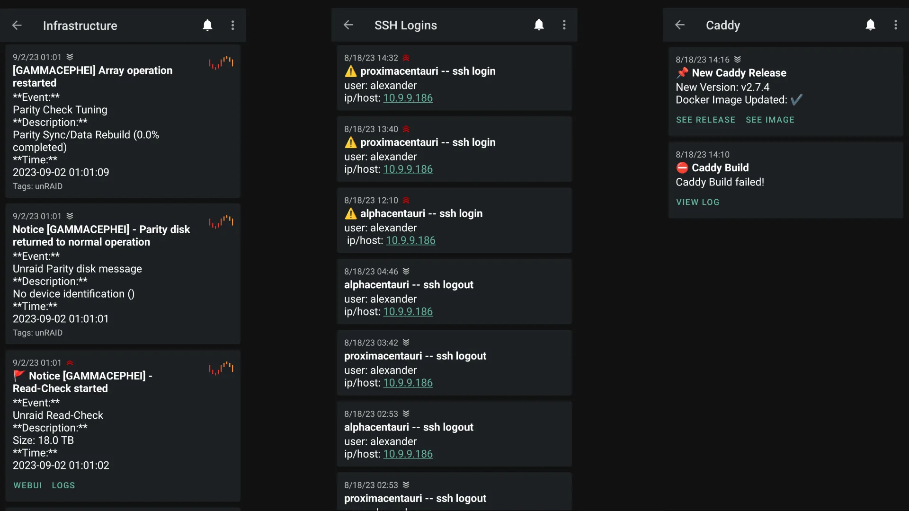
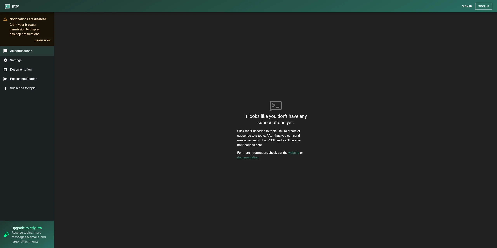
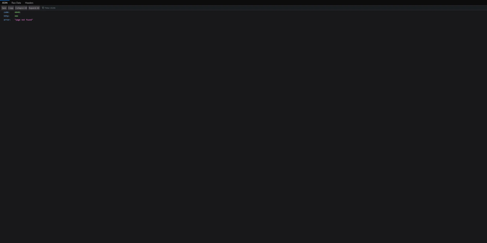
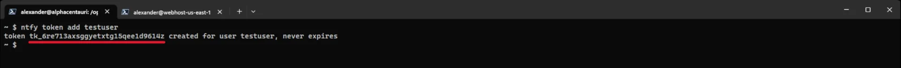
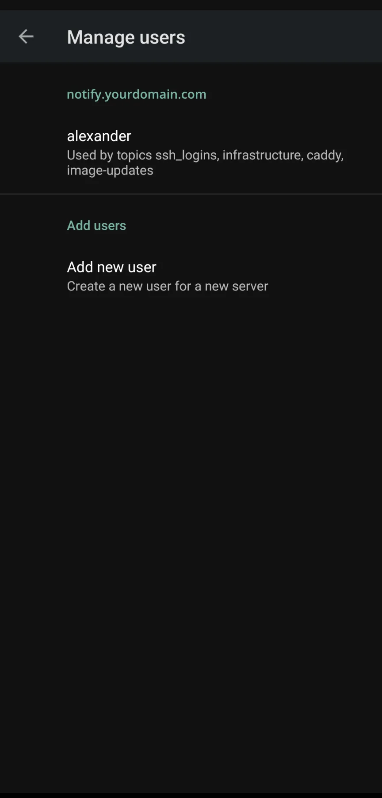

import ImgDesc from '~/components/custom/ImgDesc.astro'
import Aside from '~/components/widgets/Aside.astro'
import WebmVideo from '~/components/custom/WebmVideo.astro'
import NTFY_USER_TOKEN from 'ntfy_user_token.webm'
import NTFY_USER_ADD from 'ntfy_user_add.webm'
import NTFY_USER_ACCESS from 'ntfy_access_add.webm'
import NTFY_NOTIFICATIONS from 'ntfy_notifications_example.webm'

<div class="flex justify-center">
So in my <a href="/posts/2023/07/31/update/" target="_blank">previous blog update post</a> I mentioned a few projects I was working on for posts on this blog. Well considering this post wasn't on the list it's time to toss the plan! Or did I really have a plan to begin with? :no_mouth:
</div>

<div class="flex justify-center">
  
</div>

Currently, I have a few homelab notifications being sent to a "private" [Discord](https://discord.com) server. Evident by [Logging Fail2Ban to Discord](/posts/2022/08/09/Fail2Ban+Discord/), [SSH Login Logging to Discord via Webhooks](/posts/2022/07/02/LoggingSSHtoDiscord/), [GitHub Actions - Automating your Docker Builds with Diun](/posts/2022/06/20/AutoGHActionsDiun/), a few others I was working on, etc. Now, I was going to keep going this route as it does make it extremely convenient since I already have the Discord app on most of my devices. However, I was talking to a [good friend of mine](https://github.com/StefanMarAntonsson), and he brought up a good point. 

> "My private server isn't exactly 'private' when it comes to someone else managing the data and, the only way to send a notification to Discord is by Webhook or a custom bot. Also, sometimes push notifications to mobile are SUPER delayed."

So I decided to look into alternatives which lead me to [ntfy.sh](https://ntfy.sh/). The best part? You can self-host it!

## What is ntfy.sh?


<ImgDesc>Examples of some notifications I am piping into my ntfy instance. Picture is the mobile app view</ImgDesc>

ntfy (pronounced *notify*) is an HTTP [publish / subscribe](https://en.wikipedia.org/wiki/Publish%E2%80%93subscribe_pattern) notification service that allows you to send notifications to your phone or PC. This can be done simply using scripts that can hit ntfy's REST API or with apps that have [direct integrations](https://docs.ntfy.sh/integrations/). The best part about ntfy, (other than being FOSS and having lots of documentation), is that you can self-host it! Which means you can control the data rather than relying on an outside service! Especially if you are rocking an Android phone since you can do instant delivery without [Google FBC](https://console.firebase.google.com/)! 

<Aside type="note">
You can use [ntfy's hosted service](https://ntfy.sh/app) rather than hosting it yourself as an option. However, you might want to read "the point" above, again..
</Aside>

<Aside type="note">
See docs about [iOS instant delivery](https://docs.ntfy.sh/config/#ios-instant-notifications).
</Aside>


## Follow along notes

Before I dive in. There are a few things you will need setup before you can follow along with this post.

- **A domain with an A record forwarding to your public IP**
  - Example domain: `notify.yourdomain.com`
- **A web server that is port forwarded to listen on 80/443**

<Aside type="tip">
I recommend [Caddy](https://caddyserver.com) if you want easy certificate management! I will be using Caddy[^1] [^2] in this post but ntfy has [example configs](https://docs.ntfy.sh/config/#nginxapache2caddy) for other web servers. 
</Aside>

- **A host to run ntfy on**
  - I will be using a host that is running [Docker](https://docker.com), on Ubuntu, as it makes it easy to spin up resources without bloating the host with tons of dependencies.


## Setting up the Host

To get started, SSH to your host and install Docker. If you already have docker set up and ready you can [skip this section](#setting-up-ntfys-configuration). Run the following commands to install Docker's dependencies and prepare the host to install Docker.

```shell showLineNumbers=false
# Add Docker's official GPG key:
sudo apt-get update
sudo apt-get install ca-certificates curl
sudo install -m 0755 -d /etc/apt/keyrings
sudo curl -fsSL https://download.docker.com/linux/ubuntu/gpg -o /etc/apt/keyrings/docker.asc
sudo chmod a+r /etc/apt/keyrings/docker.asc

# Add the repository to Apt sources:
echo \
  "deb [arch=$(dpkg --print-architecture) signed-by=/etc/apt/keyrings/docker.asc] https://download.docker.com/linux/ubuntu \
  $(. /etc/os-release && echo "${UBUNTU_CODENAME:-$VERSION_CODENAME}") stable" | \
  sudo tee /etc/apt/sources.list.d/docker.list > /dev/null
sudo apt-get update
```

Finally install Docker.

```shell showLineNumbers=false
sudo apt-get install docker-ce docker-ce-cli containerd.io docker-buildx-plugin docker-compose-plugin
```

<Aside type="tip">
These instructions were pulled from the [official Docker install docs](https://docs.docker.com/engine/install/ubuntu/). I recommend looking at the official install docs if your host OS is not Debian based.
</Aside>

If you do not want to run `sudo` in front of every docker command, you can add your user to the docker group.

```shell showLineNumbers=false
sudo chmod -aG docker username
```

<Aside type="caution">
Warning from Docker about adding your user to the `docker` group: 

The `docker` group grants root-level privileges to the user. For details on how this impacts security in your system, see [Docker Daemon Attack Surface](https://docs.docker.com/engine/security/#docker-daemon-attack-surface).
</Aside>


## Setting up ntfy's Configuration

With Docker now setup we can pivot to getting ntfy up and running. Create the directories to house the `docker-compose.yml`, cache, `user.db`, and the `server.yml` config file.

```shell showLineNumbers=false
sudo mkdir -p /opt/docker/ntfy
sudo mkdir /opt/docker/ntfy/cache
sudo mkdir /opt/docker/ntfy/config
sudo chown -R $USER:$USER /opt/docker
```

Next create the `docker-compose.yml` file and edit it.

```shell showLineNumbers=false
cd /opt/docker/ntfy
nano docker-compose.yml
```
<br />

```yaml title="docker-compose.yml"
version: "3"
services:
  server:
    restart: always
    logging:
      driver: "json-file"
      options:
        max-size: "500k"
        max-file: "1"
    image: binwiederhier/ntfy
    command: serve
    environment:
      - TZ=America/New_York
    user: ${UID}:$(id -g)
    volumes:
      - /opt/docker/ntfy/cache:/var/cache/ntfy
      - /opt/docker/ntfy/config:/etc/ntfy
    ports:
      - 80:80
```

Hit `CTRL`+ `X` then `Y` to save your changes and close nano. Now do the same but for a file called `server.yml`.

```shell showLineNumbers=false
cd config/
nano server.yml
```

```yaml title="server.yml"
default-host: "https://notify.yourdomain.com"
base-url: "https://notify.yourdomain.com"
listen-http: ":80"
cache-file: "/var/cache/ntfy/cache.db"
behind-proxy: true
attachment-cache-dir: "/var/cache/ntfy/attachments"
keepalive-interval: "45s"
auth-file: "/etc/ntfy/user.db"
auth-default-access: "deny-all"
```

Save and close the file. Now we need to create a user in ntfy. First start the container.

```shell showLineNumbers=false
cd ..
docker compose up -d
```


## Configuring the Web Server

For my environment I use Caddy as my web server / reverse proxy. So this section will be covering how to configure Caddy to serve ntfy with an SSL certificate. If you don't have Caddy configured already, check out my quick start guide for [Caddy with Cloudflare/cloudflared](/posts/2023/12/04/caddyguide-part1/). Otherwise, you can check out the [ntfy docs for other web servers](https://docs.ntfy.sh/config/#nginxapache2caddy) / [skip this section](#securing-ntfy).

To serve ntfy we need to tell Caddy where to point our notify domain to. To do this edit the Caddyfile and add the following block section.

```shell title="Caddyfile"
notify.yourdomain.com, http://notify.yourdomain.com {
  import tls
  log {
    output file /config/logs/notify.log {
      roll_size 10mb
      roll_keep 5
      roll_keep_for 24h
    }
  }
  reverse_proxy ntfy-server-1
  @httpget {
    protocol http
    method GET
    path_regexp ^/([-_a-z0-9]{0,64}$|docs/|static/)
  }
  redir @httpget https://{host}{uri}
}
```

You will need to change `notify.yourdomain.com, http://notify.yourdomain.com` to your domain. You will also need to replace `ntfy-server-1` to match your container environment or service IP/port. Once added, save and close the file and reload Caddy. If all goes well you can hit your domain, and you will see the web interface for ntfy. It will look like the image below minus the pro upgrade.

<Aside type="tip">
I recommend testing your configuration with the [Let's Encrypt staging acme server](https://letsencrypt.org/docs/staging-environment/) `https://acme-staging-v02.api.letsencrypt.org/directory` and watching the log. This will let you know if you have a DNS configuration issue before being rate limited as the production acme server has low retry counts.
</Aside>

*Since I have a dedicated docker network I attach containers to for Caddy, I am able to do DNS lookups internally on the container names. This also means I am not exposing service ports to the host so port conflicts are minimized.*


<ImgDesc>Image from ntfy.sh's web app</ImgDesc>

If you are not using a web server to serve ntfy, you can hit the web UI at the `IP:PORT` of your machine hosting it.


## Securing ntfy

Now that we have ntfy up and being served we can lock it down. First we need to disable the web app (skip this if you want to use the web app) since we won't be using it. Return to the `server.yml` file and uncomment the `web-root` line. Your file should look similar to below.

```yml title="server.yml"
default-host: "https://notify.yourdomain.com"
base-url: "https://notify.yourdomain.com"
listen-http: ":80"
cache-file: "/var/cache/ntfy/cache.db"
behind-proxy: true
attachment-cache-dir: "/var/cache/ntfy/attachments"
keepalive-interval: "45s"
auth-file: "/etc/ntfy/user.db"
auth-default-access: "deny-all"
web-root: "disable"
```

`CTRL`+ `x` then `y` to save and close the file.


<ImgDesc>Applying the above changes and refreshing your notify URL will update the page to this</ImgDesc>


### Creating a User in ntfy

Since we already have the `auth-file` and `auth-default-access` set, we can skip to adding our first user. To do this we will need to execute into the ntfy container environment and run a few commands. Substitute `ntfy-server-1` with the name of your container.

<Aside type="tip">
If you do not know your container name you can use `docker ps | grep ntfy` to list out all running containers and then grep the output for ntfy. 
</Aside>

```shell showLineNumbers=false
docker exec -it ntfy-server-1 /bin/sh
ntfy user add yourusername
```

Once inside the container invoke the ntfy cli and add your first user.

<WebmVideo src={NTFY_USER_ADD} width={1920} height={1080} autoplay loop muted />
<ImgDesc>Example of creating a user using ntfy cli</ImgDesc>

```shell showLineNumbers=false
ntfy user add nameofuser
```

Invoking this command with a username will auto prompt you to create a password for the new user. After the user is created we can subscribe it to our first notification topic.

<WebmVideo src={NTFY_USER_ACCESS} width={1920} height={1080} autoplay loop muted />
<ImgDesc>Example of setting user access using ntfy cli</ImgDesc>

```shell showLineNumbers=false
ntfy access nameofuser ssh_logins wo
```

`wo` specifies the access level of the user for the topic `ssh_logins`. Since this user will be used to send notifications, we need to give it the ability to write to the topic. Hence, the `wo` = "write-only". You can do `rw` for read-write, `ro` - read-only, and `deny` as well. You can change access permissions whenever, by re-running the above command with a different access level specified. Now create a second user but give it `read-only` permissions to the topic. This second user will be used for our mobile app.

<Aside type="tip">
You can create new topics by giving a user access to one that does not exist yet.
</Aside>

### User Access Tokens

Now at this stage the user can be used to post messages to the topic. Though, to make it even easier we are going to create a access token for the user account. This token can be used in place of the username and password when sending messages. To add an access token run the following inside the ntfy docker container.

<WebmVideo src={NTFY_USER_TOKEN} width={1920} height={1080} autoplay loop muted />
<ImgDesc>Example of creating user access token using ntfy cli</ImgDesc>

```shell showLineNumbers=false
ntfy token add testuser
```

When you receive the output, copy the token to your notes as we will need it later. 


<ImgDesc>Example of the output of the `token add` command with the token underlined in red</ImgDesc>


<Aside type="tip">
You can retrieve tokens at anytime by running `ntfy token list username`.
</Aside>

Type `exit` to leave the container interface.

## Logging SSH login/logouts to ntfy

As an example for this post, I will only be covering ssh login/logout notifications to keep it short. I will include some extra scripts for other services in the [blog-files](https://github.com/alexandzors/blog-files/tree/main/posts/selfhosting-ntfy) repository. Now, SSH into the host you want to send notifications from and create the script file in `/bin`. Mark it executable and then edit it.

```shell showLineNumbers=false
# Create the script file
sudo touch /bin/sshd-login-ntfy
# Mark it as executable
sudo chmod +x /bin/sshd-login-ntfy
# Edit the script file
sudo nano /bin/sshd-login-ntfy
```

```bash title="/bin/sshd-login-ntfy"
#!/bin/bash

# User access token and url to post notification messages
NTFYTOKEN=
NTFYURL=

# If session was opened then post this message with priority level 5
if [ "${PAM_TYPE}" = "open_session" ]; then
  curl -H "Title: ${HOSTNAME} -- ssh login" \
 -u :$NTFYTOKEN \
 -H "Priority: 5" \
 -H "X-Tags: warning" \
 -d "user: ${PAM_USER}
ip/host: ${PAM_RHOST}" \
 $NTFYURL
fi

# If session was closed then post this message with priority level 1
if [ "${PAM_TYPE}" = "close_session" ]; then
  curl -H "Title: ${HOSTNAME} -- ssh logout" \
 -u :$NTFYTOKEN \
 -H "Priority: 1" \
 -d "user: ${PAM_USER}
ip/host: ${PAM_RHOST}" \
 $NTFYURL
fi
```

<Aside type="note">
You will need to add your token to the `NTFYTOKEN=` var as well as your notify domain to the `NTFYURL=`. The URL will be `https://notify.yourdomain.com/TOPIC` with `/TOPIC` being the name of the topic you gave your user access to [earlier](#creating-a-user-in-ntfy). A completed file will look similar to the example below. Info on message priority and x-tags can be found in the ntfy docs [here](https://docs.ntfy.sh/publish/#message-priority), and [here](https://docs.ntfy.sh/publish/#tags-emojis) respectively.
</Aside>

Save and close the file: `CTRL` + `x` then `y`. 

```bash title="EXAMPLE /bin/sshd-login-ntfy"
#!/bin/bash

# User access token and url to post notification messages
NTFYTOKEN=tk_6re713axsggyetxtg15qee1d9614z
NTFYURL=https://notify.yourdomain.com/ssh_logins

# If session was opened then post this message with priority level 5
if [ "${PAM_TYPE}" = "open_session" ]; then
  curl -H "Title: ${HOSTNAME} -- ssh login" \
 -u :$NTFYTOKEN \
 -H "Priority: 5" \
 -H "X-Tags: warning" \
 -d "user: ${PAM_USER}
ip/host: ${PAM_RHOST}" \
 $NTFYURL
fi

# If session was closed then post this message with priority level 1
if [ "${PAM_TYPE}" = "close_session" ]; then
  curl -H "Title: ${HOSTNAME} -- ssh logout" \
 -u :$NTFYTOKEN \
 -H "Priority: 1" \
 -d "user: ${PAM_USER}
ip/host: ${PAM_RHOST}" \
 $NTFYURL
fi
```

Next we need to edit the sshd file for pam.d. 

```shell showLineNumbers=false
sudo nano /etc/pam.d/sshd
```

And drop this into the bottom of the file.

```shell showLineNumbers=false
session   optional   pam_exec.so /bin/sshd-login-ntfy
```

Save and close the file `CTRL` + `x` then `y`.

## Configuring the Android Mobile App

<Aside type="tip">
You can do this on iOS as well **BUT** you won't get instant delivery without relying on a central server. See [here](https://docs.ntfy.sh/config/#ios-instant-notifications) for more details.
</Aside>

First download the app from Google Play Store, [here](https://play.google.com/store/apps/details?id=io.heckel.ntfy) ([f-droid](https://f-droid.org/en/packages/io.heckel.ntfy/)), and after it installs launch it. 


<ImgDesc>Example of the ntfy app users screen</ImgDesc>

At first launch you will be greeted by a blank screen with zero topics. To set the app up for your self-hosted instance open the settings menu (3 dot menu > settings) and go to "Manage Users" under General. Tap on "Add new user" and in the `Service URL` field enter the URL you used for [your ntfy instance above](#configuring-the-web-server). The Username & Password fields will be the second user [you created earlier](#creating-a-user-in-ntfy). After the fields are filled out tap "ADD USER." Your user section should then look like the image above.

Tap the back arrow (or swipe back) and enter the "Default server" setting and enter your ntfy URL again. Now tap or swipe back to the home screen. To disable the instant delivery notification, that shows in your notification drawer, swipe up to the app switcher and long press on the ntfy app icon. Then tap "App info". On the app settings page, tap on Notifications and disable the "Subscription Service" notification under "Other."

### Subscribing to a Topic

On the app home screen, tap on the green "+" button and enter the name of the topic you created earlier during the [user access step](#creating-a-user-in-ntfy). Then tap "SUBSCRIBE." If done correctly your new topic should show up on your app's home screen. 

<Aside type="note">
The settings of the subscription can be adjusted by tapping on it and then tap on the 3 dots menu. Then tap on "Subscription Settings" from the menu. Here you can edit notification preferences as well as the icon and display name of the subscription.
</Aside>

## Sending a Notification Message

We can send a notification message by either logging out of the host you used to set up ntfy (if you are doing this over ssh) or by logging into a host with the above [`sshd-login-ntfy`](#logging-ssh-loginlogouts-to-ntfy) script active. Or simply running:

```shell showLineNumbers=false
curl -H "Title: ${HOSTNAME} -- ssh login" -u :token_here https://notify.yourdomain.com/ssh_logins -d "This is a test message"
```

<WebmVideo src={NTFY_NOTIFICATIONS} width={1920} height={1080} autoplay loop muted />
<ImgDesc>Example of notifications in action</ImgDesc>

## Conclusion

There is so much more you can do with ntfy, but I'll leave that up to the imagination.. Otherwise, this post would be extremely long, haha! I will however, include more examples in the [blog-files](https://github.com/alexandzors/blog-files/tree/main/posts/selfhosting-ntfy) repository and the [docs](https://docs.ntfy.sh/) have great [examples](https://docs.ntfy.sh/examples/) on how to send messages as well as services with direct [integrations](https://docs.ntfy.sh/integrations/).

As always if you have any questions feel free to reach out via the comments or email! Happy homelabbing!

*PS: If you like ntfy and end up using it, make sure to drop a tip to the dev! [https://github.com/binwiederhier/ntfy#sponsors](https://github.com/binwiederhier/ntfy#sponsors)*

### References and other resources:
As I was working on this post Network Chuck posted a video on it. Which I have linked down below as well as another quicker (older) overview of ntfy from Kris Occhipinti.

- Video overview by [NetworkChuck](https://www.youtube.com/watch?v=poDIT2ruQ9M) and [Kris Occhipinti](https://www.youtube.com/watch?v=u9EcWrsjE20)

[^1]: My Caddy [docker image](https://hub.docker.com/alexandzors/caddy) includes the Cloudflare DNS plugin if you do not want to build it yourself.
[^2]: You can also use the [binary version](https://github.com/alexandzors/caddy). Both this and the docker image are built from the source. 