import ImgDesc from '~/components/custom/ImgDesc.astro'
import Aside from '~/components/widgets/Aside.astro'

<sub class="flex mb-8 mt-8 justify-center">*FTC: Some links in this post are income earning affiliate links.*</sub>

<hr />

## Introduction

<Aside type="caution">
Exposing internal services to the internet comes with its own risks. It is highly recommended that you secure your web server host as much as possible and only expose services that are absolutely necessary! This guide will be getting your feet wet with some good default settings, but I also recommend you do your own research into these topics.
</Aside>

Ever wondered how to expose your home network services securely? It's the classic tech puzzler. You could use a VPN[^1] to tunnel into your network, but that requires you to have the connection enabled and running. You could also use an SSH Tunnel[^2] or a bastion server[^3]. Though, this requires your remote device to have the ability to SSH. Now there is another way: Reverse Proxy[^4]! A reverse proxy sits in front of your backend services and forwards incoming web requests to them. This can also help increase security, since you are not exposing the service directly. Now the downside is that you still have to forward ports 80/443 (HTTP/HTTPS) through your firewall. However, this can potentially leave your network vulnerable to port attacks. This can be mitigated with [Cloudflare Tunnel](https://www.cloudflare.com/products/tunnel/).

Cloudflare Tunnel acts as an encrypted tunnel between your server and the nearest Cloudflare data center. It requires no ports to be forwarded through the firewall. This guide series will focus on utilizing Cloudflare Tunnel with [Caddy](https://caddyserver.com) to serve / secure services hosted in Docker. It will be broken into 3 parts, so it's not too long and easier to read through. I will be walking you through the bare minimum with a few extra security options. I recommend you do your own research as well since things change all the time. 

*Sorry for the wall of text but doing something like this requires a lot of information, and I'm hoping to make it easy to follow for people that are just starting out and want to learn.*

## Before You Begin

In order to host your own web server, with SSL, you need to have a domain registered with a registrar[^5]. You will also need a host to run everything on. Preferably a host that can be easily secured, aka not your personal desktop! For this post I will be using a machine running [Ubuntu Server](https://ubuntu.com/server) and [Docker](https://docker.com). I will be walking you through the entire process (broken into 3 parts as stated above). The only things you will need to begin are a form of payment (for the registrar) and a fresh host with Ubuntu Server installed. You can use any OS but keep in mind that this guide is built around using Ubuntu Server. Some commands will be different if you are not on a Debian based OS.

### Guide Parts Reference

1. Registering a domain on [Cloudflare](https://cloudflare.com), setting up the host, and deploying Caddy with Cloudflare Tunnel. :round_pushpin:
2. Securing resources behind Caddy with [Authelia](https://www.authelia.com/).
3. Using an internal only domain with Caddy that has SSL.

Listed on the [Guides'](/guides) page as well.

## Registering a Domain with Cloudflare

The first few things we need to tackle are getting a domain registered and our host setup with Docker. After that we can start setting up services, Caddy, and Cloudflare Tunnels. We are going to start off with registering the domain. Now, I highly recommend using Cloudflare for this as it will make it extremely easy to set up the tunnel later. 

<Aside type="note">
There are other registrars[^6] you can use if you want, though I will not be covering configs for them in this series.
</Aside>

In order to register a new domain with Cloudflare. You first need to create an account. Head over to their site, [here](https://dash.cloudflare.com/sign-up), and follow the account creation process for a free account.

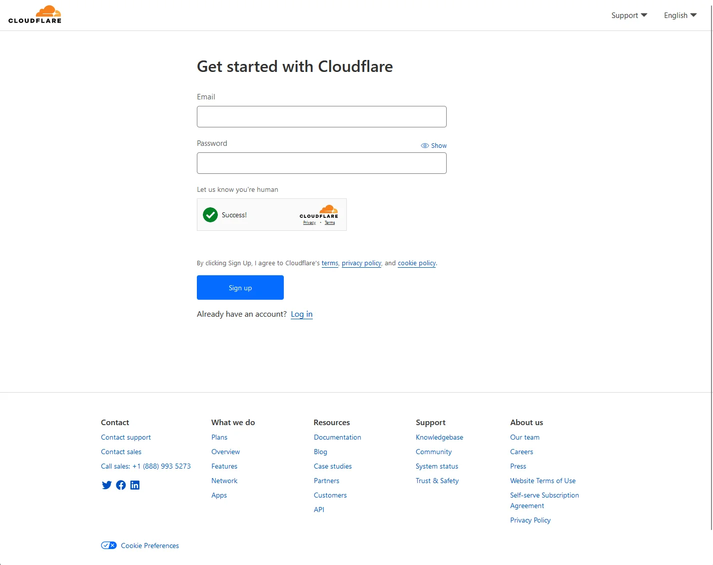
<ImgDesc>Cloudflare Sign up Page</ImgDesc>

Once you are set up with an account, [sign in](https://dash.cloudflare.com/login?lang=en-US) and head to the billing > payment info section of your profile. Fill in your payment method and a billing address. 

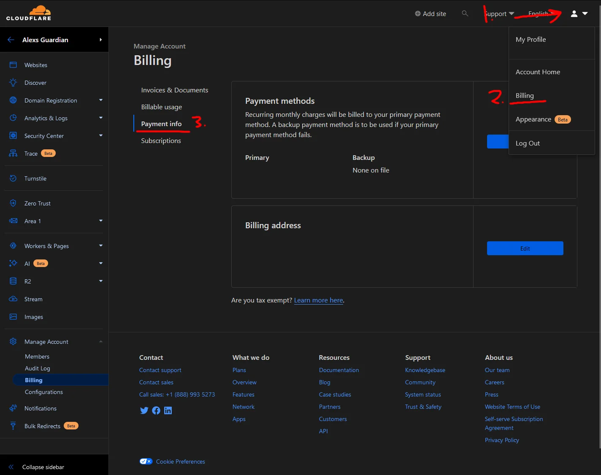
<ImgDesc>Cloudflare Billing Info</ImgDesc>

Then head back to the dashboard and enter the domain registration page.

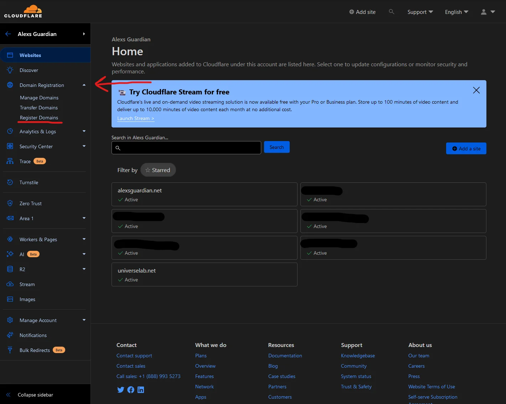
<ImgDesc>Cloudflare Domain Registering Menu</ImgDesc>

On the Register Domain page, search for a domain you'd like to use. When you find one, click on the "Purchase" link and check out. Follow the checkout process. 

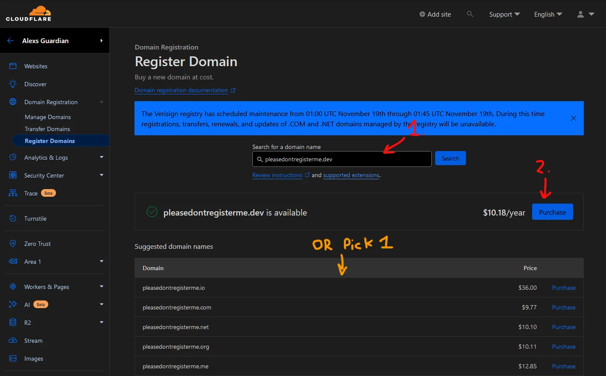
<ImgDesc>Cloudflare Domain Registering</ImgDesc>

Once you have registered your domain you should see it on the dashboard with a green checkmark and "Active" listed under it.

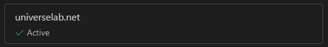
<ImgDesc>An active domain in Cloudflare</ImgDesc>

Now that we have our domain registered, let's get the host prepared!

<Aside type="tip">
Before continuing, I recommend going into your Cloudflare account settings and setting up 2FA/MFA so that your account is secure. I personally use a [Yubikey](https://amzn.to/3QWoyKT), [USB-A version](https://amzn.to/49AK3rX), for stuff like this.
</Aside>

## Preparing the Host

Like I stated earlier, we will be using [Docker](https://docker.com) to run all our services. Docker makes it easy to spin up services in containers which can include all the dependencies. This makes it extremely easy to also blow away a service if you want to start fresh or don't need it anymore. It also adds a layer of separation from the host which can enhance host security a bit.

<Aside type="note">
Wikipedia: What is Docker?
> "<u>Docker</u> is a set of platform as a service (PaaS) products that use OS-level virtualization to deliver software in packages called <u>containers</u>. The service has both free and premium tiers. The software that hosts the containers is called <u>Docker Engine</u>."

[https://en.wikipedia.org/wiki/Docker_(software)](https://en.wikipedia.org/wiki/Docker_(software))
</Aside>

SSH into your host and install Docker.

```shell showLineNumbers=false
ssh youruser@host

# Install Docker Dependencies
sudo apt install ca-certificates curl gnupg
sudo install -m 0755 -d /etc/apt/keyrings
curl -fsSL https://download.docker.com/linux/ubuntu/gpg | sudo gpg --dearmor -o /etc/apt/keyrings/docker.gpg
sudo chmod a+r /etc/apt/keyrings/docker.gpg

# Add the Docker repository to apt sources
echo \
  "deb [arch="$(dpkg --print-architecture)" signed-by=/etc/apt/keyrings/docker.gpg] https://download.docker.com/linux/ubuntu \
  "$(. /etc/os-release && echo "$VERSION_CODENAME")" stable" | \
  sudo tee /etc/apt/sources.list.d/docker.list > /dev/null
```

Now update the apt sources and install Docker-CE

```shell showLineNumbers=false
sudo apt update

# Install Docker
sudo apt-get install docker-ce docker-ce-cli containerd.io docker-buildx-plugin docker-compose-plugin
```


<ImgDesc>Installing Docker</ImgDesc>

Now, I like to create a dedicated user to run containers in my lab. This is not a recommended method and is optional since it can be dangerous, unless you run Docker root-less as noted in the [docs](https://docs.docker.com/engine/install/linux-postinstall/#manage-docker-as-a-non-root-user). This guide will not be covering how to do a root-less docker user, but it is definitely the recommended route. It does come with some limitations as noted [here](https://docs.docker.com/engine/security/rootless/#known-limitations) though. For the time being we are going to add our current user to the docker group, so we can omit `sudo` in every command from here on out.

<Aside type="danger">
>"For the time being we are going to add our current user to the docker group, so we can omit `sudo` in every command from here on out."

**<u>DO NOT</u> do this in a production type environment or one that has sensitive data stored on the host.... please...**
</Aside>

```shell showLineNumbers=false
sudo groupadd docker
sudo usermod -aG docker $USER
```

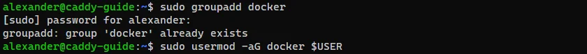
<ImgDesc>Adding the current user to the Docker group</ImgDesc>

Logout and log back into the host for the changes to take effect or run `newgrp docker`. You can then run `docker` to view the command help, to see if everything is working correctly.

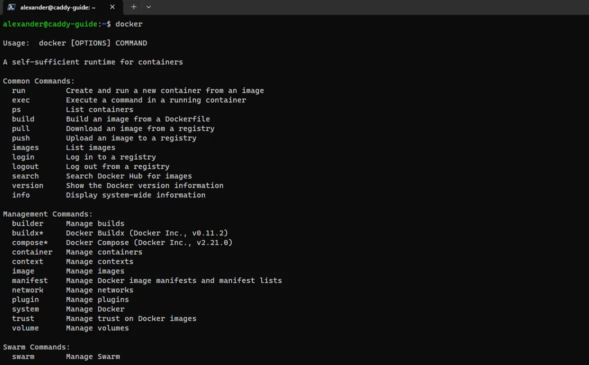
<ImgDesc>Help output from running `docker` with no parameters</ImgDesc>

Next we need to create the network that we will use for communications between Cloudflare tunnel and Caddy.

```shell showLineNumbers=false
docker network create cf-internal-net
```

### Preparing for Caddy

For this I will be using my [custom Docker image](https://hub.docker.com/r/alexandzors/caddy) which includes the Cloudflare DNS module[^7]. We need this module as Caddy will not be able to do proper certificate generation, since it will not be directly exposed to the internet and will have to use the DNS challenge[^8] to obtain them. You can easily build your own image and if you want to learn how to do that via GitHub Actions automatically you can check out my guide series, [here](https://blog.alexslab.dev/guides/), and the build repo for my image [here](https://github.com/alexandzors/caddy).

Create the config directories and files for Caddy.

```shell showLineNumbers=false
mkdir ~/caddy ~/caddy/.data ~/caddy/configs ~/cloudflare
touch ~/caddy/Caddyfile ~/caddy/configs/cloudflare-tls ~/caddy/configs/cloudflare-clientip-map ~/caddy/cf.sh ~/caddy/reload.sh ~/caddy/caddy.yml
```

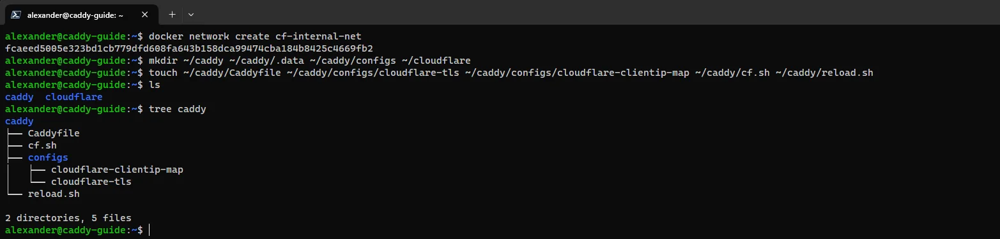
<ImgDesc>New Docker network and config directories</ImgDesc>

Change directory to the new Caddy directory we created above and edit the file called `caddy.yml`.

```shell showLineNumbers=false
cd ~/caddy

nano caddy.yml
```

Next copy and paste the following into the new file.

```yaml title="caddy.yml"
version: '3'
services:
  server:
    restart: always
    networks:
      - cf
    image: alexandzors/caddy
    env_file: .env
    ports:
      - 80:80
      - 443:443
    volumes:
      - ${PWD}/Caddyfile:/etc/caddy/Caddyfile:ro
      - ${PWD}/.data:/data
      - ${PWD}/configs:/etc/caddy/configs:ro

networks:
  cf:
    name: cf-internal-net
    external: true
```

Hit `CTRL + X` then `Y` to save and close the file. This will be the compose file for deploying Caddy. Next do the same for both `reload.sh` and `cf.sh`

```shell title="reload.sh"
#!/bin/sh
# This script runs caddy reload, caddy validate, caddy fmt, and caddy version inside the container via docker exec.
# Usage:
# -r    caddy reload
# -v    caddy validate
# -f    caddy fmt
# -V    caddy version
# Caddy docs: https://caddyserver.com/docs/command-line
# Created by: https://github.com/alexandzors/caddy
# Created for: https://blog.alexsguardian.net/guides/#caddy
caddy_container_name="caddy-server-1"
caddy_container_id=$(docker ps | grep $caddy_container_name | awk '{print $1;}')

while getopts ":r:v:f:V" option; do
  case $option in
  r)
    docker exec -w /etc/caddy $caddy_container_id caddy reload
    ;;
  v)
    docker exec -w /etc/caddy $caddy_container_id caddy validate --config /etc/caddy/Caddyfile
    ;;
  f)
    docker exec -w /etc/caddy $caddy_container_id caddy fmt --config /etc/caddy/Caddyfile
    ;;
  V)
    docker exec -w /etc/caddy $caddy_container_id caddy version
    ;;
  esac
done
```

<Aside type="note">
I have a new file I am working on that will eventually replace `reload.sh`, but it's still being tested. If you'd like this new file to help test, [let me know](javascript:location.href%20=%20'mailto:'%20+%20['blog','alexsguardian.net'].join('@'))!
</Aside>

```shell title="cf.sh"
#!/usr/bin/env sh
# This script queries cloudflare's website and pulls the list of IPv4 addresses. They are then loaded into a file to be used by Caddy.
# These IPs can be used for setting up trusted proxy configurations in web servers.
# Original file creator: https://caddy.community/t/trusted-proxies-with-cloudflare-my-solution/16124
# Updated by https://github.com/calvinhenderson to be more "succinct" as he put it. :)

FILE_IPV4="./configs/cloudflare-proxies"
tmp_file="/var/tmp/cloudflare-ips-v4-$(date +%Y%m%d_%H%M%S)"

# Make sure curl exists
command -v curl >/dev/null || { echo "Command 'curl' was not found. Is it in the PATH?"; exit 1; }

# Fetch the IP list from Cloudflare
curl -fso "$tmp_file" "https://www.cloudflare.com/ips-v4"
[ $? -eq 0 ] || { echo "Failed to fetch IPv4 list."; exit 1; }

# Transform the downloaded list into a format Caddy can understand
awk -v d=" " '{s=(NR==1?s:s d)$0}END{print "trusted_proxies "s}' "$tmp_file" > "$FILE_IPV4"

# Clean up
rm -f "$tmp_file"
```

After saving `cf.sh` edit your cron schedules and add the following schedule.

```shell showLineNumbers=false
crontab -e
```

After selecting your editor for cron, add the following to the bottom of the schedules list. Make sure to update the path to the location of `cf.sh`.

```shell showLineNumbers=false
@hourly bash /path/to/caddy/cf.sh
```

Then mark both scripts as executable.

```shell showLineNumbers=false
chmod +x ./cf.sh
chmod +x ./reload.sh
```

Now run the `cf.sh` script to generate the `cloudflare-proxies` file in `/configs/`. 

```shell showLineNumbers=false
bash cf.sh
```

If successful you should be able to `cat` the file and get a list of IPs that match the ones listed [here](https://www.cloudflare.com/ips/) under the IPv4 section.

```shell showLineNumbers=false
alexander@caddy-guide:~/caddy$ bash cf.sh
alexander@caddy-guide:~/caddy$ cat ./configs/cloudflare-proxies
trusted_proxies 173.245.48.0/20 103.21.244.0/22 103.22.200.0/22 103.31.4.0/22 141.101.64.0/18 108.162.192.0/18 190.93.240.0/20 188.114.96.0/20 197.234.240.0/22 198.41.128.0/17 162.158.0.0/15 104.16.0.0/13 104.24.0.0/14 172.64.0.0/13 131.0.72.0/22
```

Change directory into `/caddy/configs` and edit the following files with the provided information.

```shell title="cloudflare-clientip-map"
header_up X-Real-IP {http.request.header.CF-Connecting-IP}
header_up X-Forwarded-For {http.request.header.CF-Connecting-IP}
```

```shell title="cloudflare-tls"
tls {
        dns cloudflare {env.CLOUDFLARETOKEN}
}
```

### Obtaining a Cloudflare API Token

Next we need to generate an API token for Caddy to use for domain verification. The DNS Challenge utilizes a TXT record that is created by Caddy that Let's Encrypt can then verify against. To generate this token head back to your Cloudflare Dashboard and click on the profile dropdown on the top right of the page, click "My Profile" then "API Tokens" from the left-hand menu.

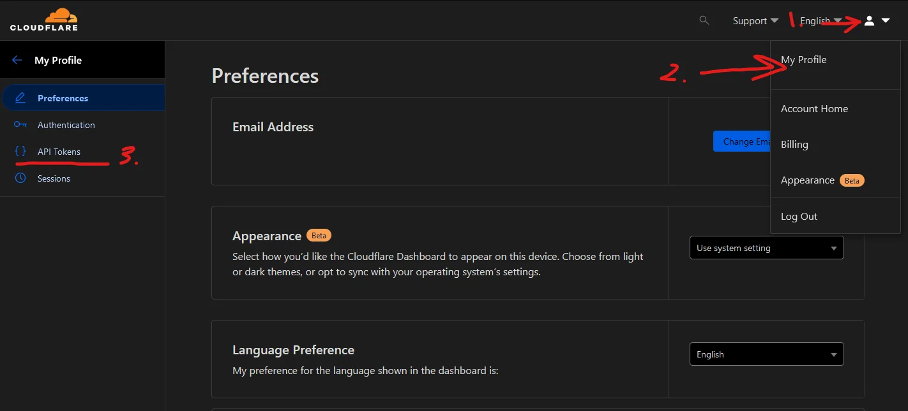
<ImgDesc>Navigating to the API Tokens page in Cloudflare</ImgDesc>

Click on the "Create Token" button in the API Tokens section. Then click on the "Use template" button for the "Edit zone DNS" option.

<Aside type="danger">
Do not use the Global API Key for Caddy!
</Aside>

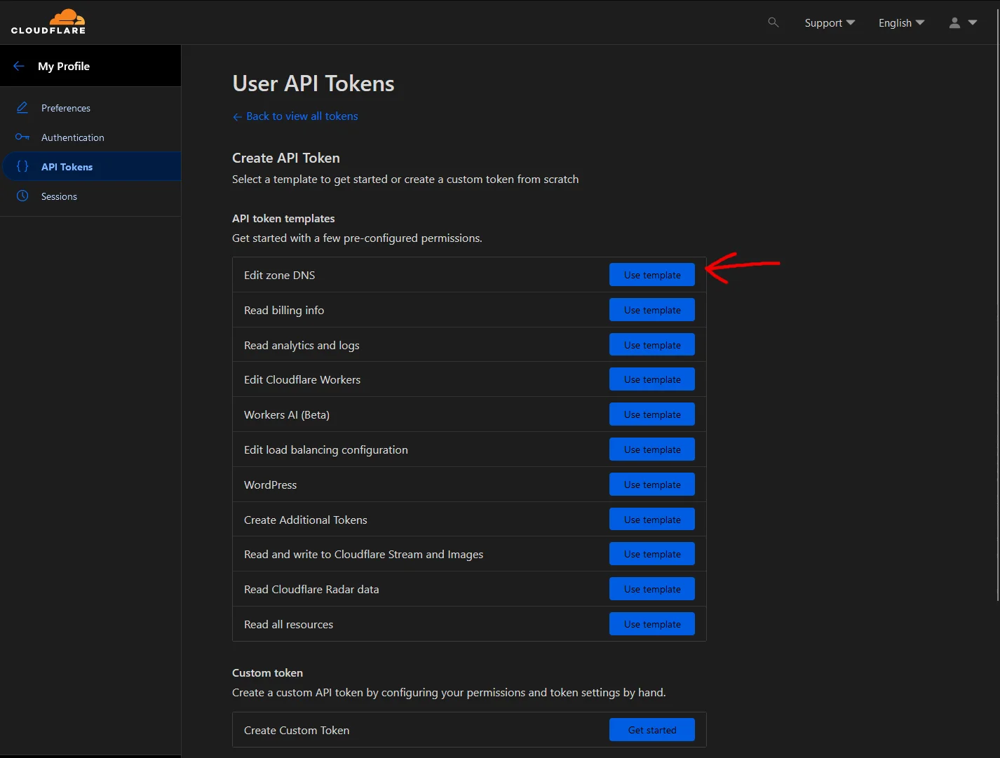
<ImgDesc>Cloudflare API template page</ImgDesc>

Give your token a recognizable name. Then in the <u>Permissions</u> section set the following options:

<div class="overflow-x-auto">
  <table class="w-full">
    <tr><th class="pl-4">Dropdown 1</th>   <th class="pl-4">Dropdown 2</th>       <th class="pl-4">Dropdown 3</th></tr>
    <tr><td>Zone</td>   <td>DNS</td>       <td>Read</td></tr>
    <tr><td>Zone</td>   <td>DNS</td>       <td>Edit</td></tr>
  </table>
</div>

In the <u>Zone Resources</u> section:

<div class="overflow-x-auto">
  <table class="w-full">
    <tr><th class="pl-4">Dropdown 1</th>   <th class="pl-4">Dropdown 2</th>       <th class="pl-4">Dropdown 3</th></tr>
    <tr><td>Include</td>   <td>Specific Zone</td>       <td>universelab.net</td></tr>
  </table>
</div>

Your page should look similar to the image below.

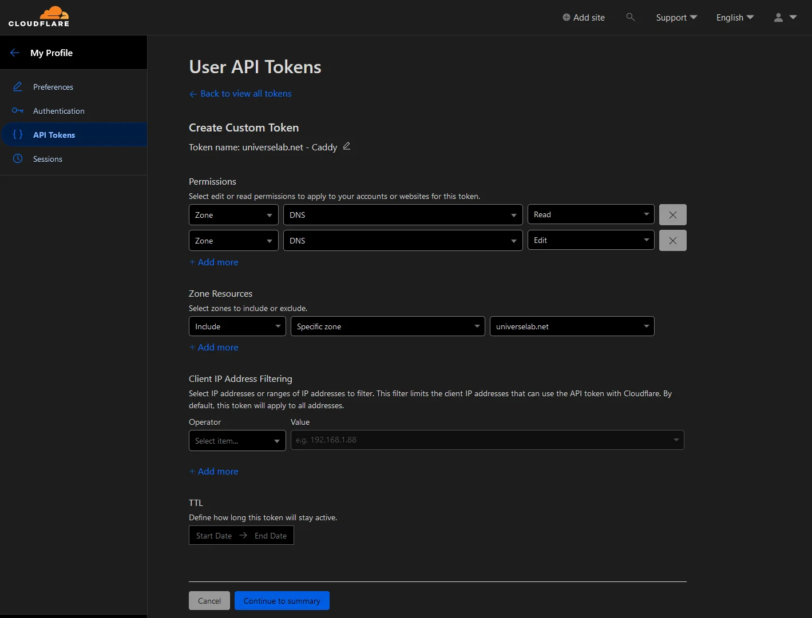
<ImgDesc>Cloudflare API Token Setup</ImgDesc>

Then click "Continue to summary". Here you can verify your configuration for the token. Click "Create Token" to finish generating your API token. Copy it to a safe location as we will need it later.

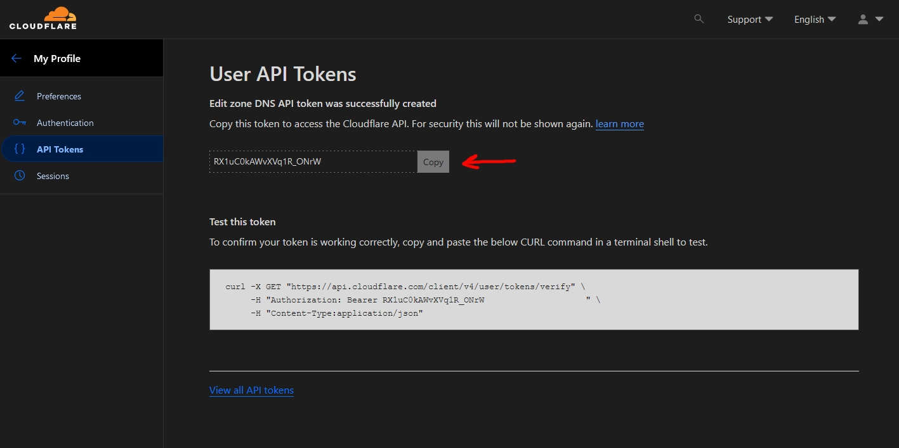
<ImgDesc>Cloudflare API Token</ImgDesc>

With the token in hand, jump back over to the host and in the `/caddy` directory create a new file called .env.

```shell showLineNumbers=false
nano ~/caddy/.env
```

Add the following to the file.

```shell showLineNumbers=false
CLOUDFLARETOKEN=RX1uC0kAWvXVq1R_ONrWxxxxxxxxxxxxxxxxxxxxxxxxx
```

Make sure to replace `RX1uC0kAWvXVq1R_ONrWxxxxxxxxxxxxxxxxxxxxxxxxx` with the token you generated above. Save and close the file with `CTRL + x` then `y`.

### Preparing for Cloudflare Tunnel

With Caddy's config prepped and ready to deploy we focus on prepping for Cloudflare Tunnel. This one will be easy as most of the config is done via Cloudflare's Zero Trust dashboard. Though, we will still need a directory to house our docker compose config, and an env file for the tunnel on the host. Create a new directory called Cloudflare as well as the docker compose config file and the .env file.

```shell showLineNumbers=false
mkdir ~/cloudflare
touch ~/cloudflare/cloudflare.yml ~/cloudflare/.env
```

Next edit the `cloudflare.yml` file and copy the following into it.

```shell showLineNumbers=false
cd ~/cloudflare
nano cloudflare.yml
```

```yaml title="cloudflare.yml"
version: '3'
services:
 tunnel:
    restart: always
    networks:
      - cf
    image: cloudflare/cloudflared:latest
    command: 'tunnel -no-autoupdate run --token ${TOKEN}'
    env_file: .env

networks:
  cf:
    name: cf-internal-net
    external: true
```

Save and close the file with `CTRL + x` then `y`. We will come back to the `.env` file later.

## Configuring and Deploying Cloudflare Tunnel

Now that we have the host prepared and Cloudflare configured, we can start setting up the tunnel. To get the tunnel up we need to navigate to the Zero Trust Dashboard in Cloudflare. Jump back to the main Cloudflare dashboard and then click on "Zero Trust" in the menu on the left.

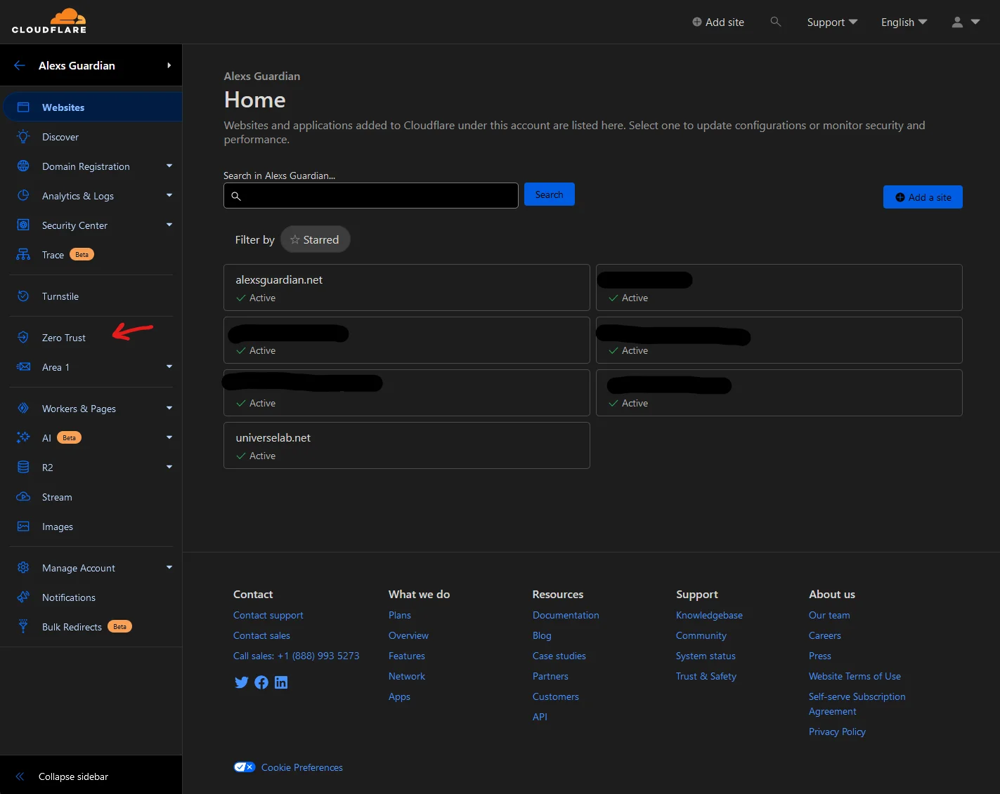
<ImgDesc>Cloudflare Zero Trust menu option</ImgDesc>

Once on the Zero Trust dashboard, select the Access > Tunnels option.

<div class="text-sm italic">*Sorry dark mode users the Zero Trust dash does not have dark mode :(*</div>

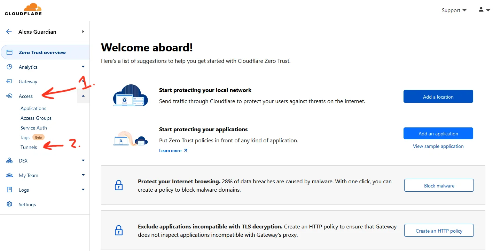
<ImgDesc>Cloudflare Tunnels menu option</ImgDesc>

Now click on the "+ Create a tunnel" button on the Tunnels overview page.

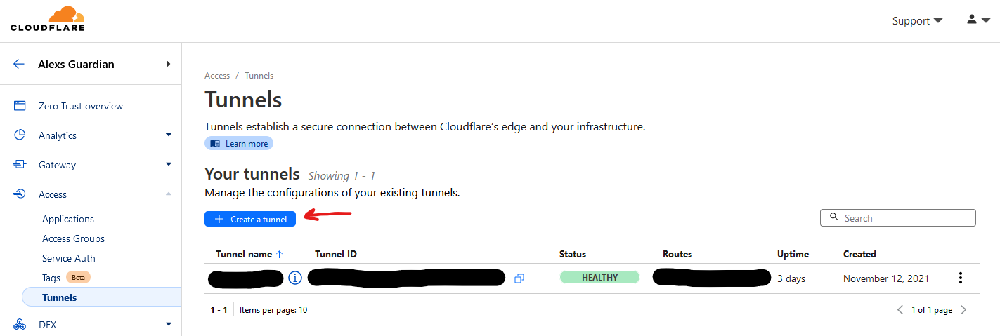
<ImgDesc>Cloudflare Tunnels Overview</ImgDesc>

Follow the wizard to create the tunnel. Give it a name and copy the Docker run command on the next page.


<ImgDesc>First Part of the Tunnel Creation Wizard</ImgDesc>

Take the command and paste it into notepad. Delete everything but the token and then copy the token. 

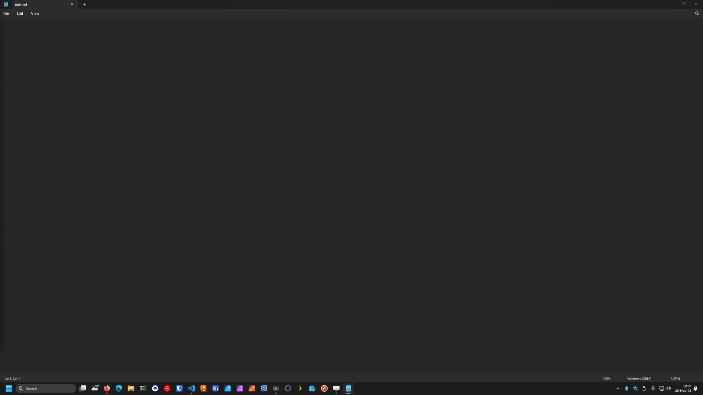
<ImgDesc>Editing the Docker Run Command for the Tunnel</ImgDesc>

Now return to your host and edit the `.env` file in the `/cloudflare` directory. Copy the following into the file. Replace my demo token with the one you copied earlier.

```shell title=".env"
TOKEN=eyJhIjoiZDNkZGU5NDhlZDEzMWZlMTM0NzRlODVkNWI3OGYwOTEiLCJ0IjoiMTVlZGY1ZTUtNDE1YS00YWFmLTg0NzQtN2VkNDhiNTU2OThjIiwicyI6Ik1qTmtNek0wTkRBdFpHSTROaTAwT1RrMUxXRTBaREV0WmpVek1Ea3pNakEzTm1aaSJ9
```

Save and close the file. Your `/cloudflare` directory should look like the following image after you are done.

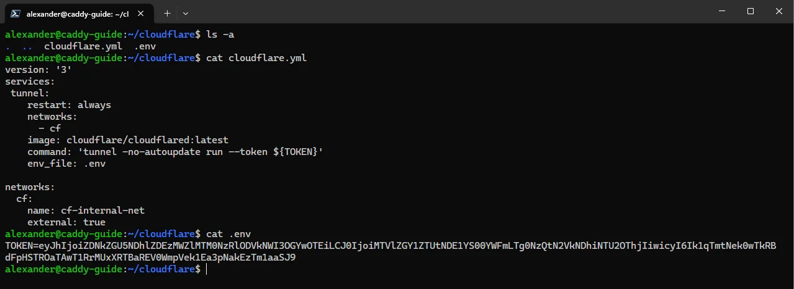
<ImgDesc>Example Cloudflare Tunnel Config</ImgDesc>

In the `/cloudflare` directory run `docker compose -f cloudflare.yml up`. If you watch the Tunnel Wizard you can see the local tunnel connect to Cloudflare in the lower box labeled "Connectors."


<ImgDesc>Local Tunnel Connecting to Cloudflare</ImgDesc>

Once the tunnel is connected. Hit `CTRL + C` to terminate the Cloudflare container. Then re-run `docker compose -f cloudflare.yml up -d`. The `-d` argument runs the container in 'detach mode' so that it can run in the background. By running `docker ps` you can verify if it is up and running.

```shell showLineNumbers=false
alexander@caddy-guide:~/cloudflare$ docker ps
CONTAINER ID   IMAGE                           COMMAND                  CREATED         STATUS         PORTS     NAMES
e9e03f600a69   cloudflare/cloudflared:latest   "cloudflared --no-au…"   9 minutes ago   Up 2 seconds             cloudflare-tunnel-1
```

Return to the Zero Trust dashboard and continue to the "Route tunnel" step in the Tunnel wizard. Under the "Public Hostnames" tab select your domain in the "Domain" drop-down. Then select `HTTPS` for the service "Type" and enter `caddy-server-1:443` for the service "URL."

<Aside type="tip">
If you change the service name for Caddy in the `caddy.yml` file, or you are using a directory that's not named "caddy", you will need to update this URL to match. Reference: caddy = The directory the compose file is in, server = service name in caddy.yml compose file, 1 = replication identifier.
</Aside>

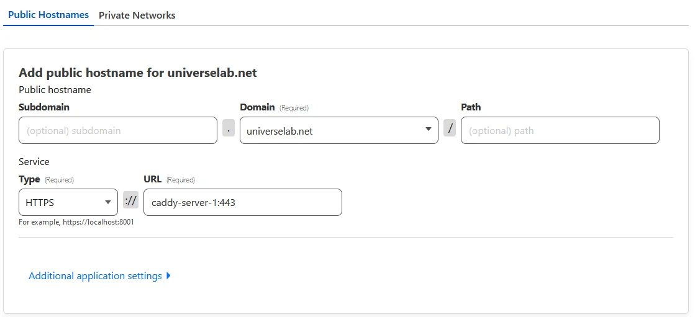
<ImgDesc>Route tunnel example</ImgDesc>

Under the "Additional application settings", select TLS and then input your domain name into the "Origin Server Name" field. 

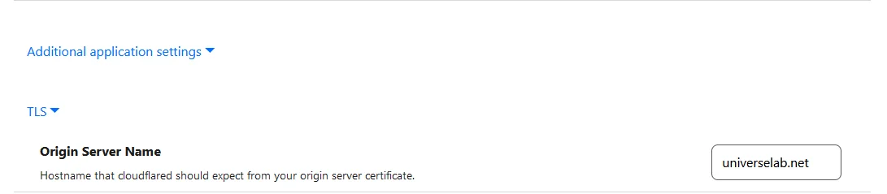
<ImgDesc>Tunnel SNI config</ImgDesc>

You can then save the tunnel configuration. We can come back later to add more routes, once we get everything set up and working with the root domain.

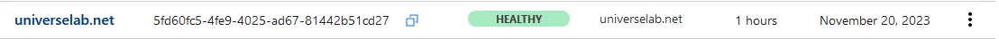
<ImgDesc>Online and Connected Tunnel</ImgDesc>

If you return to the [main dashboard](https://dash.cloudflare.com/), select your domain and go to DNS > Records. You can see the entry added for the root domain pointing to the tunnel.

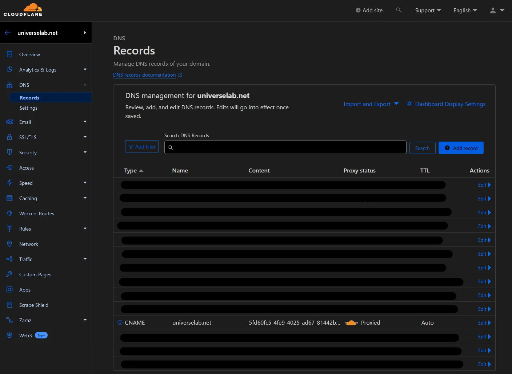
<ImgDesc>Tunnel entry in DNS records</ImgDesc>

## Basic Troubleshooting FAQ

**Q: I got an origin error page from Cloudflare. Code 502: Bad Gateway**

[^1]: [Wikipedia: VPN](https://en.wikipedia.org/wiki/Virtual_private_network)
[^2]: [Wikipedia: SSH Tunnel](https://en.wikipedia.org/wiki/SSH_tunnel)
[^3]: [Wikipedia: Bastion Host](https://en.wikipedia.org/wiki/Bastion_host)
[^4]: [Wikipedia: Reverse Proxy](https://en.wikipedia.org/wiki/Reverse_proxy)
[^5]: [Wikipedia: Domain Name Registrar](https://en.wikipedia.org/wiki/Domain_name_registrar)
[^6]: [List of Domain Name Registrars](https://en.wikipedia.org/wiki/List_of_domain_name_registrars)
[^7]: [Caddy DNS Module](https://caddyserver.com/docs/modules/dns)
[^8]: [Let's Encrypt: DNS Challenge](https://letsencrypt.org/docs/challenge-types/#dns-01-challenge) 