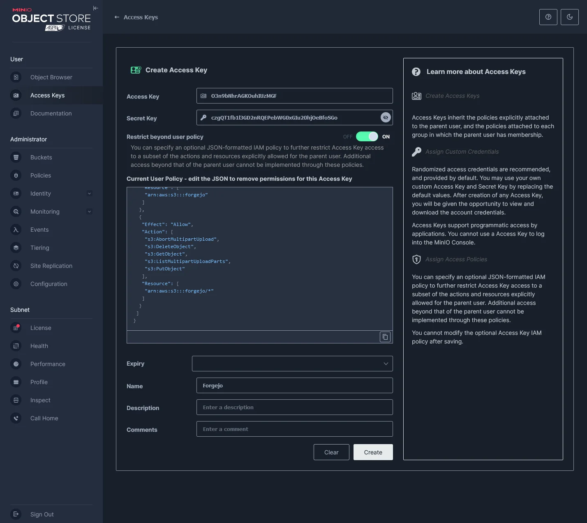
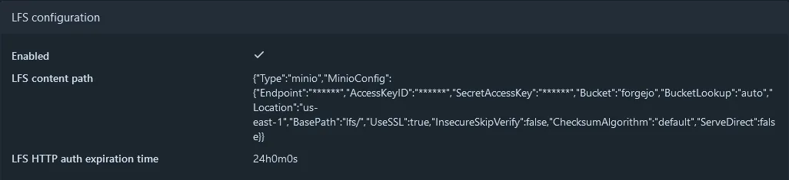
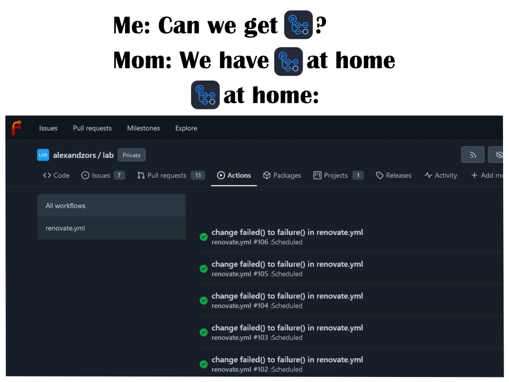
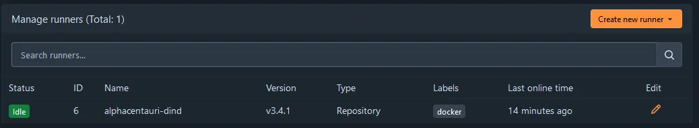
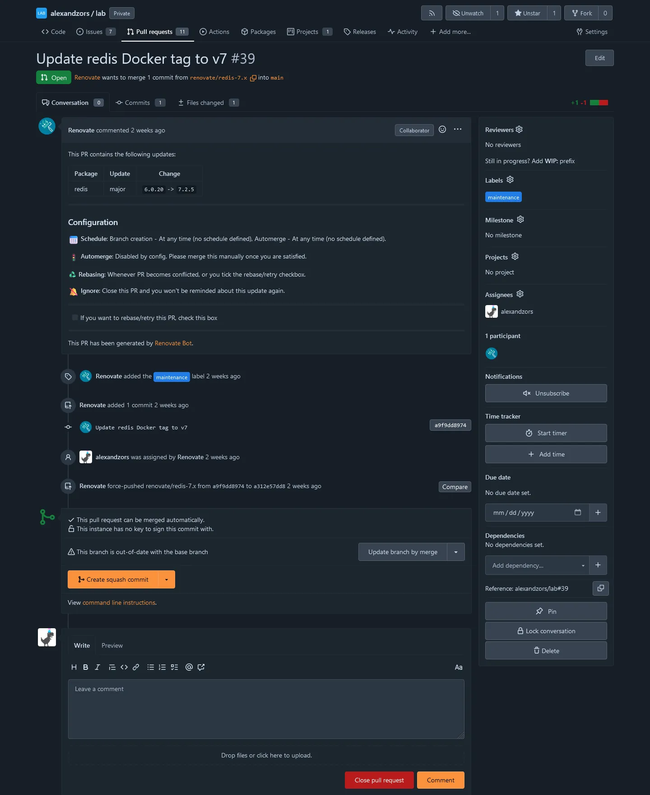

import ImgDesc from '~/components/custom/ImgDesc.astro'
import Aside from '~/components/widgets/Aside.astro'

<div class="flex justify-center text-2xl"><a href="#starting-out">Skip to the goods</a></div>

<hr />

Awhile ago I spun up my own instance of Forgejo. [Forgejo](https://forgejo.org), if you are not familiar, is a hard fork of [Gitea](https://gitea.com) when they became a *for-profit* company and is run/managed by [Codeberg](https://codeberg.org). If you want more details on why Forgejo came to be, you can read their blog post [here](https://forgejo.org/2022-12-15-hello-forgejo/). As of now it's basically a drop-in replacement for Gitea. Though over time this will change as the two projects drift apart. So it may not be one in the future! Anyhow, I've been rolling my own instance since September 2023 and, recently I have been moving my entire lab towards a more [GitOps](https://about.gitlab.com/topics/gitops/) approach. To do this and do it securely (in the confines of my internal network), I've decided to turn Forgejo into my full CI/CD manager and config storage place. I'll also be using [Bitwarden's Secret Manager](https://bitwarden.com/products/secrets-manager/) to manage, well, secrets. 

Before I begin re-doing my lab for the umpteenth time, I need to change how Forgejo operates currently. That way Forgejo can support the transition from 'FileOps' (aka loose files) to GitOps. Now this isn't the 'perfect' setup process as the repo storage still lives in /data, and it's not currently replicated across my small swarm cluster. This will change when I get to actually rebuilding the cluster from the ground up to utilize NFS mounts for shared storage. Though that requires more hardware, which the wife probably won't be happy about. :sweat_smile:

## Migrating to S3 Object Storage

Forgejo (in Docker), by default, has you map a `/data` directory where all the necessary configs/repos/logs/etc. live. As you can see by the example compose file [here](https://forgejo.org/docs/latest/admin/installation-docker/).

```yml title="docker-compose.yml"
version: '3'

networks:
  forgejo:
    external: false

services:
  server:
    image: codeberg.org/forgejo/forgejo:7
    container_name: forgejo
    environment:
      - USER_UID=1000
      - USER_GID=1000
    restart: always
    networks:
      - forgejo
    volumes:
      - ./forgejo:/data # <---- data volume
      - /etc/timezone:/etc/timezone:ro
      - /etc/localtime:/etc/localtime:ro
    ports:
      - '3000:3000'
      - '222:22'
```

This is great if you plan on just running a simple setup, or you already have shared storage. For me though, I have no shared storage, and a [MinIO](https://min.io/) server that is currently doing nothing but holding attachments for [Outline](https://github.com/outline/outline). I figured it's time to put it to more use. That, and my day job involves doing AWS things so figured it would be good practice. 

Currently, Forgejo supports the following directories (under `/appdata`) for object storage.

<div style="overflow-x:auto;">
  <table style="display: center; width: 100%;">
    <tr>
      <th style="padding-left: 20px">Subsystem</th>
      <th style="padding-left: 20px">Directory</th>
      <th style="padding-left: 20px">app.ini Sections</th>
    </tr>
    <tr>
      <td>Attachments</td>
      <td>attachments/</td>
      <td>[attachment]</td>
    </tr>
    <tr>
      <td>LFS</td>
      <td>lfs/</td>
      <td>[lfs]</td>
    </tr>
    <tr>
      <td>Avatars</td>
      <td>avatars/</td>
      <td>[avatar]</td>
    </tr>
    <tr>
      <td>Repository avatars</td>
      <td>repo-avatars/</td>
      <td>[repo-avatar]</td>
    </tr>
    <tr>
      <td>Repository archives</td>
      <td>repo-archive/</td>
      <td>[repo-archive]</td>
    </tr>
    <tr>
      <td>Packages</td>
      <td>packages/</td>
      <td>[packages]</td>
    </tr>
    <tr>
      <td>Actions logs</td>
      <td>actions_log/</td>
      <td>[storage.actions_log]</td>
    </tr>
    <tr>
      <td>Actions Artifacts</td>
      <td>actions_artifacts/</td>
      <td>[actions.artifacts]</td>
    </tr>
    <caption style="text-align: center;"><a href="https://forgejo.org/docs/latest/admin/storage/">Forgejo Docs: Storage Settings</a></caption>
  </table>
</div>

As you can see in the table above there are a few storage directories missing. Mainly repositories. Since repositories do not work well in object storage they are unsupported. Which means they will still be living on one of my hosts temporarily until I finalize my cross cluster storage solution. In order migrate the storage to MinIO, I first need to create a bucket (named `forgejo`), an Access Identity, and an ACL for it.

```shell showlinenumbers=false title="access-credentials"
Access_key: O3n9bNhrbadkeyAGKOuhIUzMGF
Secret_key: czgQT1fb1l3GD2nRQEPebadsecretbWG0xGIu20hjOeBfoSGo
```

<br />

```json title="Access Key User Policy"
{
 "Version": "2012-10-17",
 "Statement": [
  {
   "Effect": "Allow",
   "Action": [
    "s3:ListBucketMultipartUploads",
    "s3:GetBucketLocation",
    "s3:ListBucket"
   ],
   "Resource": [
    "arn:aws:s3:::forgejo"
   ]
  },
  {
   "Effect": "Allow",
   "Action": [
    "s3:AbortMultipartUpload",
    "s3:DeleteObject",
    "s3:GetObject",
    "s3:ListMultipartUploadParts",
    "s3:PutObject"
   ],
   "Resource": [
    "arn:aws:s3:::forgejo/*"
   ]
  }
 ]
}
```

The above ACL replaces the default one under the "Current User Policy" after enabling the "ON" switch for "Restrict beyond user policy" setting in `User > Access Keys > Create access key`. It limits the access key to the `forgejo` bucket. The bucket is also private by default, so I do not have to change the bucket ACL.


<ImgDesc>MinIO Create Access Key with a custom user policy</ImgDesc>

Next was to upload the existing files to MinIO so that when Forgejo restarted with the new s3 config it would pick them back up. As you can see in the picture below there are a few absent directories. I decided to condense a few related directories into parent ones for my ease of use. Also, some of them do not exist yet and will be created when needed (e.g. packages/).


<ImgDesc>Example MinIO bucket directory layout</ImgDesc>

My current s3 bucket directory layout:

```shell showlinenumbers=false title="arn:aws:s3:::forgejo"
actions/
  |- artifacts/
  |- logs/

attachments/

avatars/
  |- repositories/
  |- users/
```

With MinIO ready to go, all I had to do was update the Forgejo container environment variables for the MinIO connection and re-deploy. Forgejo environment variables can be defined using the `env -> ini` notation. So in your `app.ini` you have sections that are labeled, such as '[security].' In order to update the INI value for say, 'INSTALL_LOCK', you'd need to define it as `FORGEJO__security__INSTALL_LOCK`.

As you can see in the example snippet file below, I am defining the MinIO connection information, as well as, where to look for specific directories in the bucket.

```yml showlinenumbers=false title="forgejo-minio-env-example"
    # < truncated >
    environment:
      # Storage Configs
      - FORGEJO__storage__STORAGE_TYPE="minio"
      - FORGEJO__storage__MINIO_USE_SSL="true"
      - FORGEJO__storage__MINIO_ENDPOINT="s3.${LAB_DOMAIN}"
      - FORGEJO__storage__MINIO_ACCESS_KEY_ID=${FJ_S3_ACCESS_ID}
      - FORGEJO__storage__MINIO_SECRET_ACCESS_KEY=${FJ_S3_ACCESS_KEY}
      - FORGEJO__storage__MINIO_BUCKET="forgejo"
      - FORGEJO__storage__MINIO_LOCATION="us-east-1"
      # Path Configs
      - FORGEJO__attachment__MINIO_BASE_PATH="attachments/"
      - FORGEJO__lfs__MINIO_BASE_PATH="lfs/"
      - FORGEJO__avatar__MINIO_BASE_PATH="avatars/users/"
      - FORGEJO__repo-avatar__MINIO_BASE_PATH="avatars/repositories/"
      - FORGEJO__repo-archive__MINIO_BASE_PATH="archives/"
      - FORGEJO__packages__MINIO_BASE_PATH="packages/"
      - FORGEJO__storage.actions_log__MINIO_BASE_PATH="actions/logs/"
      - FORGEJO__actions.artifacts__MINIO_BASE_PATH="actions/artifacts/"
      # < truncated >
```

<a name="compose-example"></a>
<details>
  <summary>Forgejo Compose Example [Expand me]</summary>
  <div markdown="1">

  ```yml title="forgejo.yml"
  version: '3'
  services:
    server:
      restart: always
      healthcheck:
        test: ["CMD", "curl", "-fSs", "localhost:3000/api/healthz"]
        interval: 5s
        timeout: 10s
        retries: 3
        start_period: 60s
      image: codeberg.org/forgejo/forgejo:7.0
      environment:
        # Global Config
        - FORGEJO_APP_NAME="Forgejo"
        - FORGEJO_RUN_MODE="prod"
        - FORGEJO_RUN_USER="git"
        - FORGEJO_WORK_PATH="/data/gitea"
        # Repository Configs
        - FORGEJO__repository__ROOT="/data/git/repositories"
        - FORGEJO__repository.local__LOCAL_COPY_PATH="/data/gitea/tmp/local-repo"
        - FORGEJO__repository.pull-request__DEFAULT_MERGE_STYLE="merge"
        - FORGEJO__repository.signing__DEFAULT_TRUST_MODEL="committer"
        # Server Configs
        - FORGEJO__server__APP_DATA_PATH="/data/gitea"
        - FORGEJO__server__DOMAIN="git.${LAB_DOMAIN}"
        - FORGEJO__server__SSH_DOMAIN="git.${LAB_DOMAIN}"
        - FORGEJO__server__HTTP_PORT="3000"
        - FORGEJO__server__ROOT_URL="https://git.${LAB_DOMAIN}"
        - FORGEJO__server__DISABLE_SSH="false"
        - FORGEJO__server__SSH_PORT="22"
        - FORGEJO__server__SSH_LISTEN_PORT="22"
        - FORGEJO__server__LFS_START_SERVER="true"
        - FORGEJO__server__LFS_JWT_SECRET="${FJ_JWT_SECRET}"
        - FORGEJO__server__OFFLINE_MODE="false"
        # Database Configs
        - FORGEJO__database__DB_TYPE="postgres"
        - FORGEJO__database__HOST="${FJ_DB_HOST}"
        - FORGEJO__database__NAME="${FJ_DB}"
        - FORGEJO__database__USER="${FJ_DB_USER}"
        - FORGEJO__database__PASSWD="${FJ_DB_PASS}"
        - FORGEJO__database__LOG_SQL="false"
        - FORGEJO__database__SCHEMA=""
        - FORGEJO__database__SSL_MODE="disable"
        # Indexer Configs
        - FORGEJO__indexer__ISSUE_INDEXER_PATH="/data/gitea/indexers/issues.bleve"
        # Session Configs
        - FORGEJO__session__PROVIDER_CONFIG="/data/gitea/sessions"
        - FORGEJO__session__PROVIDER="file"
        - FORGEJO__session__COOKIE_SECURE="true"
        # Log Configs
        - FORGEJO__log__MODE="console"
        - FORGEJO__log__LEVEL="info"
        - FORGEJO__log__ROOT_PATH="/data/gitea/log"
        # Security Configs
        - FORGEJO__security__INSTALL_LOCK="true"
        - FORGEJO__security__SECRET_KEY="${FJ_SECRET_KEY}"
        - FORGEJO__security__REVERSE_PROXY_LIMIT="1"
        - FORGEJO__security__REVERSE_PROXY_TRUSTED_PROXIES="${CADDY_INT_IP}"
        - FORGEJO__security__INTERNAL_TOKEN="${FJ_INT_TOKEN}"
        - FORGEJO__security__PASSWORD_HASH_ALGO="${FJ_PASS_ALGO}"
        # Service Configs
        - FORGEJO__service__DISABLE_REGISTRATION="true"
        - FORGEJO__service__REQUIRE_SIGNIN_VIEW="false"
        - FORGEJO__service__REGISTER_EMAIL_CONFIRM="false"
        - FORGEJO__service__ENABLE_NOTIFY_MAIL="false"
        - FORGEJO__service__ALLOW_ONLY_EXTERNAL_REGISTRATION="false"
        - FORGEJO__service__ENABLE_CAPTCHA="true"
        - FORGEJO__service__CAPTCHA_TYPE="cfturnstile"
        - FORGEJO__service__REQUIRE_CAPTCHA_FOR_LOGIN="true"
        - FORGEJO__service__CF_TURNSTILE_SECRET="${FJ_CFT_SECRET}"
        - FORGEJO__service__CF_TURNSTILE_SITEKEY="${FJ_CFT_SITE_KEY}"
        - FORGEJO__service__DEFAULT_KEEP_EMAIL_PRIVATE="true"
        - FORGEJO__service__DEFAULT_ALLOW_CREATE_ORGANIZATION="true"
        - FORGEJO__service__DEFAULT_ENABLE_TIMETRACKING="true"
        - FORGEJO__service__NO_REPLY_ADDRESS="noreply@${FJ_DOMAIN}"
        # Mailer Configs
        - FORGEJO__mailier__ENABLED="false"
        # OpenID Configs
        - FORGEJO__openid__ENABLE_OPENID_SIGNIN="false"
        - FORGEJO__openid__ENABLE_OPENID_SIGNUP="false"
        # cron Configs
        - FROGEJO__cron.update_checker__ENABLED="false"
        - FORGEJO__oauth2__JWT_SECRET="${FJ_OAUTH_SEC}"
        # Actions Configs
        - FORGEJO__actions__ENABLED="true"
        - FORGEJO__actions__DEFAULT_ACTIONS_URL="https://git.${LAB_DOMAIN}"
        - FORGEJO__actions__ARTIFACT_RETENTION_DAYS="90"
        # Storage Configs
        - FORGEJO__storage__STORAGE_TYPE="minio"
        - FORGEJO__storage__MINIO_USE_SSL="true"
        - FORGEJO__storage__MINIO_ENDPOINT="s3.${LAB_DOMAIN}"
        - FORGEJO__storage__MINIO_ACCESS_KEY_ID=${FJ_S3_ACCESS_ID}
        - FORGEJO__storage__MINIO_SECRET_ACCESS_KEY=${FJ_S3_ACCESS_KEY}
        - FORGEJO__storage__MINIO_BUCKET="forgejo"
        - FORGEJO__storage__MINIO_LOCATION="us-east-1"
        # Path Configs
        - FORGEJO__attachment__MINIO_BASE_PATH="attachments/"
        - FORGEJO__lfs__MINIO_BASE_PATH="lfs/"
        - FORGEJO__avatar__MINIO_BASE_PATH="avatars/users/"
        - FORGEJO__repo-avatar__MINIO_BASE_PATH="avatars/repositories/"
        - FORGEJO__repo-archive__MINIO_BASE_PATH="archives/"
        - FORGEJO__packages__MINIO_BASE_PATH="packages/"
        - FORGEJO__storage.actions_log__MINIO_BASE_PATH="actions/logs/"
        - FORGEJO__actions.artifacts__MINIO_BASE_PATH="actions/artifacts/"
      volumes:
        - ./data:/data
        - /etc/timezone:/etc/timezone:ro
        - /etc/localtime:/etc/localtime:ro
      ports:
        - 3000:3000
        - 2222:22
  ```
  <Aside type="tip">
  If you are curious about all the configuration options for Forgejo, you can check out the configuration cheat sheet [here](https://forgejo.org/docs/latest/admin/config-cheat-sheet/).
  </Aside>

  </div>
</details>
<br />

With the environment variables updated, and a quick redeploy of Forgejo, I was up and running with object storage via MinIO! A quick trip into the `Site Administration > Configuration > Summary` in Forgejo shows that LFS was now using MinIO as seen in the below image.


<ImgDesc>Forgejo site admin config showing LFS using MinIO</ImgDesc>

## Setting up Forgejo Actions



All jokes aside, Forgejo Actions is actually fairly decent. The runner is not production ready (according to [Forgejo themselves](https://code.forgejo.org/forgejo/runner#forgejo-runner)) but it works well enough that I am going all in on it for my lab. Setting up the action runner was fairly straight forward. It's got a similar setup process to the self-hosted GitHub runner.

1. Enable Actions in the `app.ini` or using environment variables. Restart/Redeploy Forgejo.
  - <a href="#compose-example">See above</a> for an example using environment variables under `#Actions Configs`.
2. Create a new runner in `Site Administration > Actions > Runners > Create new runner`.
3. Copy the new runner registration token.
4. Deploy Forgejo Runner and register it with the token from step 3.

Now there are a few ways you could deploy the runner, but I decided to deploy it in Docker. You can bind the runner container to the Docker sock, but I did not. I really do not like doing that so, I ended up using [Docker in Docker (DIND)](https://hub.docker.com/_/docker). It's not really recommended to use Docker this way but for my lab it will do fine. The compose file was also pretty easy to set up.

```yml title="forgejo-actions.yml"
version: '3'
services:
  dind:
    restart: unless-stopped
    image: docker:dind
    privileged: true
    command: ['dockerd', '-H', 'tcp://0.0.0.0:2375', '--tls=false']

  runner:
    restart: unless-stopped
    image: code.forgejo.org/forgejo/runner:3.4.1
    links:
      - dind
    depends_on:
      dind:
        condition: service_started
    command: '/bin/sh -c "while : ; do sleep 1 ; done ;"'
    # Change to this command after registration
    #command: '/bin/sh -c "sleep 5; forgejo-runner daemon"'
    user: 1001:1001
    environment:
      - DOCKER_HOST=tcp://dind:2375
    volumes:
      - ./runner:/data
```

As you can see above there are two `commands:`. `'/bin/sh -c "while : ; do sleep 1 ; done ;"'` starts up the runner container and does nothing. This allows you to enter the container via `docker exec` and run the registration command using the token generated in the Site Administration settings. After registering the container, it can be brought down and the current command can be replaced with the commented out one (`'/bin/sh -c "sleep 5; forgejo-runner daemon"'`). Then after redeploying the container the runner will become available in Forgejo globally. Having a global runner means it can be used by all repositories. Which for me works fine since my Forgejo instance is mainly private except for a few public repositories and a few GitHub mirrors.


<ImgDesc>Forgejo Manage Runners</ImgDesc>

With my runner online and working, I am now able to have workflows kick off from steps defined in files located in `.forgejo/workflows/`. The syntax is fairly similar to GitHub actions so most of the actions you can run there can run in Forgejo. The best part is I can mirror the action repositories and have my runner pull them directly from my Forgejo instance. The first thing I set up was Renovate Bot to keep my Docker images updated. The bot runs on a cron based workflow as seen below and opens a PR for image updates.

```yml title=".forgejo/workflows/renovate.yml"
name: Run Renovate

on:
  schedule:
    - cron: '0 0/6 * * *'  # every 6 hours, every day

env:
  RENOVATE_REPOSITORIES: ${{ github.repository }}

jobs:
  renovate:
    if: ${{ secrets.RENOVATE_TOKEN != '' }}
    runs-on: docker
    container:
      image: renovate/renovate:full

    steps: 
      - name: Run Renovate
        run: renovate
        env:
          GITHUB_COM_TOKEN: ${{ secrets.RENOVATE_GITHUB_COM_TOKEN }}
          LOG_LEVEL: info
          RENOVATE_BASE_DIR: ${{ github.workspace }}/.tmp
          RENOVATE_ENDPOINT: ${{ github.server_url }}
          RENOVATE_PLATFORM: gitea
          RENOVATE_REPOSITORY_CACHE: 'enabled'
          RENOVATE_TOKEN: ${{ secrets.RENOVATE_TOKEN }}
          RENOVATE_GIT_AUTHOR: 'Renovate Bot <renovate@mydomain.dev>'

          GIT_AUTHOR_NAME: 'Renovate'
          GIT_AUTHOR_EMAIL: 'renovate@mydomain.dev'
          GIT_COMMITTER_NAME: 'Renovate Bot'
          GIT_COMMITTER_EMAIL: 'renovate@mydomain.dev'

  ntfy:
    if: failure()
    runs-on: docker
    container:
      image: node:20

    steps:
      - name: Get Ntfy Token from SM
        uses: actions/sm-action@v4
        access_token: ${{ secrets.BITWARDEN_LAB_KEY }}
        secrets: |
          some-secret-id-string > NTFY_TOKEN
          some-secret-id-string > LAB_DOMAIN          

      - name: Ntfy on Fail
        uses: actions/ntfy-action@master
        with:
          url: 'https://ntfy.${LAB_DOMAIN}'
          topic: 'git'
          priority: 4
          headers: '{"authorization": "bearer $NTFY_TOKEN"}'
          tags: failed
          details: Renovate Bot failed to run!
```

The bot is configured via a `renovate.json` file located in the root of the repository.

```json title="renovate.json"
{
  "$schema": "https://docs.renovatebot.com/renovate-schema.json",
  "extends": ["config:base"],
  "assignees": ["alexandzors"],
  "dependencyDashboard": true,
  "labels": ["maintenance"],
  "docker": {
    "enabled": true
  },
  "enabledManagers": ["docker-compose"],
  "docker-compose": {
    "fileMatch": ["^.*\\.yml$"]
  },
  "packageRules": [
    {
      "managers": ["docker-compose"],
      "depTypeList": ["services"],
      "datasources": ["docker"]
    }
  ]
}
```

At the moment I have it scanning through all YAML files since I do not name my compose files `docker-compose.yml`. They are named as the service so: `forge.yml`, `caddy.yml`, `authelia.yml`, etc. They are also located in their own folders. This will be changing as I move more to GitOps but for now it's fine.


<ImgDesc>PR Opened by Renovate Bot using the Forgejo Action workflow</ImgDesc>

## Conclusion

This was a fun project to work on in between work and family stuff. Hopefully this inspires one of you to upgrade your own local git setup with an 'Actions' runner or object storage! I'll have a full config dump for MinIO, Forgejo, Forgejo Actions, and an example workflow in the [blog-files repo](https://github.com/alexandzors/blog-files/tree/main/posts/upgradingforgejo).

*On to the next project. :rocket:*