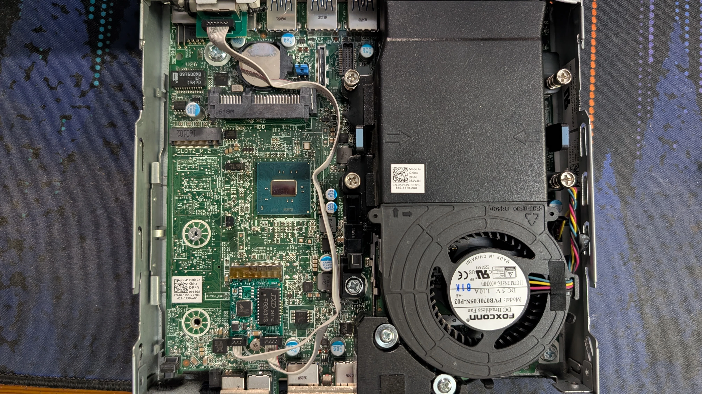
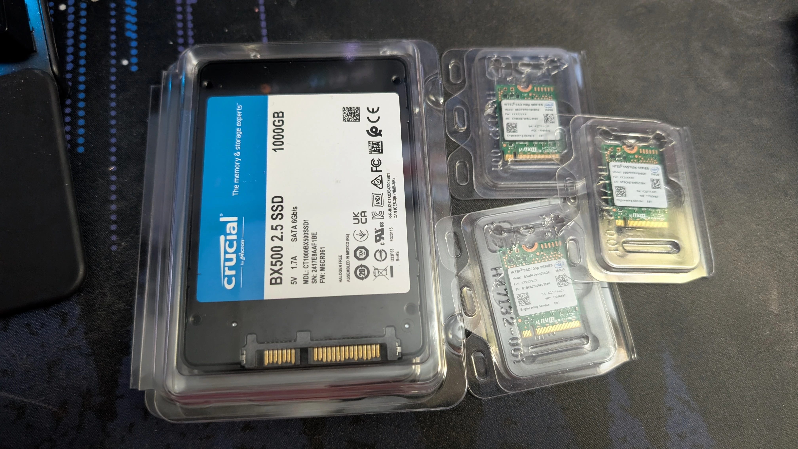
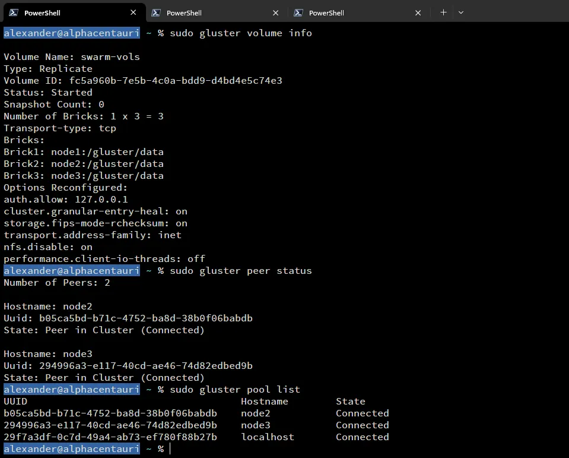
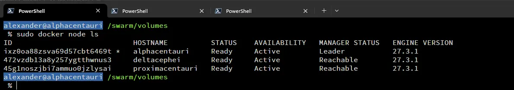
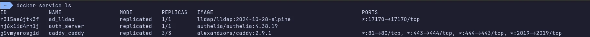
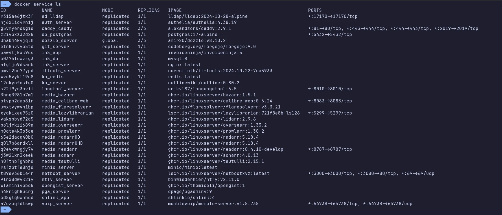

import Aside from 'src/components/widgets/Aside.astro';
import ImgDesc from 'src/components/custom/ImgDesc.astro';
import WebmVideo from 'src/components/custom/WebmVideo.astro';
import SkipAnchor from 'src/components/custom/SkipAnchor.astro';
import FTCDisclaimer from 'src/components/custom/FTCDisclaimer.astro';
import { Image } from 'astro:assets';
import ImageGallery from 'src/components/custom/ImageGallery.astro';

import cluster_v1_1 from 'PXL_20240927_184752868.webp';
import cluster_v1_2 from 'PXL_20240927_191148006.webp';
import cluster_v1_3 from 'PXL_20240927_192037557.MP.webp';
import cluster_v1_4 from 'PXL_20241001_175440336.MP.webp';
import cluster_v1_5 from 'PXL_20241002_022753726-na.webm';
import cluster_v1_6 from 'PXL_20241002_030609443.MP.webp';
import cluster_v1_7 from 'PXL_20241002_174514730.MP.webp';
import cluster_v1_8 from 'PXL_20241002_231242529.MP.webp';
import cluster_v1_9 from 'PXL_20240927_190244662.webp';
import cluster_v1_10 from 'Screenshot_2023-10-09_021948.webp';

import cluster_v2_1 from 'PXL_20241023_172155241.MP.webp';
import cluster_v2_2 from 'PXL_20241002_230611176.webp';
import cluster_v2_3 from 'PXL_20241023_172952741.webm';
import ansible_prep from 'ansible_prep.webm';
import iperf_test from 'cluster_speed.webm';
import keepalived_node_switching from 'keepalived_node_switching.webm';

<FTCDisclaimer />

It's been a while since I last posted about my homelab or well posted on the blog. So I figured I'd start off with a banger for 2025. Rebuilding my homelab into a Docker Swarm cluster that supports high availability. Hope you're ready for a ride, because this was definitely a journey. :sweat_smile:

<sub>*Side note: I also recently acquired a Bambu Lab A1 3D printer (with the AMS :)) to replace my old Anet A8. I'd say it's mine, but I've only been printing stuff for my wife so far..*</sub>

## The Plan

The plan for this project was to:

<ol type="a">
  <li>Create a cluster that supported high availability :white_check_mark:</li>
  <li>Setup a distributed storage solution that supported the above :white_check_mark:</li>
  <li>Setup a load balancer :white_check_mark:</li>
  <li>Have the cluster communicate over 2.5gb or faster networking :white_check_mark:</li>
  <li>Have a minimum of 3 nodes :white_check_mark:</li>
  <li>Be small and efficient :white_check_mark:</li>
</ol>

Easy enough right?... *right?*

Since I had two Dell Optiplex 5050 Micros that I was using already, I decided to grab a third micro to complete the 3 node cluster. As for the actual orchestration software I decided to stick with Docker and use Docker Swarm. I'm a Docker guy but never had a chance to use Swarm properly with a shared storage system. Figured it was time to give it a proper go.

<div class="flex flex-col items-center justify-center">
  <strong>Wait... Docker Swarm? Alex you should use Kubernetes!!!!!!</strong>
  <Image src="https://media4.giphy.com/media/v1.Y2lkPTc5MGI3NjExeWZ2eWN6czc3NWN1OXJyeDRvZ210azVzamF4ejNzejVkeWQ3djZkdCZlcD12MV9pbnRlcm5hbF9naWZfYnlfaWQmY3Q9Zw/daPCSjwus6UR2JxRX1/giphy.gif" alt="Dwight Schrute saying 'Let's put it this way... no' from The Office" width="480" height="398" class="shadow-md" />
</div>

## Current v2 Cluster Specs

- 2x Dell Optiplex 5050 Micros
  - i5-7600T, 16GB RAM
- 1x Dell Optiplex 7040 Micros
  - i5-6500T, 16GB RAM
- 3x Realtek 8125B 2.5gb A+E NICs
- 3x Intel 700p 256GB SSDs
- 3x Crucial BX500 1TB SSDs
- Ubiquiti Flex-2.5g Switch
- Ubuntu 24.04 LTS
- GlusterFS

## Cluster v1

<sub>circa 2023</sub>

Cluster v1 never actually made it to 'production'. It ended up being a test bed and a learning experience on gotchas when it came to Linux, Intel, drivers, and poor research on my part...

> **TLDR:** I originally bought some Intel i225-v 2.5gb m.2 cards from IOCrest thinking they'd work. Come to find out these particular chips have some <a href="https://duckduckgo.com/?t=h_&q=intel+225-v+linux+driver+issues&ia=web" target="_blank" class="underline">driver issues</a> on Linux (specifically Ubuntu).

When originally designing the cluster I had planned on using M.2 2.5g cards since the Micro's had M.2 M-key slots. That way I could get a less expensive SATA SSD for storage. After doing some research I settled on some <a href="https://www.aliexpress.us/item/3256805389320511.html" target="_blank" class="underline">Intel 225-V 2.5g cards</a> from IOCrest on AliExpress. The one downside to these cards was the vertical connector pins. The chassis did not have enough space with a SATA SSD installed. So I did what any tinkerer would do and replaced the pins with right angle ones. The first two cards went good, but my old soldering iron doesnt keep temp well. On the third card's NIC module I messed up and destroyed one of the traces. So I had to fix it with a jumper wire. Live and learn I suppose. 

As for the NICs themselves, I started experiencing driver issues after getting two of the nodes up and running in a 'mock' swarm. These issues manifested as random disconnects or complete NIC power loss. I tried to fix it by messing with grub configs for pcie_aspm thinking it was related to Active State Power Management (ASPM) at first. I then tried manually setting the autonegotiation via ethtool. Also double checked UEFI settings, etc. Nothing seemed to work. So I ended up scrapping the Intel cards and going with Realtek 8125B cards for cluster v2.

Anyways, I'll leave you with a few pictures from the v1 prototype, and we can move on to v2.

<ImageGallery
  galleryId="cluster-v1"
  items={[
    {
      src: cluster_v1_1,
      type: 'image',
      alt: 'My desk covered in soldering hardware and one of the cluster nodes'
    },
    {
      src: cluster_v1_2,
      type: 'image',
      alt: 'Desoldering pins'
    },
    {
      src: cluster_v1_3,
      type: 'image',
      alt: 'Example of new right angle pins and old straight pins'
    },
    {
      src: cluster_v1_4,
      type: 'image',
      alt: "Looking through the magnifying glass on my helping hands stand. Yes that's spot rust...."
    },
    {
      src: cluster_v1_5,
      alt: '3D printer making NIC adapters',
      type: 'video',
      autoplay: true,
      loop: true,
      muted: true,
    },
    {
      src: cluster_v1_6,
      type: 'image',
      alt: '3D printed adapter NIC ears'
    },
    {
      src: cluster_v1_7,
      type: 'image',
      alt: 'Installed M.2 NIC adapter'
    },
    {
      src: cluster_v1_8,
      type: 'image',
      alt: 'Installed NIC adapter'
    },
    {
      src: cluster_v1_9,
      type: 'image',
      alt: 'In the interest of being transparent... here is a mistake I made that I had to fix.'
    },
    {
      src: cluster_v1_10,
      type: 'image',
      alt: "Trying to fix the driver issues by setting pcie_aspm policy in grub's config"
    }
  ]}
/>

## Cluster v2

<sub>circa 2024</sub>

My second attempt at the cluster faired a bit better. Well mostly (more on that later). After my first purchase mistake I went back and bought <a href="https://www.aliexpress.us/item/3256803984886712.html" target="_blank" class="underline">different M.2 adapters</a>. These were A+E keyed and used the WLAN slot rather than the M.2 M-keyed slot which got freed up for more storage. These new adapters also use a Realtek chipset (8125B) rather than an Intel one. So no more odd driver issues.


<ImgDesc>M.2 A+E keyed adapter installed</ImgDesc>

With the new adapters using the A+E slot, I decided to use the M slot for a boot drive and the SATA port for cluster storage. For the boot drive I went with some Intel 700p 256GB SSDs I bought off someone from the Ubiquiti Discord server. As for cluster storage I went with <a href="https://amzn.to/4hCYdg4" target="_blank" class="underline">1TB Crucial BX500 SSDs</a> from Amazon. These are not the fastest drives by any means but for my use case they should do just fine.


<ImgDesc>Storage SSDs</ImgDesc>

There was one downside to the Intel SSDs though. Their physical size. They are 2230 and the Micro chassis only supports 2260 and 2280. So in order to use them I had to print out some 2230 to 2280 adapter brackets. I also printed out a 2.5in tray for the third Micro since it did not come with one. The print files are linked below.

<Aside type="note">
    If you are curious about M.2 keys and sizes: <a href="https://en.wikipedia.org/wiki/M.2#Form_factors_and_keying" target="_blank" class="underline">https://en.wikipedia.org/wiki/M.2#Form_factors_and_keying</a>
</Aside>

<ImageGallery
  galleryId="cluster-v2-components"
  items={[
    {
      src: cluster_v2_1,
      type: 'image',
      alt: '2230 to 2280 M.2 adapter in PLA'
    },
    {
      src: cluster_v2_2,
      type: 'image',
      alt: '2.5in tray in PETG (Image was taken before new NIC adapters were installed.)'
    },
    {
      src: cluster_v2_3,
      type: 'video',
      alt: '3D printer go brrrrr',
      autoplay: true,
      loop: true,
      muted: true,
    }
  ]}
/>

- [2230 to 2280 m.2 adapter ssd by nzalog](https://www.thingiverse.com/thing:5161985) via Thingiverse
- [Dell Optiplex micro 2.5" SSD / HDD Caddy](https://www.thingiverse.com/thing:4515328) via Thingiverse
- [3D printed NIC ears](https://www.thingiverse.com/thing:5830572) via Thingiverse

### The OS

For the OS I decided to stick with my tried and true [Ubuntu **Server**](https://ubuntu.com/server) (24.04 LTS btw). It's stable and easy to manage. Though, I may eventually re-image to [Rocky Linux](https://rockylinux.org/) for easy live patching when I rebuild again. The process was pretty standard. I booted via my [netboot.xyz](https://netboot.xyz/) PXE server, ran through the installer and then used [Ansible](https://docs.ansible.com/) to configure the OS. I'll have the playbooks + task files in the blog-files repo after this post is live.

<Aside type="tip">
  Looking at getting started with Ansible? I highly recommend Jeff Geerling's [Ansible for DevOps](https://www.ansiblefordevops.com/) handbook.
</Aside>

<Aside type="tip">
  If you want to know more about the netboot.xyz server, Techno Tim has a great video on it [here](https://www.youtube.com/watch?v=4btW5x_clpg&pp=ygUSdGVjaG5vIHRpbSBuZXRib290).
</Aside>

<WebmVideo src={ansible_prep} alt="Ansible prep" autoplay loop muted width="100%" height="auto" />
<ImgDesc>Ansible playbook running on the cluster nodes</ImgDesc>

### Networking

After the OS was set up on all the nodes, I went ahead configured the network interfaces. During the v2 build Ubiquiti launched their Flex 2.5g switch line. Since this was an SFF cluster the <a href="https://store.ui.com/us/en/category/all-switching/products/usw-flex-2-5g-5" target="_blank" class="underline">Flex Mini 2.5g</a> was a perfect fit as the cluster's network backbone. Also with it being powered by POE made for one less cable to deal with. The cluster network is also a fairly simple one. It has no access to the internet and no access to any other networks. Other networks also can't access it. Don't need stuff snooping on my unencrypted SQL traffic..

With the network interfaces configured and working, it was time to test the speed using <a href="https://iperf.fr/" target="_blank" class="underline">iperf</a>. As you can see by the short video below, I was able to get roughly 2.5gbps of bandwidth between the nodes.

<WebmVideo src={iperf_test} alt="Iperf testing" autoplay loop muted width="100%" height="auto" />
<ImgDesc>iperf testing</ImgDesc>

### Distributed File System

This was probably the most difficult part of the cluster build. At the time I had really no experience dealing with distributed file systems. I narrowed down my options to GlusterFS and Ceph. I ended up going with <a href="https://www.gluster.org/" target="_blank" class="underline">GlusterFS</a> for this iteration. Using the <a href="https://docs.gluster.org/en/main/Quick-Start-Guide/Quickstart/" target="_blank" class="underline">official documentation</a> I was able to get a basic cluster up and running fairly quickly. I also created a dedicated Docker user 'doc' and set its home directory to the GlusterFS volume on each of the nodes. I thought this would be a great idea, but it ended up being a pain later on.


<ImgDesc>GlusterFS setup</ImgDesc>

### Docker Swarm

With the OS, Networking, and DFS setup, it was time to set up Docker Swarm. Setting up Docker and Docker Swarm is fairly straight forward using the <a href="https://docs.docker.com/engine/install/ubuntu/" target="_blank" class="underline">official documentation</a>. You basically follow the installation on each of the nodes. Then you initialize the swarm on one and join the other nodes to it. In my case my commands were:

```shell
sudo docker swarm init --advertise-addr 192.168.100.2 ## init the swarm on the cluster network interface
sudo docker swarm join --token SWMTKN-1-4c2d6gncjh15gaznem5m8t2twwfn09o0paqpjxwdkqr1n76h8j-chr42vcbaobx7v2nrk86q9e93 192.168.100.2:2377 ## joining other nodes to the swarm
```

I then promoted the other two nodes to managers. This way I had proper high availability as it requires a minimum of 3 managers to be in the swarm.


<ImgDesc>Docker Swarm cluster</ImgDesc>

### Keepalived

Next up was setting up <a href="https://www.keepalived.org/" target="_blank" class="underline">Keepalived</a> to handle <a href="https://en.wikipedia.org/wiki/Virtual_Router_Redundancy_Protocol" target="_blank" class="underline">VRRP</a> for the cluster. This allowed me to have a single IP address that automatically failed over to the next node automatically. The video below shows the failover in action (sped up to keep the video short).

<WebmVideo src={keepalived_node_switching} alt="Keepalived failover" autoplay loop muted width="100%" height="auto" />
<ImgDesc>Keepalived VRRP failover</ImgDesc>

As you can see the active node switches as each keepalived service is terminated. The lower right shows a constant ping to the VRRP virtual IP (VIP). In this case 10.8.8.11. Having this VIP allows me to bring down hosts for maintenance or updates without having to worry about service connectivity.

### HA Caddy

The final step before I could start using the cluster was to set up a load balancer/reverse proxy. There are a few different options but, if you've read any of my <a href="/tag/caddy" target="_blank" class="underline">previous posts</a> you know I love using <a href="https://caddyserver.com/" target="_blank" class="underline">Caddy</a>. With its easy-to-use configuration and automatic certificate management makes it hard to beat. Also, Caddy is a great choice for this since it automatically clusters itself if all instances use the same storage volume. 

First thing I did was create the new overlay network for Caddy. This network would be for any services that I wanted to be able to access from outside the cluster. 

```shell
sudo docker network create --opt encrypted=true --driver overlay --attachable --internal --subnet=172.0.96.0/20 caddy-internal
```

Creating the Caddy service file.

```yaml title="caddy.yml"
services:
  caddy:
    deploy:
      replicas: 3
      restart_policy:
        condition: on-failure
      placement:
        constraints:
         - node.role == manager
    networks:
      - caddy
      - auth
    image: alexandzors/caddy:2.9.1
    env_file: .env
    ports:
      - 81:80
      - 443:444
      - 444:443
      - 2019:2019
    volumes:
      - /swarm/volumes/doc/caddy/Caddyfile:/etc/caddy/Caddyfile:ro
      - /swarm/volumes/doc/caddy/.data:/data
      - /swarm/volumes/doc/caddy/configs:/etc/caddy/configs:ro
      - /mnt/plex:/srv:ro

networks:
  caddy:
    name: caddy-internal
    external: true
  auth:
    name: auth-internal
    external: true
```

Then deploying Caddy to the swarm.

```shell
sudo docker stack deploy --c caddy.yml caddy
```


<ImgDesc>docker service ls command showing Caddy running on all 3 nodes</ImgDesc>

I eventually need to update the Caddy deployment to use host mode for port assignments. That way I can get the source IP address of incoming requests and not the docker proxy IP. But that will be part of v3.

## Cluster v3

<sub>circa 2025</sub>

So here we are. Cluster v2 has been running great for a while now, but I've been having some issues with it. The main, and arguably the largest, issue I have been running into is the slow performance of GlusterFS. I'm not sure if it's the hardware choices I made, or a misconfiguration? I tried the performance tuning tips from the <a href="https://docs.gluster.org/en/main/Administrator-Guide/Performance-Tuning/" target="_blank" class="underline">official documentation</a> but was still running into issues. Like switching to the cluster user 'doc' would take anywhere from 30 to 45 seconds to complete. Also, deploying stacks of services could take up to 5 minutes before they were alive and running.

Either way for v3 I'm probably going to move to <a href="https://ceph.com/" target="_blank" class="underline">Ceph</a> as my DFS solution. Since it seems to be the more popular of the two after digging around more. I may need to upgrade the RAM on the nodes to handle it though. I'm also going to try and add a 4th node to the cluster with beefier hardware since I still have one 2.5g port left on the switch. Maybe one with some GPU compute to handle local LLMs?


<ImgDesc>Current services running on the cluster</ImgDesc>

However, what won't be changing is my use of Docker Swarm. :wink: